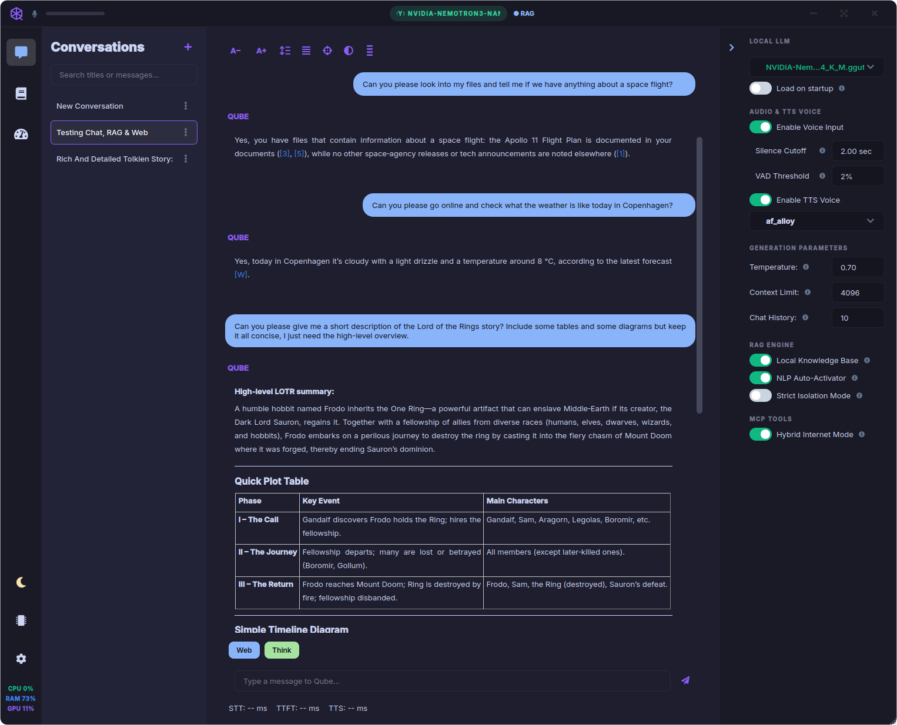
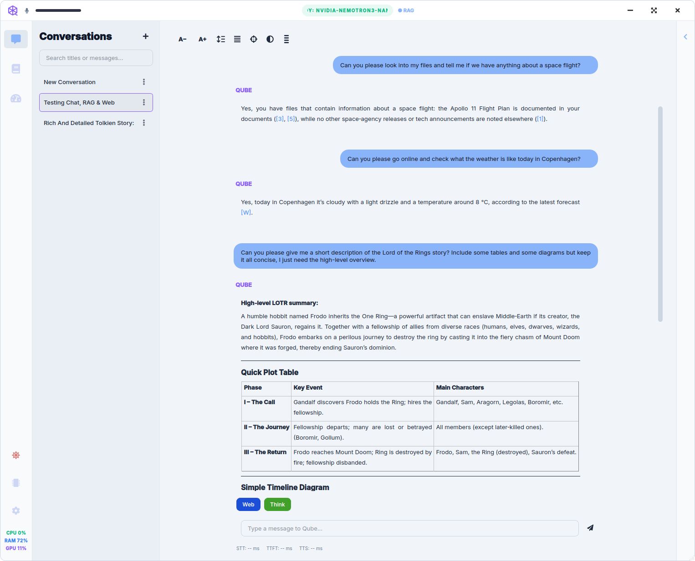
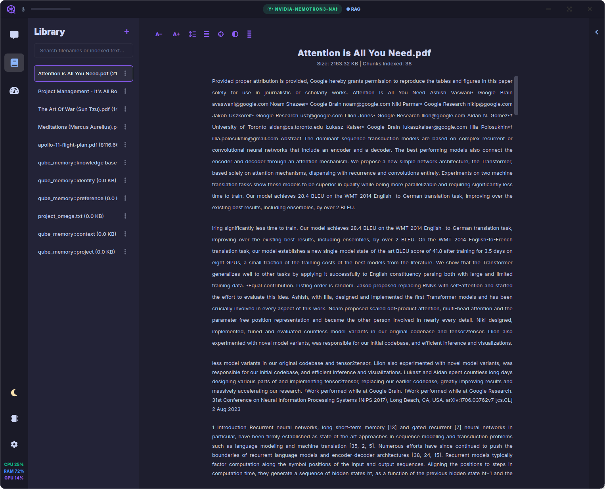
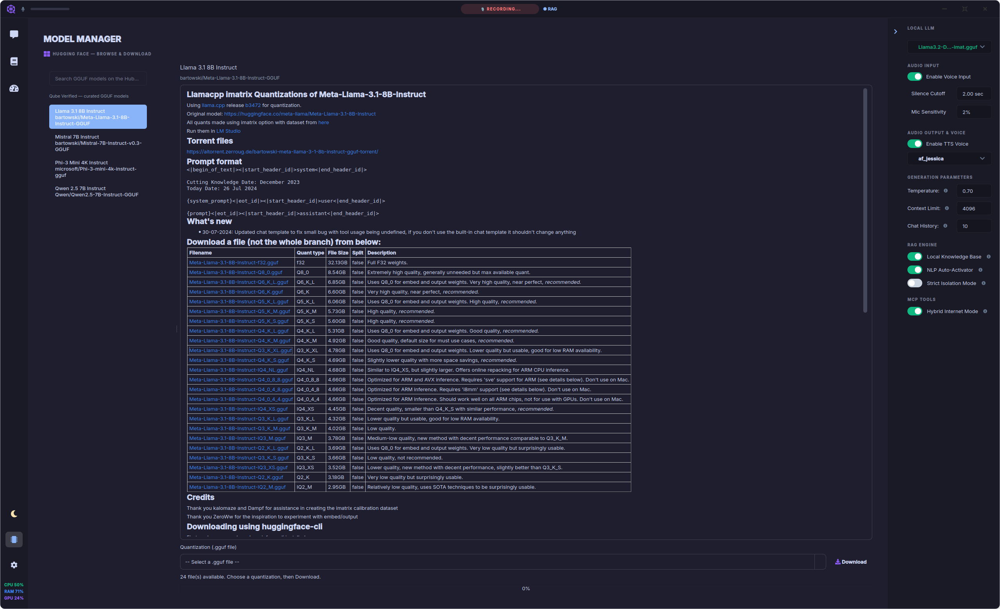
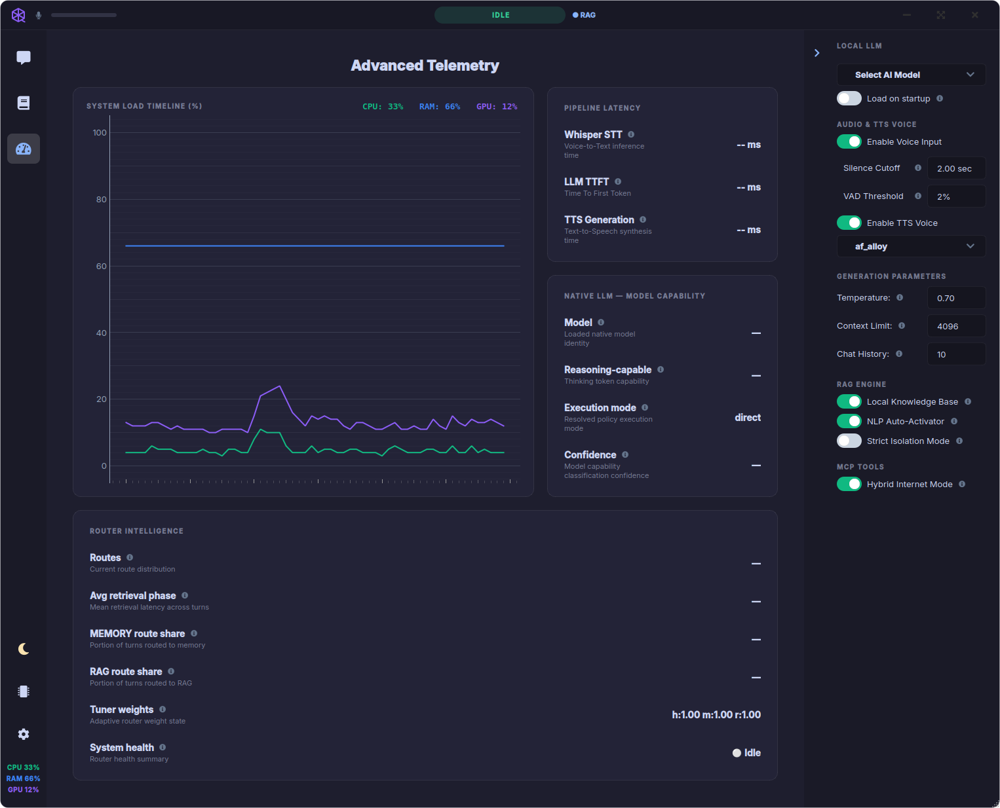

# Qube

<p align="center">
  
</p>

<p align="center">
  <strong>Your AI Model. Your Intelligence. Your Hardware.</strong><br>
  <strong>Complete Privacy &amp; Sovereignty.</strong>
</p>

<p align="center">
  <em>Grounded answers from your Library, memory, and trusted sources — with citations you can inspect.</em>
</p>

<p align="center">
  <a href="#quick-start">Quick Start</a> ·
  <a href="https://dagaza.github.io/Qube/">Landing page</a> ·
  <a href="https://www.qubeapp.eu">Website</a> ·
  <a href="#features">Features</a> ·
  <a href="#see-it-in-action">See it in action</a> ·
  <a href="#documentation">Docs</a> ·
  <a href="#built-in-help">Help</a> ·
  <a href="#support-the-project">Support</a>
</p>

| **Dark theme** | **Light theme** |
| :---: | :---: |
|  |  |

---

## What is Qube?

Qube is a **native desktop AI assistant** for privacy-sensitive work on **your own hardware**. Chat in text, ingest documents into a **Library**, let Qube distill **long-term memory** you can edit in **Memory Manager**, and pull **Live Sources** — scientific literature, filings, case law, and more — with numbered citations and per-turn **INSPECT RETRIEVAL**.

Inference stays local. Web and research tools run **only when you ask**. Help, settings tours, and troubleshooting live **inside the app** — **Library → Qube**, **`@[tool:help]`**, and **`?` guided tours** — not on a separate wiki.

Optional **voice input**, text-to-speech, and a **Desktop Companion** orb are available when you want hands-free turns; precision routing with **`@` composer tools** and **skills** is richest from the main window with keyboard and mouse.

---

## Why Qube?

- **Private by default** — chat, Library, and long-term memory stay on your device; no cloud chat API required
- **Grounded answers** — cognitive router plus **`@` tools**; weak retrieval is dropped instead of faked citations
- **Memory you control** — automatic fact extraction, **Memory Manager** edit/flag/delete, and a **negative list** so deleted facts stay gone
- **Research built in** — **58+ Live Source** adapters, private web discovery by default, async **`@research`** reports
- **Transparent** — local **Telemetry**, **INSPECT RETRIEVAL**, and opt-in diagnostic logs (on-device only — not vendor analytics)
- **Ready after install** — Recommended bootstrap bundles sidecar, **search embeddings**, and an optional main model — not a blank shell
- **Help inside the app** — **`@help`** and **`?` tours** on every major screen
- **Your hardware** — built-in GGUF engine or plug in **LM Studio** / **Ollama**
- **Voice & accessibility (optional)** — push-to-talk, wake word, streaming TTS, barge-in, and **Desktop Companion** for hands-free when your setup allows

---

## Features

<a id="features"></a>

**Composer & `@` routing** — Per-message control: `@library`, `@file`, `@evidence`, `@finance`, `@legal`, `@research`, `@internet`, `@memory`, `@help`, custom **`@[tool:user:…]` presets**, and **`@[skill:…]`** reasoning frameworks. The cognitive router handles everyday phrasing; attach `@` when you want a specific pathway.

**Library** — A persistent document corpus: ingest PDFs, EPUBs, and text; search titles and indexed body text; preview from the vector index; **Chat with document** prefills `@file`. Shipped help lives in **Library → Qube** and is reachable via **`@help`** without mixing into your uploads.

**Memory Manager** — Long-term facts distilled from chat — preferences, projects, knowledge — with tier filters, edit/flag/delete, export, and a negative list so deleted memories stay gone.

**Live Sources** — Institutional adapters beyond generic web search: trusted/Wikipedia, scientific literature, SEC EDGAR, U.S. case law, page **fetch**, and multi-step **`@research`** reports (async, non-blocking). **58+ adapters** with per-source toggles; build your own via **My knowledge** presets and **Custom sources** (REST, GraphQL, MCP, …).

**Transparency** — **Advanced Telemetry** (local hardware + routing stats), per-reply **INSPECT RETRIEVAL**, and **Settings → Advanced** diagnostic logs with redaction options. Web discovery defaults to **private** search (DuckDuckGo + Wikipedia); point at **your SearXNG** when you want self-hosted SERP.

**Model Manager** — Search Hugging Face, browse curated picks, read model READMEs in-app, and download **.gguf** quantizations with disk-space guardrails. Run natively or point at an external server.

**Built-in help** — Full guides in **Library → Qube**, searchable with **`@[tool:help]`** from chat (same retrieval pipeline as your docs, separate scope). **`?` guided tours** on every major screen.

**Voice & Desktop Companion (optional)** — Speech-to-text and TTS when voice models are installed; interrupt mid-sentence with **barge-in**. Optional floating orb for quick voice turns and glanceable status. Uncheck voice downloads at bootstrap if RAM is tight — chat and routing work fully without them.

| **Library** | **Model Manager** | **Telemetry** |
| :---: | :---: | :---: |
|  |  |  |

> **Before launch:** capture a Desktop Companion orb screenshot for this section — see [launch documentation guidelines](docs/launch_documentation_guidelines.md) Phase 4.

---

## Quick Start

<a id="quick-start"></a>

### Download (recommended)

| Platform | Install |
|----------|---------|
| **Windows** | [`winget install -e --id dagaza.Qube`](https://github.com/dagaza/Qube/releases) or `choco install qube` |
| **macOS** | Download the `.dmg` for your Mac from [GitHub Releases](https://github.com/dagaza/Qube/releases) |
| **All platforms** | Latest installer or bundle from [GitHub Releases](https://github.com/dagaza/Qube/releases) |

### First launch

1. **Complete setup** — On first run, Qube shows a **Recommended** preset: required sidecar + **search embeddings**, optional **Whisper** / **Kokoro TTS**, and (by default) a **main chat model** sized for ~16 GB RAM — with disk/memory feasibility checks. Uncheck voice models if RAM is tight; uncheck the main LLM if you will use **LM Studio** or **Ollama** instead.
2. **Or use an external backend** — Point Qube at **LM Studio** or **Ollama** under **Settings → AI & Models**; add more weights anytime in **Model Manager**.
3. **Start in Conversations** — Type a question, attach **`@library`** or **`@evidence`** when you want grounding, or press **?** for a guided tour. Enable voice under **Settings → Voice & Audio** when you want hands-free input.

> **Tip:** At 16 GB RAM, start with a small model (for example Nemotron 3 Nano 4B). See **Settings → Help** to enable hardware-fit suggestions in Model Manager.

### From source (developers)

See **[Install from source](docs/user/install-from-source.md)** for clone, venv, GPU builds, and developer flags.

Quick start:

```bash
git clone https://github.com/dagaza/Qube.git && cd Qube
python3 -m venv venv && source venv/bin/activate
pip install -r requirements.txt && python main.py
```

---

## See it in action

<a id="see-it-in-action"></a>

1. **Ground on your files** — Drop a PDF into **Library**, then ask naturally or attach **`@[tool:library]`** / **`@[file:…]`**. Citations link back to source chunks.
2. **Route with `@`** — Try **`@[tool:evidence]`** for papers, **`@[tool:finance]`** for SEC filings, or **`@[tool:research]`** for an async evidence report — or let the router infer from your wording.
3. **Inspect a reply** — Open **Sources**, then **INSPECT RETRIEVAL** to see adapters, discovery tier, and phase detail for that turn.
4. **Curate memory** — Open **Memory Manager** to see what Qube filed away; edit or delete anything you do not want kept.
5. **Optional: voice or Companion** — Enable push-to-talk or the **Desktop Companion** orb when you want hands-free turns alongside other apps.

---

## Built-in help

<a id="built-in-help"></a>

Qube ships with a full help library — no browser required.

- Open **Library → Qube** to browse guides, workflows, and troubleshooting.
- Type **`@[tool:help]`** in chat and ask how to do something (*"How do I set GPU layers?"*, *"Memory vs Library?"*).

Guided tours (**?** buttons) on each screen walk you through the layout step by step.

More workflows: [How to use Qube](docs/user/how-to-use.md).

---

## System requirements

| | Minimum | Recommended |
|---|---------|-------------|
| **RAM** | 16 GB | 20 GB |
| **OS** | Windows 10+, macOS 12+ (Apple Silicon or Intel), Linux (source) | Same |
| **Storage** | ~2 GB for app + optional voice models; plan extra for each chat model | SSD strongly recommended |
| **Audio** | Optional — microphone and speakers for voice features | Same |
| **GPU** | Optional — speeds up the internal engine via GPU offload layers | Discrete GPU or Apple Silicon with enough VRAM for your chosen model |

Full hardware guidance (models, GPU paths, storage): **[System requirements](docs/user/system-requirements.md)**.

Qube uses a native **PyQt6** desktop shell — not Electron and not a browser tab — so more of your **16 GB budget** stays available for models and context. See [System requirements](docs/user/system-requirements.md) for hardware guidance.

---

## Documentation

<a id="documentation"></a>

| Audience | Start here |
|----------|------------|
| **Users** | [docs/user/](docs/user/README.md) — install, requirements, workflows |
| **In-app** | **Library → Qube** or **`@[tool:help]`** (see [Built-in help](#built-in-help)) |
| **Contributors** | [docs/architecture/](docs/architecture/README.md) — memory, pipeline, stack |
| **Contributing** | [CONTRIBUTING.md](CONTRIBUTING.md) — setup, tests, PRs |
| **Launch doc playbook** | [docs/launch_documentation_guidelines.md](docs/launch_documentation_guidelines.md) — re-run before official launch |
| **Landing page** | [dagaza.github.io/Qube](https://dagaza.github.io/Qube/) · [setup](docs/pages.md) |
| **Website** | [qubeapp.eu](https://www.qubeapp.eu) |
| **Social preview** | [assets/social/qube-social-preview.png](assets/social/qube-social-preview.png) — upload in repo Settings |
| **Release notes** | [CHANGELOG.md](CHANGELOG.md) — what changed in each version |

The pre–launch rewrite README (453 lines of technical detail) is preserved at [docs/archive/readme-pre-launch-rewrite.md](docs/archive/readme-pre-launch-rewrite.md).

**What's new:** [v1.0.1](CHANGELOG.md#101---2026-06-28) — first-run bootstrap, phased model downloads, WinGet first-launch fixes.

---

## How Qube compares

**LM Studio** excels at running and serving models; **SillyTavern** at prompt craft and character workflows; **Odysseus** at a broad self-hosted workspace. **Qube targets a different job:** a **native desktop assistant** with automatic routing to Library, memory, or live sources; **`@` composer control**; an editable **Memory Manager**; and **in-app help** — with optional voice and a lean PyQt shell on tight RAM. Qube can use **LM Studio or Ollama** as its inference backend.

---

## Support the project

<a id="support-the-project"></a>

Qube is free, open-source software built with care. If it saves you time or helps you learn, consider supporting continued development:

- ☕ **[Support on Patreon](https://patreon.com/Dagaza)**
- 🐛 **[Report a bug or request a feature](https://www.qubeapp.eu)** — or use **Settings → Contact & Feedback** in the app
- 💬 **GitHub [Issues](https://github.com/dagaza/Qube/issues)** — bug reports and discussions welcome

---

## Acknowledgements

Qube stands on the shoulders of excellent open-source projects:

[Kokoro-82M](https://huggingface.co/hexgrad/Kokoro-82M) · [Faster-Whisper](https://github.com/SYSTRAN/faster-whisper) · [Nomic Embed](https://www.nomic.ai/) · [LanceDB](https://lancedb.com/) · [PyMuPDF](https://pymupdf.readthedocs.io/) · [OpenWakeWord](https://github.com/dscripka/openWakeWord) · [Hugging Face Hub](https://huggingface.co/) · [LM Studio](https://lmstudio.ai/) · [Ollama](https://ollama.com/) · [PyQt6](https://riverbankcomputing.com/software/pyqt/) · [llama.cpp](https://github.com/ggerganov/llama.cpp)

Thank you to everyone who encouraged this project along the way.

---

## License

This project is licensed under the **MIT License**. You may use, modify, and distribute it freely — including in commercial projects — as long as you include the original copyright notice. See [`LICENSE`](LICENSE) for details.

---

## Developers

Clone, test, and contribute: **[CONTRIBUTING.md](CONTRIBUTING.md)** · [Install from source](docs/user/install-from-source.md) · [Architecture](docs/architecture/README.md)
