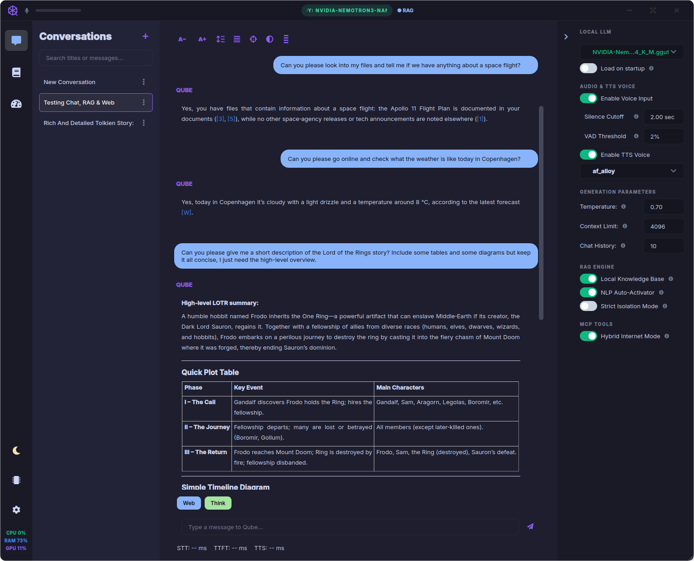
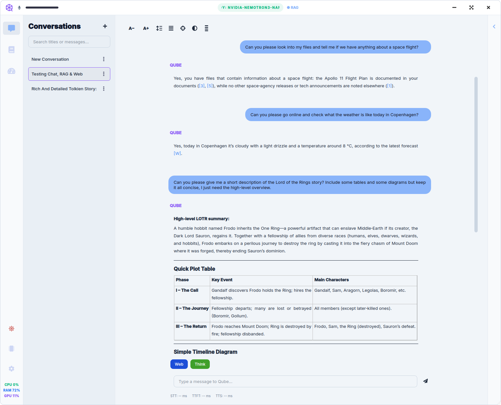
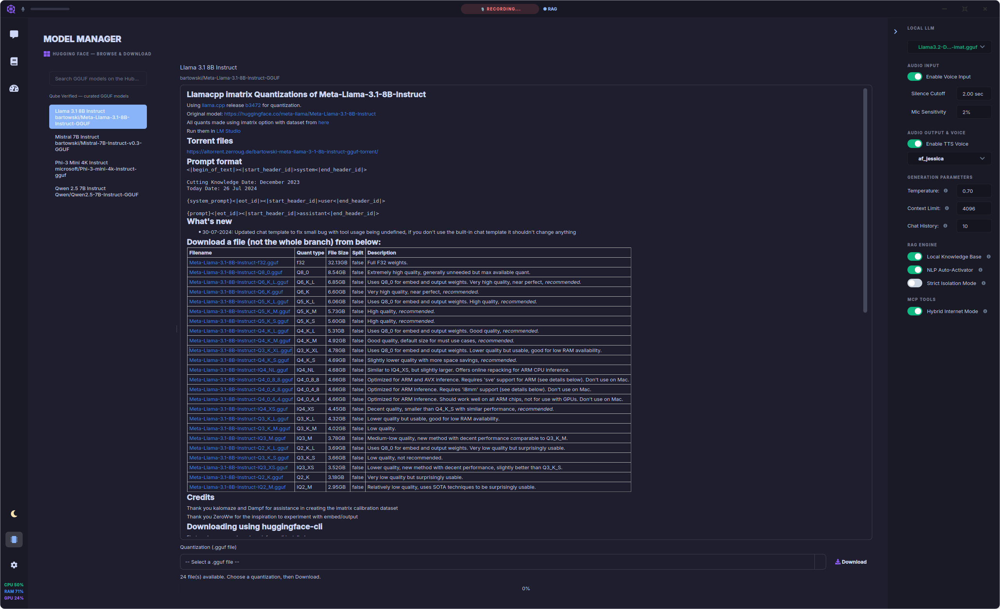
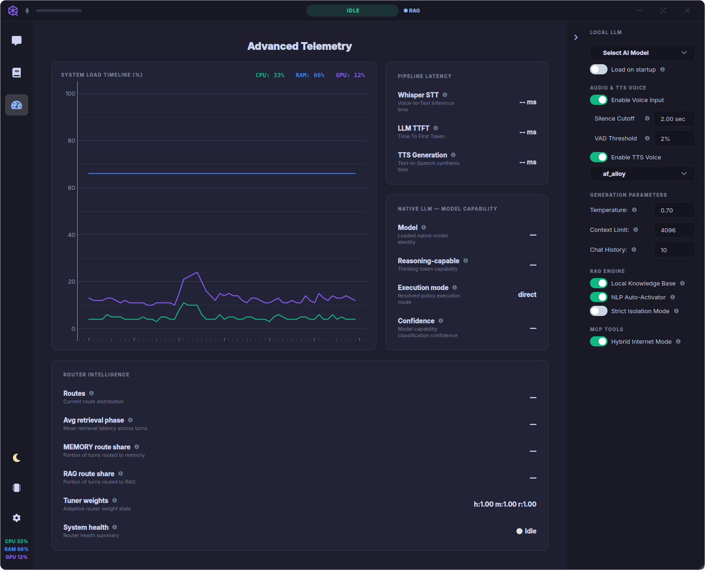
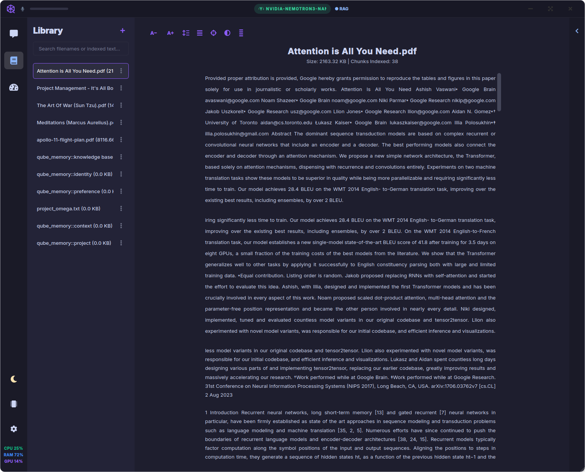
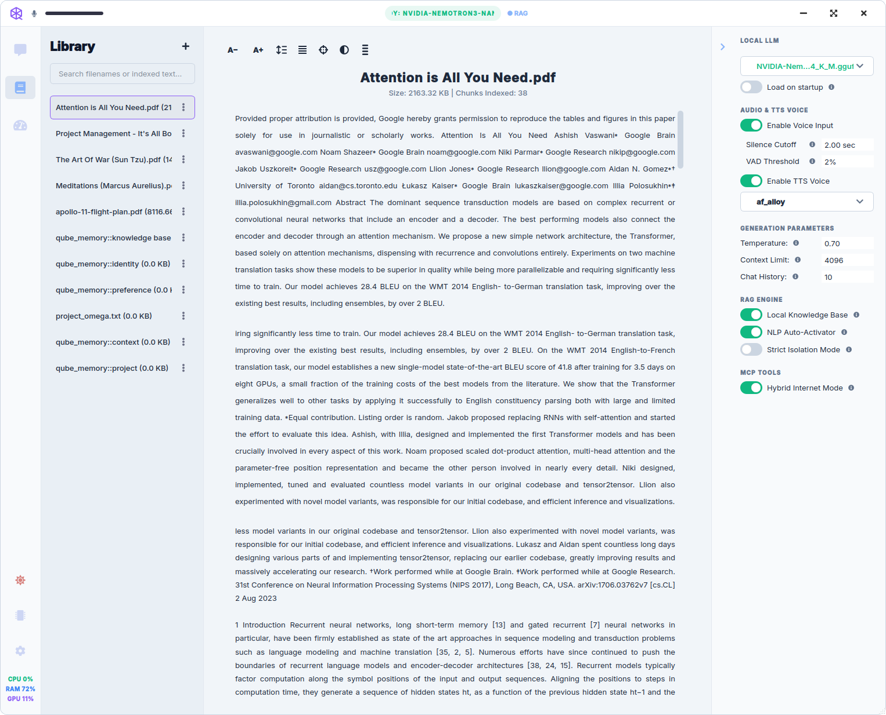

# Qube: Local Hardware-Accelerated AI Assistant

| **Dark Theme** | **Light Theme** |
| :---: | :---: |
|  |  |

Qube is a fully local, privacy-first, voice-to-voice AI desktop assistant built on a multithreaded, streaming-first pipeline. Operating entirely offline under a strict memory budget, it integrates state-of-the-art voice processing, adaptive cognitive routing, and asynchronous semantic memory enrichment directly into your hardware environment. Run inference with a **built-in native llama.cpp engine** *or* plug in LM Studio / Ollama—load your files either way—and experience a genuinely intelligent second brain.

Unlike traditional chat-based assistants, Qube is designed around a **low-latency streaming architecture**, combining:

- adaptive cognitive routing
    
- retrieval-augmented generation (RAG)
    
- live web search integration
    
- async long-term semantic memory enrichment
    
- strict RAM-aware execution constraints (~10–15GB usable budget)
    

Inference and RAG stay on-device—**no** third-party chat API. (Optional **Model Manager** downloads talk to Hugging Face only when **you** choose to fetch weights.)

## ✨ Quick Overview

🧠 **Long-Term Semantic Memory & RAG (v6):** Qube doesn't just hold temporary context; it learns. A background enrichment worker extracts **typed atomic facts** (subject / source_role / durability / provenance_quote) from your conversations, drops thin or unprovable claims at the door, links each memory back to the document chunk that inspired it, and stores everything in LanceDB. **Hardened against the classic memory regressions**: assistant refusal messages ("I don't have internet access") are scrubbed before extraction, single-token name stubs cannot become a memory on their own, and a persistent negative list ensures a memory you delete cannot be recreated. **Usage-driven decay** prunes memories that aren't earning their keep, and a periodic **self-reflection auditor** flags suspect entries for your review without ever deleting them on its own.

🗂️ **Memory Manager (NEW):** A dedicated **Memories** screen exposes everything Qube remembers about you. Filter by category, search by content, flip the **Flagged for review** toggle to see what the self-reflection worker has surfaced, and use per-row **Edit / Flag / Delete** (or bulk delete) to take direct editorial control of the assistant's long-term knowledge of you. Every delete also writes the entry into the negative list so the same memory cannot be recreated by a similar conversation in the future.

⚡ **Real-Time Interruption (Barge-In):** Experience true conversational fluidity. Qube supports "Barge-In" capabilities, allowing you to interrupt the assistant mid-sentence by calling it out.

🤖 **Dual-mode LLM routing:** Choose **Internal Engine (native llama.cpp)** for a self-contained app with no separate server, or **External Server (localhost)** for LM Studio / Ollama-style OpenAI-compatible APIs—same streaming pipeline either way. Intelligent NLP triggers and dashboard toggles for RAG routing.

🎙️ **Lightning-Fast STT:** Powered by faster-whisper, Qube offers incredibly fast and accurate Speech-to-Text transcription right on your hardware (excellent on CPU alone).

🗣️ **High-Fidelity TTS:** Uses the cutting-edge Kokoro engine for ultra-realistic Text-to-Speech, with over 30 voices included. In the Settings area you can load your own engine if you prefer something like Voxtral or Qwen TTS, but be prepared to keep an eye out on the Dashboard telemetry as these require more beefy hardware like a dedicated GPU (or a solid APU) acceleration.

📚 **Advanced RAG Engine:** Built on LanceDB for blazing-fast vector storage and PyMuPDF for aggressive text extraction from complex PDFs, eBooks, and text files.

🌐 **Live Web Search Integration:** Qube can break out of its offline shell when explicitly requested. Using the internet_tool, it performs real-time web searches, parses the data into the context window, and provides beautifully formatted, clickable [W] citations right next to your local document sources.

🎛️ **Responsive native GUI:** A lean **PyQt6** desktop shell (not an Electron wrapper)—so more of your RAM stays available for models and context. Includes a real-time VU meter, dynamic settings, custom wake-word support (currently over 4 different wake-words available), and **Model Manager**: search Hugging Face, browse Editor’s Picks, read READMEs, and download **.gguf** quantizations with **disk-space guardrails** (pre-flight free-space check + safe **.part** cleanup on cancel or failure).

🎚️ **Hardware controls:** Per-model **GPU offload layers** for the native engine, plus granular audio and generation settings—tuned for real hardware, not abstract “cloud” tiers.


## 🏗️ Deep Dive: Architecture & Features

### 🧠 Dual Memory System (RAG + Long-Term Atomic Memory)

Qube uses two complementary memory layers:

#### 1. Document RAG Memory

- Built on **LanceDB vector storage**.
    
- Ingests PDFs, EPUBs, TXT, and Markdown files.
    
- Retrieves semantic chunks for grounding responses.
    
- Injects retrieved context directly into LLM prompts using sequential numeric citations (e.g., `[1]`).
    

#### 2. Long-Term Atomic Memory (v6)

- Extracts durable “facts” from conversations asynchronously.

- Runs in a background **QThread Enrichment Worker** that yields to the main LLM to prevent local server deadlocks.

- Stores structured atomic memory in LanceDB using a dedicated `qube_memory::%` namespace.

**Key properties (Phase A → C hardening):**

- **Typed extraction schema** — every memory carries `subject` (user / third_party / system), `source_role` (user / assistant / derived), `durability`, `category`, `content`, `provenance_quote`, and `confidence`. The LLM is given explicit NEGATIVE examples for the classic regressions ("Tell me about Alice" → `[]`, "I don't have internet access" → `[]`).

- **Role-aware preprocessing** — assistant refusal / limitation messages are matched against a regex blacklist and replaced with `[failure message omitted]` *before* the extraction prompt is built, so a one-off "I can't access the internet" turn cannot become a permanent "the agent has no internet" memory.

- **Tool-aware turn fences (T3.3)** — the LLM worker now tells the enrichment worker when a turn should not be mined at all. Stream-repetition guard trips, web-search failure sentinels on WEB/INTERNET/HYBRID routes, pipeline errors, and assistant-failure final text all set `enrichment_mode = "skip"`. Explicit-remember turns ("please remember that…") set `enrichment_mode = "explicit_only"` so the user-requested fact is still seeded while the extractor LLM call is skipped on the acknowledgement. Cadence-driven maintenance (usage drain, decay sweep) keeps running independently.

- **Episodic session summaries (T3.2)** — alongside the atomic-fact pipeline, the enrichment worker now writes a single-paragraph `episode` row per active session. After every extraction flush, `_maybe_summarise_session` bumps a per-session turn counter and fires `_summarise_session_now` when it hits the cadence (8 turns) or when the session has been idle for more than 15 minutes. The summariser LLM returns `SUMMARY: <paragraph>` + `TOPICS: <tags>` (or `SUMMARY: SKIP` for trivial chitchat), the result is validated against the usual thin-content / assistant-failure / negative-list filters, capped at 800 chars, and written in-place to `qube_memory::episode::<session_id>` — replacing any prior episode for that session. Narrative recap queries ("what have we been working on?", "where did we leave off?", "recap my session", "summarize this conversation") are detected up-front by `detect_narrative_intent`, routed to `MEMORY` with `prefer_episode=True`, and the retrieval scorer boosts `category=="episode"` rows by `+0.35` so they outrank atomic facts; the returned sources are inline-labelled `[EPISODE]` and a narrative-recap system-prompt suffix tells the LLM to prefer them. The reflection worker skips episode rows (they regenerate on cadence and are not the kind of durable user fact the judge rates), and the Memory Manager surfaces episodes under a dedicated **Episode** category with a topics line so you can inspect / flag / delete them like any other memory.

- **Structured preference / knowledge tiers (T3.4)** — every atomic fact is now stored under a structural tier derived from its validated payload: `preference` (user-subject user_stated/user_confirmed facts), `knowledge` (third-party subject, document-derived, or explicit-remember), `episode` (T3.2 session summaries), or `context` (legacy fallback). The tier lives in the LanceDB `source` column as `qube_memory::<tier>::<category>` so retrieval is tier-scoped with a cheap `LIKE` filter — no new columns, no migration needed on fresh installs. Plain chat turns now run a MemGPT-style "core memory" lookup that queries preferences + context only (`top_k=3`); recall / hybrid turns additionally surface the knowledge tier; narrative recap turns surface every tier with episodes on top. The Memory Manager grows a two-level **Tier × Category** filter, each row gets a colour-coded `PREF` / `KNOW` / `EP` / `CTX` pill next to the category badge, and the reflection worker learned two new structural labels — `tier_mismatch` (preference-tier row whose subject is not the user) and `orphan_knowledge` (knowledge-tier row that has lost every piece of evidence it was stored for) — both raised deterministically before the LLM judge runs.

- **RAG relevance gate + empty-retrieval downgrade (T4.1)** — RAG vector hits now pass through a hard semantic-relevance floor (`MIN_RAG_SEMANTIC_SCORE=0.30` on L2-normalised Nomic v1.5 embeddings, mirroring the memory tool's gate). Below-floor chunks are dropped before ranking, and if the vector channel produced candidates but the gate killed all of them, the FTS fallback is also suppressed — lexical matches without semantic corroboration are almost always brittle (FTS matching the word "blue" in a Blue Jay migration study when you asked about Rayleigh scattering). If every retrieval channel comes back empty on a `MEMORY` / `RAG` / `HYBRID` turn, the route is downgraded to `NONE` after telemetry is logged, so the LLM answers the general-knowledge question from its own parameters on the base system prompt instead of being steered by a citation-discipline suffix into a "I couldn't find anything in my sources" reply. This closes the regression where "Why is the sky blue?" against a single-document library returned a bare `[1]` pointing to the unrelated document.

<<<<<<< HEAD
- **WEB-route empty-source downgrade + proactive tool-disabled veto** — the cognitive router internally promotes `route` to `"web"` as soon as `_score_web_intent` clears its threshold on keywords like `weather` / `today`, and that value previously flowed straight through to the prompt build. When the user had the internet tool turned off (or when `search_internet` returned the "Internet search failed" sentinel and the guard cleared `web_results`), the WEB system-prompt branch still asserted *"You have just been provided with real-time, live web search results. Cite the web sources inline using a plain [W] token…"* against an empty source block — a small LLM duly hallucinated both an answer and a `[W]` citation, and the UI correctly warned `Citation id 'W' not found on this message (0 sources)`. Two complementary guards now close this: (a) a **proactive veto** that reverts `execution_route` from `WEB` to `NONE` before tool execution when the router picked WEB but none of `force_web` / manual-trigger / auto-trigger fired *and* `mcp_internet_enabled` is False (stamping `decision["web_vetoed_tool_disabled"]=True` and emitting a distinctive INFO log), and (b) an **extended T4.1 empty-source downgrade** that now includes `WEB` / `INTERNET` in its route tuple, so even when the tool is enabled but the search returns nothing usable the route still flips to `NONE` before the prompt build — landing the turn on the base *"You are Qube, be concise"* system prompt with no `[W]` citation instruction. The WEB-downgrade path also marks `skip_enrichment("web_route_no_sources")` so the thin "I can't check live data right now" reply is not mined for user facts by the enrichment worker, mirroring the existing `web_tool_failure` sentinel behaviour.
=======
- **Cognitive router chat-class margin + threshold bump (T4.2)** — the cognitive router no longer treats general-knowledge questions ("Why is the sky blue?", "What is the speed of light?", "How does photosynthesis work?") as recall queries just because they share high cosine geometry with "tell me about X" phrasings. A second, symmetric **chat centroid** is built from a curated negative-class example set (factual / coding / chitchat / translation prompts, deliberately with no "remember" / "recall" / "tell me about" / "who is" tokens) and installed alongside the existing recall centroid by the LLM worker's `_ensure_router_centroids`. The `recall_active` override now requires **both** `recall_score >= recall_threshold` **and** `(recall_score - chat_score) >= recall_margin_over_chat`, and the threshold is bumped `0.55 -> 0.62` as defense in depth. When the chat centroid is unset (pre-T4.2 installs), `chat_score` defaults to `0.0` so the margin gate is trivially satisfied and the single-class behaviour is preserved. Each blocked-by-margin turn surfaces one INFO line on `Qube.CognitiveRouterV4` — `[RouterV4] recall blocked by chat-class margin (recall=..., chat=..., margin=..., required=...)` — so the fix is greppable in `logs/llm_debug.log` instead of being a silent config change. Together with T4.1 this makes the router both *correct* (no more false HYBRID on general-knowledge questions) and *safe* (the RAG gate still catches anything that slips through).
>>>>>>> origin/main

- **Server-side validation** — drops candidates that are `subject=system`, `source_role=assistant` (without an explicit `remember that…` from the user), bare third-party stubs, non-`long_term`, thin (`< 3 words` / single proper-noun / all stop-words), match an assistant-failure pattern, or are missing a `provenance_quote`.

- **Per-turn provenance** — each memory records its `source_session_id`, `source_message_ids`, `origin` (user_stated / user_confirmed / document_derived / system_derived), and `links_to_document_ids` for the RAG chunks that were in context when it was formed. On retrieval, a thin memory **auto-expands to its originating document chunk** so "Who is Alice?" answers from the actual document, not the bare name.

- **Embedding-based clustering** — replaces the old keyword-length cluster key with a nearest-neighbor join (`L2 < 0.30`) on the memory table, so related-but-distinct facts ("I prefer dark roast" / "my favorite is arabica") share a cluster and can trigger the contradiction judge.

- **Two-stage contradiction judge** — Jaccard fast-path detects literal duplicates; otherwise a short LLM micro-call labels the pair `duplicate` (reinforce strength), `contradiction` (replace old with new), or `complement` (insert alongside).

- **Persistent negative-pattern list** — every memory you delete in the Memory Manager is appended (content + vector) to `~/.qube/memory_negatives.json` so the next extraction pass rejects any candidate within `L2 < 0.20` of a deleted memory. The same memory cannot be recreated by a similar conversation tomorrow.

- **Usage-driven decay** — payloads carry `times_retrieved`, `times_cited_positively`, `last_used_at`. A 24 h sweep recomputes `usefulness` and `decay`, purges rows below `decay < 0.15`, and the retrieval scorer re-weights to include the decay term so memories that earn their keep float to the top.

- **Self-reflection worker** — every 6 hours, batches 10 least-recently-reflected memories and asks the titler LLM to label each as `durable_user_fact` / `third_party_stub` / `system_claim` / `transient` / `unclear`. Anything other than `durable_user_fact` is marked `flagged_for_review` and surfaced in the Memory Manager's Flagged section. **Never auto-deletes** — final say belongs to you.

---

### 🗂️ Memory Manager

A dedicated nav screen (between Library and Telemetry) that makes the long-term memory store a first-class, user-editable surface.

- **Top "Flagged for review" section** shows entries the self-reflection worker has surfaced as suspect, so you can confirm or delete them in one pass.

- **Category-grouped sections** for everything else (preference / identity / project / knowledge / context), with subject, origin, confidence, decay, and usage counters visible at a glance.

- **Per-row actions:** Edit content (PrestigeDialog input), Flag / Unflag for review, Delete (PrestigeDialog confirm). Bulk **Delete all visible** for cleanup passes.

- **Filters:** SelectorButton category dropdown, **Flagged only** toggle, free-text search across memory content.

- **Negative-list integration:** every delete also records the entry into `~/.qube/memory_negatives.json`, so the enrichment pipeline cannot recreate it from a similar conversation later.

- **Off-thread DB work:** all LanceDB read / delete / re-add goes through a `MemoryManagerWorker` QThread; the UI stays fluid even on large stores.

---

### ⚡ Real-Time Interruption (Barge-In)

Qube supports true conversational interruption without crashing the UI thread:

- Speech can interrupt TTS playback instantly.
    
- Wake-word detection triggers immediate cancellation signals via thread-safe booleans.
    
- TTS is micro-chunked (~85ms segments) for fast interruption response without blocking `stream.write()`.
    
- Employs a ~0.75s "Deaf Window" immediately following a wakeword trigger to allow hardware speaker buffers to clear, preventing echo feedback.
    

---

### 🧭 Intent-Aware Routing System (Cognitive Router v4)

Qube uses an adaptive routing system that selects between:

- CHAT (direct LLM response)
    
- RAG (document retrieval)
    
- WEB/TOOL (external/local tools)
    
- MEMORY (long-term memory retrieval)
    

**Key properties:**

- Built on a semantic centroid-based scoring system (`IntentRouter`).
    
- Detects conversation intent drift and adjusts retrieval thresholds dynamically.
    
- Self-tunes using real-time telemetry, applying load penalties if latency spikes.
    
- Deterministic decision making with a <10ms latency target.
    
- Safe fallback to CHAT under uncertainty.

- **Semantic RECALL intent (Memory v6 Phase B):** "tell me about X", "remind me about X", "who is Y" style queries are scored against a recall-intent centroid and forced into the **HYBRID** memory + RAG fusion path automatically — so a thin name-stub memory is always answered with the actual document context behind it instead of just the bare name.
    
- No DAGs, multi-step planners, or recursive loops (intentional simplicity to protect hardware constraints).
    

---

### 🤖 Local LLM routing (dual mode)

Qube no longer *depends* on a separate inference app. Pick your backend in **Settings → Inference engine**:

| Mode | What it is |
| :--- | :--- |
| **Internal Engine (native)** | **llama-cpp-python** inference runs **inside Qube** on a dedicated worker thread—load **.gguf** models, set **GPU offload layers**, and stream tokens with the same low-latency path as external mode. No LM Studio or Ollama required. Includes **execution policy** (Think toggle, reasoning strip/display), **model-aware prompt bundles** for validation and logging (template detection for ChatML, Llama&nbsp;3, Phi, Mistral, etc.—structurally safe reasoning hints), **model-name template overrides** (extra stop tokens + assistant-anchor hints for common families), and **self-healing overrides** persisted under **`~/.qube/model_overrides.json`** when the diagnostic ablation harness detects bad first-token or leakage patterns (applied on later loads—load-time behavior profiling skips a repeat ablation when an override already exists). Optional **load-time behavior profiling** still classifies difficult models for automatic policy tweaks when ablation runs. Chat inference still uses the normal **`messages`** → formatter path; bundles are for observability and parity, not a second sampling stack. |
| **External Server (localhost)** | Classic stack: **LM Studio**, **Ollama**, or any **OpenAI-compatible** server on `localhost` (e.g. ports `1234` / `11434`). |

- **Streaming-first** in both modes (TTFB-friendly, sentence-chunked for TTS).
    
- External mode uses OpenAI-style SSE; internal mode uses the same UI and cancellation semantics via a **thread-safe queue handoff** from the native engine.
    
- Strict timeouts and `finally`-style teardown so the chat UI **always unlocks** if a stream aborts or the server drops.
    

#### 🏪 Model Manager (“App Store” for weights)

Open **Model Manager** from the nav to **search the Hugging Face Hub** (GGUF-oriented results), browse **Qube Verified / Editor’s Picks**, read repo **README** Markdown in-app, pick a **quantization** from the live file list, and **download** directly into Qube’s model storage—**with disk-space checks** before large downloads and clean teardown of partial files if you cancel or something fails.


---

### 🎙️ Speech-to-Text (STT)

- Powered by `faster-whisper`.
    
- CPU-efficient transcription pipeline.
    
- Streaming-compatible chunk processing.
    
- Optimized for low-latency voice input.
    

---

### 🗣️ High-Fidelity Text-to-Speech (TTS)

- Uses **Kokoro ONNX engine**.
    
- Micro-chunk streaming for fast interrupt response.
    
- Strips bracketed citations via regex before audio synthesis to ensure fluid speech.
    
- Designed for real-time conversational playback.
    

---

### 📚 Advanced RAG Engine

- LanceDB-based vector retrieval system.
    
- PyMuPDF-based document parsing.
    
- Semantic chunking (overlapping window strategy capped at ~1500 chars to protect the C++ engine).
    
- **Strict context budgeting:** max memory characters and max result caps enforced.
    
- **UI-safe retrieval contract:** guarantees `filename` and `content` payloads to prevent UI crashes.
    

---

### 🎛️ Responsive Multithreaded GUI

- Built with **PyQt6** (native widgets—not a RAM-heavy embedded browser), keeping headroom for models and long context.
    
- Fully asynchronous worker architecture (UI thread is strictly isolated).
    
- Escapes model citations into native Markdown (e.g., `[1]`) to bypass `heightForWidth` geometry recalculation loops that would freeze the Qt layout engine.
    
- Real-time telemetry (latency, VU meter, system stats).
    
- Wake-word support (multiple configurable triggers).


---


## 🚀 Getting Started

### Prerequisites
* Python 3.12 or higher (Linux/Windows)
* **LLM backend (pick one):** use Qube’s **Internal Engine** with downloaded **.gguf** models (see **Model Manager**), *or* run **[LM Studio](https://lmstudio.ai/)** / **[Ollama](https://ollama.com/download)** (or any OpenAI-compatible server on `localhost`, e.g. `:1234` / `:11434`) if you prefer **External Server** mode.
* **Hardware:** Minimum 16GB RAM (20GB recommended to avoid disk swapping).
* **Suggested SLM at 16GB RAM:** Nemotron 3 Nano 4B
* A microphone and speakers for STT & TTS interactions

### 1. Installation

Clone the repository and navigate into the directory:
```bash
git clone [https://github.com/dagaza/Qube.git](https://github.com/dagaza/Qube.git)
cd Qube
```

Create a virtual environment and activate it:

Bash

```
# On Windows
python -m venv venv
venv\Scripts\activate

# On Linux/Mac
python3 -m venv venv
source venv/bin/activate
```

Install the dependencies:

Bash

```
pip install -r requirements.txt
```

### 2. First Run & Auto-Download

Start the application:

Bash

```
python main.py
```

_Note: On the very first run, Qube will automatically connect to Hugging Face and download the necessary Kokoro TTS models (approx. 400MB) directly into the `models/` directory. Optional chat weights are **not** pulled automatically—use **Model Manager** when you want to fetch **.gguf** files (with on-device disk checks). Grab a coffee while TTS finishes, then you’re ready to chat._

---

## 🛠️ How to Use Qube

### Voice Interaction

1. **Inference:** In **Settings**, choose **Internal Engine** (after selecting a **.gguf** in **Model Manager**) *or* **External Server** and start your local LLM server (e.g., LM Studio or Ollama) if you use external mode.
    
2. Say the wake word (Default: _"Hey Alexa"_) (training your own custom wake word in the app is coming soon).
    
3. Speak your prompt. Qube uses a smart sliding-window VAD (Voice Activity Detection) threshold—it listens as long as you speak and processes your request after 2 seconds of silence. You can change this cut-off time setting at any time from the Settings screen.
    

### RAG (Document Retrieval)

Want Qube to answer questions based on a specific book or PDF?

1. Open the **Library View** and ingest your documents (PDF, EPUB, TXT, or MD). Qube will parse and embed them into the local LanceDB store.

| **Dark Theme** | **Light Theme** |
| :---: | :---: |
|  |  |
    
2. Use the **RAG Toggle** in the tools pane or use trigger phrases like _"According to my files..."_ You can define your own trigger phrases in the settings. In practice, only a few examples are needed—the cognitive router will generalize from them, so there’s no need to repeat exact wording. Qube supports NLP-triggered RAG, web search, and other tool-calling capabilities out of the box. 
    
3. Ask your question. Qube will retrieve the most relevant chunks and inject them into the LLM's context window, which also showing you the sources and citations
    
4. **Conversational Turn:** Because Qube saves context to its internal "RAG Memory," you can ask follow-up questions about your documents without re-triggering a search.

### Memory Manager

Qube learns about you over time. Open the **Memories** screen (between Library and Telemetry) to see exactly what the assistant has filed away — preferences, identity facts, ongoing projects, knowledge you explicitly asked it to remember — and curate it directly:

1. **Review the "Flagged for review" section at the top.** The self-reflection worker labels suspect entries (third-party stubs, system claims, transient notes) and parks them here for your decision. Confirm or delete in one pass.

2. **Filter and search** by category, by flagged state, or by free-text content to zero in on a memory.

3. **Edit** rephrases a memory in place. **Flag** marks it for the next reflection pass. **Delete** removes it AND records it into the negative list at `~/.qube/memory_negatives.json`, so the same memory cannot be recreated by a similar conversation later.

You never *have* to use the Memory Manager — extraction filtering, decay, and self-reflection keep the store healthy on their own — but it's there whenever you want direct editorial control.

---

## 🏗️ Architecture Stack

- **UI Framework:** PyQt6 (Frameless, Thread-Isolated)
    
- **Chat inference (internal mode):** llama-cpp-python (**GGUF**), long-lived native worker thread + streaming queue handoff to the main LLM pipeline; execution policy + template-aware prompt representation for logs/validation; **template_override** (built-in name heuristics) + **model_override_store** (learned JSON at **`~/.qube/model_overrides.json`**) adjust merged stop lists and assistant anchoring in the prompt bundle only; optional one-shot ablation on model load for behavior classification when no persisted self-heal entry exists (diagnostic **`python -m tools.run_ablation`** can also write the same store).
    
- **Vector Database:** LanceDB (Disk-native, zero-copy)
    
- **Embeddings:** Nomic v1.5 GGUF via llama-cpp-python (Vulkan/CPU).

- **Long-Term Memory pipeline (v6):** Typed-schema extraction with role-aware preprocessing + server-side validation in **`workers/enrichment_worker.py`**; per-turn provenance with `links_to_document_ids` for RAG chunks in context; embedding-based clustering + two-stage contradiction judge (Jaccard + LLM micro-call); usage counters drained from a thread-safe **`MemoryUsageRecorder`** queue; 24 h decay sweep that purges below `decay < 0.15`; persistent negative-pattern list at **`~/.qube/memory_negatives.json`**; periodic self-reflection via **`workers/memory_reflection_worker.py`** (6 h cadence, flags only — never auto-deletes); user-facing **`ui/views/memory_manager_view.py`** for Edit / Flag / Delete with all DB work on a **`MemoryManagerWorker`** QThread.
    
- **Wake Word:** OpenWakeWord
    
- **STT:** Faster-Whisper
    
- **TTS:** Kokoro-ONNX with Micro-Chunking

## 💖 Support the Project

Qube is built with passion and released as free, open-source software. If this app makes your life easier, helps you study, or saves you time, consider supporting its continued development!

* ☕ **[Support me on Patreon](https://patreon.com/Dagaza)** ---

Any help in the form or feedback, feature requests, issue reporting, or any other type of participatory involvement with the project is equally appreciated! <3 

## 🙏 Acknowledgements

Qube stands on the shoulders of giants. A massive thank you to the brilliant developers and teams behind the open-source stack that makes this app possible:

* **[Kokoro-82M](https://huggingface.co/hexgrad/Kokoro-82M):** For the breathtakingly realistic TTS engine (by Hexgrad).
* **[Faster-Whisper](https://github.com/SYSTRAN/faster-whisper):** For blazing-fast speech recognition (by SYSTRAN).
* **[Nomic AI](https://www.nomic.ai/)**: For the high-performance **Nomic Embed v1.5** model powering our hardware-accelerated RAG pipeline.
* **[LanceDB](https://lancedb.com/):** For the incredibly efficient, serverless vector database.
* **[PyMuPDF](https://pymupdf.readthedocs.io/):** For the industrial-strength document parsing.
* **[OpenWakeWord](https://github.com/dscripka/openWakeWord):** For lightweight, customizable wake word detection.
* **[Hugging Face](https://huggingface.co/):** For the Hub APIs and model artifacts used by **Model Manager** (search, READMEs, **.gguf** downloads).
* **[LM Studio](https://lmstudio.ai/) & [Ollama](https://ollama.com/):** For optional external local LLM hosting when you’re not using the built-in engine.
* **[PyQt6](https://riverbankcomputing.com/software/pyqt/):** For the robust framework powering the Qube UI.
* **All the wonderful people around me who have encouraged me with the project, you rock!**

---

## 📄 License

This project is licensed under the **MIT License**.

You are completely free to use, modify, distribute, and even use this code in commercial projects. The only requirement is that you **must include the original copyright notice and permission notice** (giving proper attribution to this repository) in any copy or substantial reuse of the software. See the `LICENSE` file for more details.
