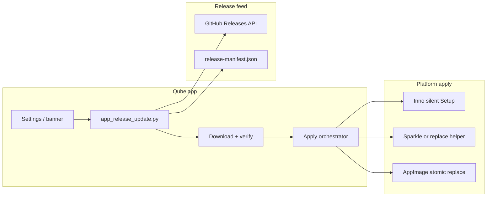

# App update roadmap

This document records what shipped for **cross-platform in-place updates** (Tiers 1–2, July 2026) and what remains for **automatic background updates** (Tier 3, deferred).

Related docs:

- [Update Qube (user guide)](user/update-qube.md)
- [Releasing Qube](releasing.md)
- In-app help: **Library → Qube → Update Qube**

Implementation PR: [cross-platform-app-updating → dev](https://github.com/dagaza/Qube/pull/50)

---

## Goals

| Goal | Status |
|------|--------|
| User can **upgrade in place** without losing models, Library, memory, or settings | **Done** (manual download + install) |
| User understands **how** to update on each platform | **Done** (docs + in-app help) |
| Release CI **verifies** Windows upgrade path | **Done** |
| App can **detect** a newer GitHub Release and link to the right asset | **Done** |
| App can **download and apply** updates without user fetching an installer | **Not started** (Tier 3) |

User data is always stored outside the application bundle:

| Platform | User data |
|----------|-----------|
| Windows | `%LOCALAPPDATA%\Qube\` |
| macOS / Linux | `~/.qube/` |

---

## Current state (Tiers 1–2 — shipped)

### Summary

Today, updating Qube is a **manual but supported** flow: download the new release artifact and install over the existing copy. The app can **check** GitHub Releases and open the correct download; it does **not** download or apply updates silently.

### Tier 1 — documentation, CI, Linux install cleanup

| Area | What shipped |
|------|----------------|
| **Windows** | Documented that re-running `Qube-<version>-Setup.exe` upgrades in place (Inno Setup stable `AppId`). Added CI upgrade smoke test. |
| **macOS** | Documented DMG drag-to-`/Applications` replace flow. |
| **Linux `.deb`** | Documented `sudo apt install ./qube_….deb` upgrade path. |
| **Linux AppImage** | `install_appimage.sh` removes stale AppImages when upgrading. |
| **Docs** | [docs/user/update-qube.md](user/update-qube.md), help workflow, release notes blurb. |
| **CI** | [scripts/release/smoke_upgrade.ps1](../scripts/release/smoke_upgrade.ps1) — install synthetic prior-version Setup, upgrade to release, verify registry version + launch. Wired in [.github/workflows/release.yml](../.github/workflows/release.yml). |

### Tier 2 — UX polish and in-app update check

| Area | What shipped |
|------|----------------|
| **In-app checker** | **Settings → About → Software updates → Check for updates**. Background worker hits GitHub Releases API, compares semver, opens platform asset or release page. |
| **Core logic** | [core/app_release_update.py](../core/app_release_update.py) — release fetch, asset selection, Linux variant detection. |
| **Worker** | [workers/app_update_check_worker.py](../workers/app_update_check_worker.py) |
| **UI handler** | [ui/views/settings/handlers/updates.py](../ui/views/settings/handlers/updates.py) |
| **Windows Inno** | [installer/qube.iss](../installer/qube.iss) — custom welcome text when upgrading (“Updating from X to Y… data kept”). |
| **Linux AppImage** | Stable install path `~/.local/opt/qube/Qube.AppImage`; all other `.AppImage` files in that folder removed on upgrade. |
| **Linux variant marker** | `.qube_linux_variant` (`cpu` / `vulkan` / `cuda`) written at package time ([scripts/render_linux_packages.py](../scripts/render_linux_packages.py)) so the checker picks the correct AppImage/`.deb`. |
| **Help corpus** | `workflows/update-qube.md`, canonical `@help` answer, `corpus_version` **1.0.23**. |
| **Tests** | [tests/test_app_release_update.py](../tests/test_app_release_update.py), extended AppImage/packaging tests. |

### Deferred from Tier 2

| Item | Why deferred |
|------|----------------|
| **macOS `.pkg` installer** | New packaging/signing/notarization path; DMG replace + in-app checker is sufficient for now. |

---

## Platform update flows today

### Windows

1. Download `Qube-<version>-Setup.exe` from [GitHub Releases](https://github.com/dagaza/Qube/releases), **or** use **Check for updates**, **or** `winget upgrade -e --id dagaza.Qube`.
2. Run Setup — detects existing install, closes Qube if running, replaces files under `%LOCALAPPDATA%\Programs\Qube\`.
3. User data in `%LOCALAPPDATA%\Qube\` is preserved.

### macOS

1. Download architecture-matching DMG (`arm64` or `x86_64`).
2. Drag `Qube.app` to `/Applications` and confirm **Replace**.
3. Optional: `brew upgrade --cask qube`.

### Linux

| Format | Update action |
|--------|----------------|
| **`.deb`** | `sudo apt install ./qube_<new>_amd64.deb` (or `qube-vulkan` / `qube-cuda`) |
| **AppImage + menu** | Re-run `scripts/linux/install_appimage.sh` with the new file → installs `~/.local/opt/qube/Qube.AppImage` |
| **Portable AppImage** | Run new file; delete old file manually |

Package managers (WinGet, Chocolatey, Homebrew) already handle upgrades for users who installed through those channels.

---

## Tier 3 — automatic updates (deferred)

Tier 3 means the user does **not** need to visit GitHub Releases or run an installer manually. The app (or OS integration) **downloads**, **verifies**, and **applies** updates—with clear consent, rollback options, and safe handling when Qube is running.

This is **weeks of work**, not days, and touches signing, legal/consent copy, and release infrastructure on all three platforms.

### Tier 3 outcomes (target)

- [ ] **Optional auto-check** on startup or on a schedule (user preference).
- [ ] **Download** update in the background with progress UI.
- [ ] **Signature verification** before apply (no unsigned payloads in production).
- [ ] **Apply** update with Qube quit/relaunch orchestration.
- [ ] **Rollback** path when apply fails (keep previous build or offer re-download).
- [ ] **Channel policy** — stable vs beta; respect GitHub pre-releases or a separate feed.
- [ ] **Delta updates** (optional, cost/benefit per platform).

### Cross-cutting requirements (all platforms)

| Requirement | Notes |
|-------------|--------|
| **Update manifest / feed** | Today: GitHub Releases API ad hoc. Tier 3 needs a stable schema (version, assets, checksums, min OS, release notes URL, criticality). Could extend [core/app_release_update.py](../core/app_release_update.py) or publish `manifest.json` per release. |
| **Code signing** | Windows Authenticode ([releasing.md](releasing.md)), macOS notarized Developer ID (already planned for cask). Auto-apply without signing will trigger SmartScreen / Gatekeeper friction. |
| **User consent** | Settings toggle: notify only / download automatically / download + install on quit. Default should remain conservative (notify + link). |
| **Running app** | Must quit Qube before replacing binaries (LLM worker, LanceDB, audio). Inno already uses `CloseApplications=yes`; Tier 3 needs the same guarantee programmatically. |
| **Telemetry / support** | Log update check result, download outcome, apply outcome (local diagnostics only — align with privacy stance). |
| **Offline & air-gapped** | Graceful failure; no blocking startup when GitHub unreachable. |
| **Fork / enterprise** | `GITHUB_REPO` constant today assumes `dagaza/Qube`; Tier 3 may need env or settings override. |

---

## Tier 3 options by platform

### Windows

| Approach | Pros | Cons | Effort |
|----------|------|------|--------|
| **Keep Inno + “download & launch Setup”** | Reuses current installer; minimal new code | Still two-step UX; UAC/elevation edge cases | Low |
| **WinSparkle** | Mature Sparkle port for Windows; DSA/ed25519 signatures | Another dependency; integrate with PyQt lifecycle | Medium |
| **Squirrel.Windows** | Delta updates, used by many Electron apps | Different install layout (`Update.exe`); migration from Inno per-user install | High |
| **Custom downloader + silent Inno** | Full control; matches existing `%LOCALAPPDATA%\Programs\Qube` | Must implement hash verify, retry, partial download, exit codes | Medium |

**Recommended path:** Custom downloader that verifies SHA256 (already published in release notes / WinGet manifests) and runs `Qube-<version>-Setup.exe /VERYSILENT` after quit—or WinSparkle if we want a maintained updater library.

**Depends on:** `ENABLE_CODE_SIGNING=true` for production trust.

### macOS

| Approach | Pros | Cons | Effort |
|----------|------|------|--------|
| **Sparkle 2** | Standard for non–App Store Mac apps; delta updates; ed25519 | Requires Sparkle framework in bundle or sidecar helper; PyInstaller integration work | Medium–High |
| **`.pkg` + `installer` CLI** | Apple-native; can quit app in preinstall | New release artifact; notarization; replaces DMG-first workflow | High |
| **DMG replace helper** | Matches today’s UX | Still manual mount/drag unless we build a helper app | Medium |

**Recommended path:** Sparkle 2 feeding the existing signed/notarized DMG URL + ed25519 signature in appcast.xml generated in CI.

**Depends on:** `ENABLE_MACOS_SIGNING=true` (required for Homebrew cask today).

### Linux

| Approach | Pros | Cons | Effort |
|----------|------|------|--------|
| **AppImageUpdate + zsync** | Delta updates for AppImage users | Requires `.zsync` sidecars; stable URL or redirect; variant-specific feeds | Medium |
| **`.deb` via PackageKit / apt** | True system integration | Polkit prompts; distro-specific; conflicts with direct `.deb` install docs | High |
| **Download new AppImage + replace** | Simple; aligns with `Qube.AppImage` path | Full download each time; user must restart | Low–Medium |

**Recommended path:** Phase 1 — download verified AppImage to temp, atomic replace `~/.local/opt/qube/Qube.AppImage`, prompt relaunch. Phase 2 — zsync deltas for bandwidth.

**Note:** Three variants (cpu / vulkan / cuda) mean **three update channels** or variant-aware manifest entries (marker file already exists).

---

## Proposed Tier 3 phases

### Phase 3a — Download helper (2–3 weeks)

- Extend [core/app_release_update.py](../core/app_release_update.py) with download + SHA256 verify (reuse release workflow hashes).
- Settings: “Download updates automatically” → store in `%LOCALAPPDATA%\Qube\updates\` or `~/.qube/updates/`.
- UI: progress in Settings → Help; “Install downloaded update” button that quits and spawns installer / replace script.
- **Windows:** silent Inno after quit.
- **Linux AppImage:** replace `Qube.AppImage`, chmod +x.
- **macOS:** open DMG or run scripted replace (interim until Sparkle).

**Exit criteria:** User can check → download → one click to apply without opening a browser.

### Phase 3b — Signatures & trust (1–2 weeks)

- Windows: require Authenticode on downloaded Setup before exec.
- macOS: Sparkle appcast with ed25519 signatures; staple/notarize DMG in CI.
- Publish checksums in a machine-readable `release-manifest.json` attached to each GitHub Release.

**Exit criteria:** No apply path for tampered payloads.

### Phase 3c — Background check & polish (1–2 weeks)

- Optional startup check (debounced, network-aware).
- “Update ready — restart to install” banner in main window.
- Skip version / remind later.
- CI: end-to-end test download + apply on Windows runner ( VM snapshot).

### Phase 3d — Delta & advanced (optional)

- AppImage zsync sidecars.
- Sparkle delta packages on macOS.
- Beta channel (`releases` vs `pre-releases` vs custom feed).

---

## Architecture sketch (Tier 3 target)

---

## Open decisions (before Tier 3 kickoff)

1. **Default policy** — Notify only vs download automatically vs install on quit?
2. **macOS strategy** — Sparkle vs pkg vs enhanced DMG helper?
3. **Linux primary artifact** — Optimize for AppImage, `.deb`, or both equally?
4. **Beta channel** — Needed for monetization / early access, or stable-only forever?
5. **Mandatory updates** — Only for critical security fixes, or never force?
6. **Enterprise** — Private release URL / offline bundle support?

---

## Maintenance checklist (Tiers 1–2)

When changing packaging or release assets, verify:

- [ ] [core/app_release_update.py](../core/app_release_update.py) `preferred_release_asset_names()` matches CI artifact names.
- [ ] [.github/workflows/release.yml](../.github/workflows/release.yml) upgrade smoke test still passes.
- [ ] [docs/user/update-qube.md](user/update-qube.md) and help workflow stay accurate.
- [ ] Linux builds still write `.qube_linux_variant` for non-cpu variants.
- [ ] `install_appimage.sh` target remains `Qube.AppImage` if desktop entry paths change.

---

## Revision history

| Date | Change |
|------|--------|
| 2026-07-27 | Initial roadmap: Tiers 1–2 shipped (PR #50); Tier 3 scoped and deferred. |
