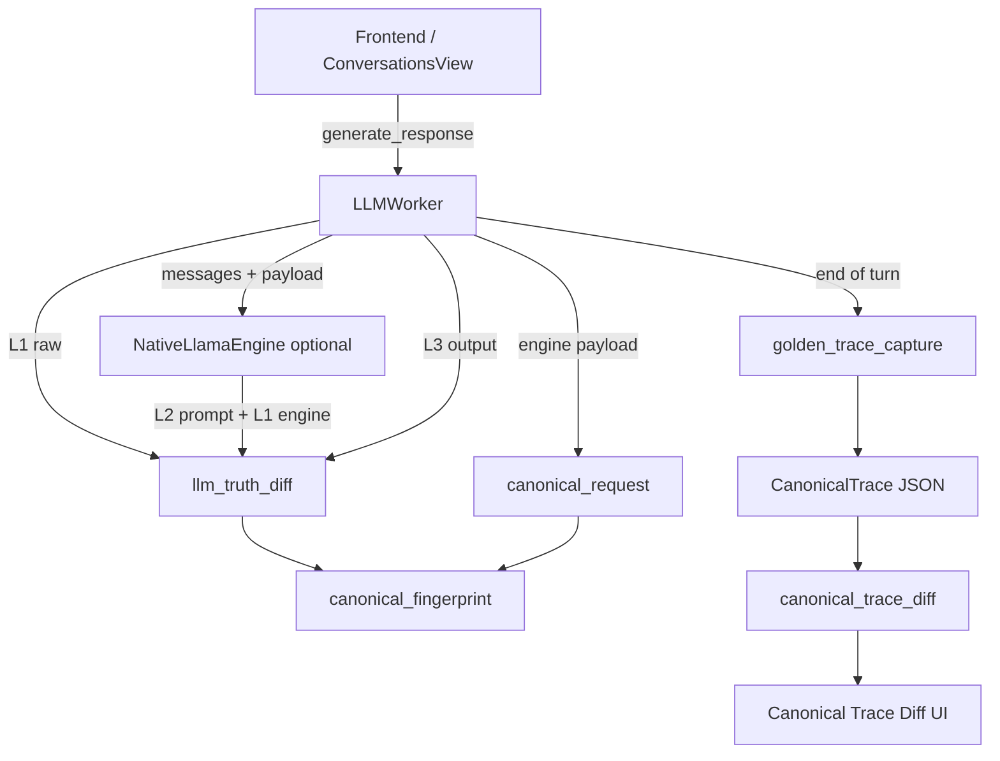

# Canonical LLM Trace Debugging

This guide describes Qube’s **provider-agnostic** LLM debugging stack. It is designed to answer one question with evidence:

> At which pipeline stage did baseline behavior diverge from what the app actually did?

The system does **not** assume LM Studio, OpenAI, or any specific model backend. Everything normalizes to **CanonicalRequest** and **CanonicalTrace** shapes before comparison or export.

---

## Quick start

| Goal | Enable | Where output goes |
|------|--------|-------------------|
| 3-layer request / prompt / I/O log | `ENABLE_LLM_TRUTH_DIFF_LOGGING=1` | `~/.qube/logs/llm_debug.log` |
| Canonical request JSON at engine boundary | `ENABLE_CANONICAL_TRACE_EXPORT=1` | `~/.qube/logs/llm_debug.log` |
| Save one golden baseline trace | `GOLDEN_TRACE_CAPTURE_MODE=1` | `debug/golden_traces/{timestamp}.json` |
| Visual diff UI | `python3 main.py --trace-diff-debug` | Detached debugger window |
| Qube vs LM Studio scenario compare | `python3 main.py --run-scenario test_scenarios/….json --trace-diff-debug` | Guided workflow + `debug/replay_traces/`, `debug/replay_diffs/` |

Set flags **before** launching Qube (shell export or early in `main.py`):

```bash
export ENABLE_LLM_TRUTH_DIFF_LOGGING=1
export ENABLE_CANONICAL_TRACE_EXPORT=1
export GOLDEN_TRACE_CAPTURE_MODE=1   # optional: first completed turn only
python3 main.py --trace-diff-debug   # optional: open diff UI at startup
```

All structured logs use logger **`Qube.NativeLLM.Debug`**, routed to **`~/.qube/logs/llm_debug.log`** (see [logging_and_diagnostics.md](logging_and_diagnostics.md)).

---

## Architecture overview



**Pipeline stages compared:**

1. **REQUEST** — what was sent toward inference (normalized `CanonicalRequest`)
2. **PROMPT** — final rendered prompt string (template, discourse, Harmony, etc.)
3. **OUTPUT** — raw model text vs filtered / presented assistant text

---

## Core modules

| Module | Purpose |
|--------|---------|
| `core/llm_truth_diff.py` | 3-layer structured JSON logging (`llm_truth_diff`) |
| `core/canonical_request.py` | Normalize internal payloads → `CanonicalRequest` |
| `core/canonical_request_adapters.py` | Optional serialization only (OpenAI-compat, LM Studio, vLLM shapes) |
| `core/canonical_fingerprint.py` | SHA-256 fingerprints for requests, prompts, outputs |
| `core/canonical_trace_diff.py` | Compare two `CanonicalTrace` objects (`find_first_divergence`) |
| `core/golden_trace_capture.py` | One-shot golden baseline capture to disk |
| `ui/canonical_trace_diff/` | Visual diff debugger (split panels, async diffs) |

---

## 1. LLM Truth Diff (3-layer logging)

**Flag:** `ENABLE_LLM_TRUTH_DIFF_LOGGING=1` (default **off**)

**Optional:** `LLM_TRUTH_DIFF_MAX_CHARS=20000` — truncates long text in logs (full content still fingerprinted).

**Class:** `LLMTruthDiffLogger` in `core/llm_truth_diff.py`

| Layer | Method | When (LLMWorker pipeline) | What is logged |
|-------|--------|----------------------------|----------------|
| **L1 raw** | `log_l1_raw_request` | `generate_response()` — before thread starts | Frontend payload: prompt, session, attachments |
| **L1 engine** | `log_l1_engine_request` | Right before backend call | HTTP JSON (external) or `create_completion` kwargs (native) |
| **L2 prompt** | `log_l2_prompt` | After prompt construction, before inference | Rendered prompt + template metadata |
| **L3 I/O** | `log_l3_model_io` | After inference completes | Raw output, stage snapshots, final presented text |

Each event is JSON under `"llm_truth_diff"` and includes:

- `timestamp`, `request_id` / `exchange_id`, `session_id`, `model_name`
- **`fingerprint`**: `{ "sha256", "short", "length" }`
- Layer-specific fields (truncated bodies when over max chars)

**View logs:**

```bash
python3 tools/view_llm_logs.py --filter llm_truth_diff --last 50
grep llm_truth_diff ~/.qube/logs/llm_debug.log
```

Logging is observer-only: failures are swallowed and never block inference.

---

## 2. Canonical request export

**Flag:** `ENABLE_CANONICAL_TRACE_EXPORT=1` (default **off**)

**Module:** `core/canonical_request.py`

Internal engine payloads (dicts with `messages`, `temperature`, `stop`, etc.) are normalized to:

```json
{
  "model": "string",
  "messages": [{"role": "system|user|assistant", "content": "..."}],
  "sampling": {
    "temperature": 0.7,
    "top_p": 0.9,
    "top_k": null,
    "repeat_penalty": null,
    "presence_penalty": null,
    "frequency_penalty": null
  },
  "stop": ["..."],
  "metadata": { "stream": true, "max_tokens": 512 }
}
```

Logs appear as `"canonical_request_trace"` in `llm_debug.log`.

**Adapters** (`core/canonical_request_adapters.py`) map `CanonicalRequest` → external HTTP body shapes for copy/export only. They do **not** change semantics:

- `OpenAICompatAdapter`
- `LMStudioAdapter` (adds optional `cache_prompt` passthrough from metadata)
- `VLLMAdapter` (adds optional `min_p`, etc. from metadata)

Example:

```python
from core.canonical_request import CanonicalRequestExporter
from core.canonical_request_adapters import OpenAICompatAdapter

internal = {"messages": [...], "temperature": 0.2, "stream": True}
canonical = CanonicalRequestExporter.export_canonical_request(internal)
body = OpenAICompatAdapter.serialize(canonical)
```

---

## 3. Canonical fingerprinting

**Module:** `core/canonical_fingerprint.py`

| Function | Input | Normalization |
|----------|-------|---------------|
| `fingerprint_canonical_request` | `CanonicalRequest` | Stable JSON (`sort_keys=True`) |
| `fingerprint_text` | `str` | LF line endings, strip trailing per-line whitespace |
| `fingerprint_trace_component` | `dict` or `str` | Dispatches to JSON or text rules |

Returns:

```json
{ "sha256": "…64 hex…", "short": "first 12 hex", "length": 1234 }
```

Fingerprints are attached to all Truth Diff layers and to golden traces.

---

## 4. Golden trace capture (regression baselines)

**Flag:** `GOLDEN_TRACE_CAPTURE_MODE=1` (default **off**)

**Module:** `core/golden_trace_capture.py`

On the **first completed chat turn** per process, writes one file:

```
debug/golden_traces/20260610T143022_123456Z.json
```

(under `~/.qube/logs/` via `core.paths.logs_dir()`)

**CanonicalTrace** on disk:

```json
{
  "request": { "...": "CanonicalRequest" },
  "prompt": "rendered prompt string",
  "output": "presented assistant text",
  "fingerprints": {
    "request": { "sha256": "...", "short": "...", "length": 0 },
    "prompt": { "...": "..." },
    "output": { "...": "..." }
  },
  "metadata": {
    "exchange_id": 1,
    "session_id": "...",
    "engine_mode": "internal",
    "execution_route": "RAG"
  }
}
```

**Load a baseline:**

```python
from core.golden_trace_capture import load_golden_trace

baseline = load_golden_trace("debug/golden_traces/your_file.json")
```

Only **one** capture runs per process even if the flag stays on.

---

## 5. Trace diff engine (programmatic)

**Module:** `core/canonical_trace_diff.py`

```python
from core.canonical_trace_diff import find_first_divergence, CanonicalTrace

report = find_first_divergence(baseline_trace, current_trace)
```

**Comparison order:**

1. **REQUEST** — canonical request fingerprint, message list, sampling fields  
2. **PROMPT** — exact string equality + normalized fingerprint  
3. **OUTPUT** — output string equality  

**Report shape:**

```python
{
  "request_match": bool,
  "prompt_match": bool,
  "output_match": bool,
  "first_divergence_level": "REQUEST" | "PROMPT" | "OUTPUT" | None,
  "diff_summary": str,
  "differences": [ { "level", "aspect", "summary", ... }, ... ]
}
```

Use this in tests or CI to detect prompt-construction drift, sampler changes, or template regressions without calling any external API.

---

## 6. Canonical Trace Diff UI

**Launch:**

```bash
python3 main.py --trace-diff-debug
```

Or from code:

```python
from ui.canonical_trace_diff import load_trace_pair, open_canonical_trace_diff_window

# Empty window — load JSON via toolbar
open_canonical_trace_diff_window()

# Or load traces directly
load_trace_pair(baseline=baseline_trace, current=current_trace)
```

### Layout

- **Summary header** — match flags + `first_divergence_level` + summary string  
- **Divergence rail** — vertical indicator for earliest mismatch (REQUEST / PROMPT / OUTPUT)  
- **Left panel** — Baseline (golden)  
- **Right panel** — Current execution  
- Each panel: collapsible **Request**, **Prompt**, **Output**, **Metadata**

### View modes

| Mode | Behavior |
|------|----------|
| **Diff View** (default) | Color-coded JSON trees; async word/sentence HTML diffs |
| **Normalized Canonical View** | Plain structured content |
| **Raw JSON** | Full trace JSON per side |

**Legend:** green = match · yellow = modified · red = missing · blue = extra

### Toolbar

- Load baseline / current JSON files  
- **Run comparison workflow…** / **Run single backend…** / **Compare sessions…** / **Load diff…** (scenario replay)  
- Copy baseline JSON, current JSON, diff report  
- Expand all / Collapse all  

See [Trace diff UI toolbar](#trace-diff-ui-toolbar) under scenario replay for button details.

Large prompts (up to ~50k chars) use async diff in a thread pool so the UI stays responsive.

---

## Typical workflows

### A. Debug a single turn in logs

1. Enable Truth Diff + optional canonical export:
   ```bash
   export ENABLE_LLM_TRUTH_DIFF_LOGGING=1
   export ENABLE_CANONICAL_TRACE_EXPORT=1
   ```
2. Send one chat message.  
3. Inspect:
   ```bash
   python3 tools/view_llm_logs.py --filter llm_truth_diff --last 20
   grep canonical_request_trace ~/.qube/logs/llm_debug.log
   ```
4. Follow `exchange_id` across L1 → L2 → L3 for the same turn.

### B. Capture a golden baseline

1. `export GOLDEN_TRACE_CAPTURE_MODE=1`  
2. Run one representative chat turn.  
3. Find `debug/golden_traces/*.json`.  
4. Commit the file (or store as test fixture) for regression.

### C. Compare golden vs new build

1. Run new build with same user prompt (or replay trace inputs).  
2. Build a current `CanonicalTrace` (from golden capture on new run, or assemble manually).  
3. Open UI:
   ```python
   from core.golden_trace_capture import load_golden_trace
   from ui.canonical_trace_diff import load_trace_pair

   load_trace_pair(
       baseline=load_golden_trace("debug/golden_traces/baseline.json"),
       current=load_golden_trace("debug/golden_traces/new_run.json"),
   )
   ```
4. Read **first_divergence_level** — REQUEST implicates routing/sampling/messages; PROMPT implicates template/discourse/rendering; OUTPUT implicates model or post-filters.

### D. Automated regression test

```python
from core.golden_trace_capture import load_golden_trace, build_golden_trace
from core.canonical_trace_diff import find_first_divergence

baseline = load_golden_trace("tests/fixtures/golden_chat_turn.json")
current = build_golden_trace(
    request=engine_payload,
    prompt=rendered_prompt,
    output=presented_text,
)
report = find_first_divergence(baseline, current)
assert report["first_divergence_level"] is None, report["diff_summary"]
```

### E. Compare Qube pipeline vs LM Studio (multi-turn scenario)

1. Launch guided workflow:
   ```bash
   python3 main.py --trace-diff-debug \
     --run-scenario test_scenarios/nepal_follow_up_chain.json
   ```
2. Load a model in Qube → click **Start Qube pathway test** when ready.
3. Eject model → start LM Studio with the same weights → click **Run external pathway test**.
4. Open `debug/replay_diffs/nepal_follow_up_chain.json` in the diff UI (**Load diff…**).
5. Use **First divergence** to jump to the earliest turn where REQUEST, PROMPT, or OUTPUT differed.

See [Scenario replay (guided Qube vs LM Studio comparison)](#scenario-replay-guided-qube-vs-lm-studio-comparison) for full detail.

---

## Environment variables reference

| Variable | Default | Effect |
|----------|---------|--------|
| `ENABLE_LLM_TRUTH_DIFF_LOGGING` | off | L1/L2/L3 `llm_truth_diff` JSON lines |
| `LLM_TRUTH_DIFF_MAX_CHARS` | `20000` | Truncate logged text fields |
| `ENABLE_CANONICAL_TRACE_EXPORT` | off | `canonical_request_trace` at engine boundary |
| `GOLDEN_TRACE_CAPTURE_MODE` | off | Write one golden trace JSON per process |

Existing Qube flags (`QUBE_LLM_DEBUG`, `QUBE_LOG_RAW_COMPLETION`, etc.) remain separate; see [logging_and_diagnostics.md](logging_and_diagnostics.md).

---

## CLI flags

| Flag | Effect |
|------|--------|
| `--trace-diff-debug` | Open Canonical Trace Diff window at startup |
| `--run-scenario PATH` | After startup, open the **guided comparison workflow** for a `test_scenarios/` JSON file |
| `--scenario-single-phase` | With `--run-scenario`, run **Phase 1 (Qube pathway) only** — still requires a loaded model |
| `--scenario-backend qube\|external` | Legacy hint; the guided workflow handles both phases. External-only capture is via CLI (below). |
| `--compare-sessions A B` | Offline diff of two saved session JSON files (opens diff in UI at startup) |
| `--routing-debug` | Routing debug tool (unrelated; see logging doc) |

---

## Scenario replay (guided Qube vs LM Studio comparison)

This workflow compares the **same conversation script** on two independent execution paths:

| Path | What it exercises | How it runs |
|------|-------------------|---------------|
| **Qube pathway** | Full Qube pipeline (Harmony, stops, discourse, native engine) | Inside the running Qube app |
| **External pathway** | Raw OpenAI-compatible HTTP to LM Studio (no Qube pipeline) | Detached background CLI process |

Backends run **serially** — only one loaded model at a time. Session traces are saved separately, then compared offline.

### Quick start (recommended)

```bash
python3 main.py --trace-diff-debug \
  --run-scenario test_scenarios/nepal_follow_up_chain.json
```

That command **starts Qube** and opens the guided workflow. You do not need a separate “open Qube first” step.

### Phase 1 — Qube pathway

After Qube starts (~2 seconds), a **non-blocking workflow panel** opens. It does **not** block the main window — you can use Qube normally.

1. **Load a model** in the toolbar (Internal Engine + GGUF).
2. Wait until the panel shows **“Model ready”** and enables **Start Qube pathway test**.
3. **Click the button** — the test does **not** start automatically when the model loads; you always confirm.
4. Qube replays every user turn in the scenario through its full pipeline.
5. Session saved to: `debug/replay_traces/{scenario_id}_qube.json`

**Panel controls:**

- **Hide for now** — minimizes the panel without cancelling. It reopens when the model becomes ready, or via **Run comparison workflow…** in the trace diff UI.
- Closing the panel with ✕ during Phase 1 behaves like hide (workflow continues).

**Qube-only run** (skip Phase 2):

```bash
python3 main.py --run-scenario test_scenarios/nepal_follow_up_chain.json \
  --scenario-single-phase
```

### Phase 2 — External pathway

After Phase 1 completes, the panel advances to **Run external pathway test**.

**You do not need to change Qube’s AI Engine setting to External Server.** Phase 2 launches a **separate background process** that talks **directly to LM Studio’s HTTP API** (`http://localhost:1234/v1/chat/completions` by default). It bypasses Qube’s LLM worker entirely.

**Recommended steps:**

1. **Eject the model** in Qube (toolbar eject) to free VRAM for LM Studio.
   - Fully quitting Qube is optional; eject is usually enough.
   - Keeping Qube open is fine — the external runner is independent of Qube’s engine mode.
2. Start **LM Studio** and load the **same model**.
   - The runner sends a model name derived from your GGUF filename (e.g. `gpt-oss-20b-Q5_K_M`). LM Studio must expose a matching model id — adjust the scenario JSON `"model"` field if needed.
3. Click **Run external pathway test** in the workflow panel.

The background runner:

- Waits up to **15 minutes** for LM Studio’s `/v1/models` endpoint (via `--wait-for-api`)
- Replays the scenario on the external HTTP path
- Saves `debug/replay_traces/{scenario_id}_external.json`
- Auto-compares against the Qube session and writes `debug/replay_diffs/{scenario_id}.json`

You can click the button **before** LM Studio is ready — the runner polls until the API responds.

**Equivalent manual CLI** (if not using the workflow button):

```bash
python3 -m tools.run_scenario_replay \
  --scenario test_scenarios/nepal_follow_up_chain.json \
  --backend external \
  --wait-for-api 900 \
  --compare-with debug/replay_traces/nepal_follow_up_chain_qube.json \
  --model gpt-oss-20b
```

### Phase 3 — View the diff

After the external runner finishes:

- Open **Load diff…** in the trace diff UI and select `debug/replay_diffs/{scenario_id}.json`, or
- Relaunch with offline compare:

  ```bash
  python3 main.py --trace-diff-debug \
    --compare-sessions \
      debug/replay_traces/nepal_follow_up_chain_qube.json \
      debug/replay_traces/nepal_follow_up_chain_external.json
  ```

Use **First divergence** and the turn selector to inspect where REQUEST, PROMPT, or OUTPUT diverged per turn.

### Trace diff UI toolbar

| Button | Purpose |
|--------|---------|
| **Run comparison workflow…** | Full guided Phase 1 + Phase 2 (pick scenario JSON) |
| **Run single backend…** | Advanced: one backend only (Qube or External via dropdown) |
| **Compare sessions…** | Offline diff of two saved session files |
| **Load diff…** | Open an existing `debug/replay_diffs/*.json` artifact |

### Scenario JSON format (`test_scenarios/`)

Use **user-only** message lists for follow-up chains:

```json
{
  "name": "Nepal follow-up chain",
  "messages": [
    { "role": "user", "content": "What is the capital of Nepal?" },
    { "role": "user", "content": "And how about its population?" }
  ]
}
```

During replay, each turn’s history is built from **prior generated assistant outputs** — the same way production chat accumulates in SQLite. Static `assistant` lines in the JSON are **ignored** (they do not pollute the context window with extra system content; only the rendered Harmony prompt carries Qube’s system suffix once per turn).

**Do not** stack consecutive user turns without replay injection — that was a replay bug, not normal chat behavior. Injecting real assistant replies matches what the model sees in the app and is the correct stress test for follow-up collapse.

The Nepal fixture now has **9 user turns** about Kathmandu (capital → population → minorities → area → climate → languages → elevation → tourism → UNESCO).

### Session file format

`debug/replay_traces/{scenario_id}_{backend}.json` — schema `qube.scenario_session.v1`

Key fields:

| Field | Meaning |
|-------|---------|
| `backend` | Replay label: `qube` or `external` |
| `execution_path` | **How the run actually executed** (see below) |
| `traces[]` | Per-turn captures with prompt, output, and nested `CanonicalTrace` |

**`execution_path` values** (explicit inference route; distinct from the `backend` label):

| Value | Meaning |
|-------|---------|
| `qube_native` | Full Qube pipeline via internal/native engine |
| `qube_external_http` | Full Qube pipeline, but worker `engine_mode == external` |
| `external_http` | Direct HTTP to LM Studio (scenario replay CLI / Phase 2) |
| `qube_pipeline` | Qube backend when sub-path could not be determined |

The embedded `scenario` snapshot inside a session file may still list template defaults (e.g. `external_api_url`) from the JSON fixture — check top-level `execution_path` and `backend` for what actually ran.

Each turn in `traces[]` also carries its own `execution_path`.

### Diff file format

`debug/replay_diffs/{scenario_id}.json` — schema `qube.scenario_diff.v1` (includes per-turn `find_first_divergence` results)

### CLI reference (`tools/run_scenario_replay.py`)

| Flag | Purpose |
|------|---------|
| `--backend external` | External HTTP path only (Qube backend requires the running app) |
| `--wait-for-api SECONDS` | Poll LM Studio until `/v1/models` responds (0 = no wait) |
| `--compare-with QUBE_SESSION` | After external replay, diff against a saved Qube session |
| `--model NAME` | Model id sent to LM Studio |
| `--api-url URL` | Override chat-completions URL (default: scenario or `localhost:1234`) |
| `--compare A B` | Offline compare only (no model required) |
| `--list` | List scenario files under `test_scenarios/` |

---

## Scenario replay (legacy manual workflow)

If you prefer fully manual steps without the guided panel:

1. **Run Qube** with `--run-scenario … --scenario-single-phase`, load a model, click **Start Qube pathway test**.
2. **Eject model**, start LM Studio, run external capture via CLI (above).
3. **Compare offline** with `--compare-sessions` or **Compare sessions…** in the UI.

---

## Integration points (code)

| Location | Role |
|----------|------|
| `workers/llm_worker.py` | Truth diff L1 raw/L3; canonical export; golden capture; stores engine request + prompt per turn |
| `workers/native_llama_engine.py` | L2 + L1 engine via worker hooks (`emit_l2_prompt`, `emit_l1_engine_request`) |
| `core/llm_truth_diff.py` | Worker hook bridge for native-thread logging |

---

## What this system is for

Use it when investigating:

- **Prompt construction bugs** — discourse injection, retrieval blocks, layout modes  
- **Template / contract drift** — Harmony vs chat templates, `prompt_contract_mode` changes  
- **Sampler mismatches** — temperature, stops, penalties differ from baseline  
- **Filter pipeline changes** — L3 stage list shows harmony parser vs worker filters vs UI text  
- **Cross-build regressions** — golden trace + `find_first_divergence` without re-running external tools  

It is **not** a generic text diff tool; comparisons are always scoped to REQUEST → PROMPT → OUTPUT semantics of an LLM turn.

---

## Related files

```
core/llm_truth_diff.py
core/canonical_request.py
core/canonical_request_adapters.py
core/canonical_fingerprint.py
core/canonical_trace_diff.py
core/golden_trace_capture.py
core/conversation_replay.py
core/scenario_loader.py
core/scenario_workflow.py
test_scenarios/
tools/run_scenario_replay.py
tools/compare_scenario_sessions.py
debug/replay_traces/            # per-backend session captures
debug/replay_diffs/             # offline comparison artifacts
ui/canonical_trace_diff/
ui/canonical_trace_diff/scenario_workflow_dialog.py
debug/golden_traces/          # created at runtime when capture enabled
~/.qube/logs/llm_debug.log            # structured JSON logs
tests/test_llm_truth_diff.py
tests/test_canonical_request.py
tests/test_canonical_fingerprint.py
tests/test_canonical_trace_diff.py
tests/test_golden_trace_capture.py
tests/test_canonical_trace_diff_ui_compute.py
```
