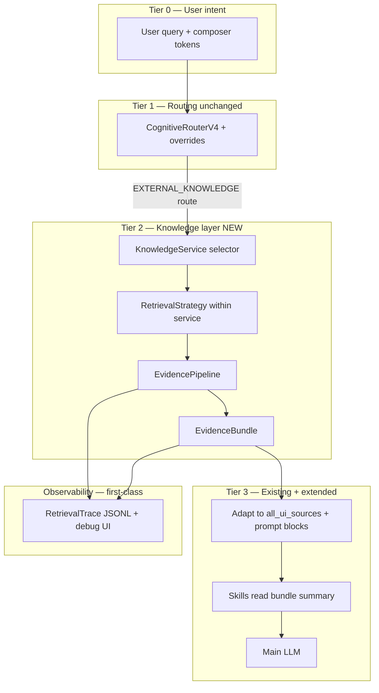
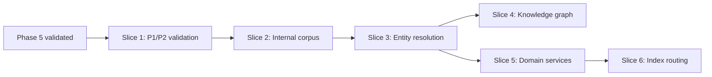
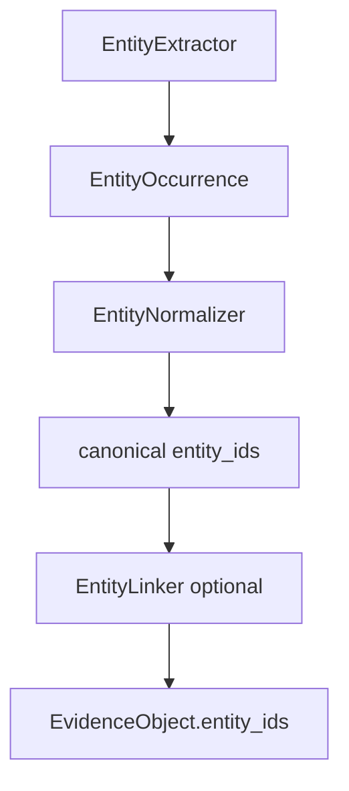
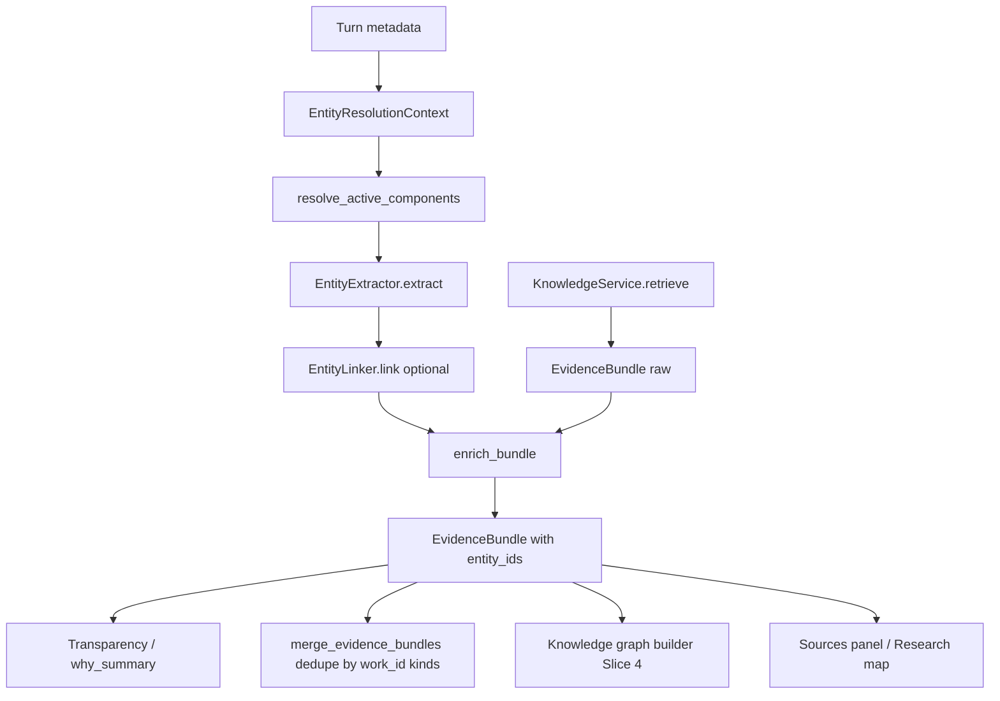

# External Knowledge Platform — Design & Implementation Plan

**Status:** Phases 0–4 validated; Phase 5 complete; **Phase 6 Slices 2–5b implemented** — internal corpus, entities, research map, `@finance`/SEC EDGAR, `@legal`/CourtListener, user-configurable source preferences  
**Date:** 2026-06-25 (updated 2026-06-26)  
**Related:** [ADR 001 — Skills orthogonal to routing](./adr/001-skills-orthogonal-to-routing.md), [§21 — ADR 002 Compositional entity resolution](#21-adr-002-compositional-entity-resolution-registry), [§21 — Future evolution: EntityOccurrence](#future-evolution-planned--not-implemented), [Manual QA Phase 6](./manual_qa_phase6.md), [Cognitive router](./cognitive_router.md), [Sidecar tasks](./sidecar_tasks.md), [Logging & diagnostics](./logging_and_diagnostics.md)

This document is the **source of truth** for Qube’s external-knowledge architecture: trusted retrieval, scientific evidence, Knowledge Services, EvidenceBundles, and the phased rollout. It merges internal codebase analysis with external architecture review feedback.

Use this plan when implementing retrieval profiles, composer tools, observability, and Deep Research — without re-litigating routing vs skills boundaries.

---

## 0. Executive summary

Qube today routes live lookups through a **WEB** lane that calls DuckDuckGo HTML search, keeps ~3 SERP snippets, applies a lexical/embedding relevance gate, and injects them into the prompt. There is **no page fetch**, **no authority reranking**, **no unified evidence model**, and **`target_site`** in `mcp/internet_tool.py` is **not wired** into `LLMWorker`.

This plan upgrades that path into a **knowledge substrate**:

1. **Knowledge Services** own adapters, policies, ranking, caching, and bundle assembly.
2. **EvidenceBundle** is the primary contract between retrieval and reasoning.
3. **Skills** consume bundle *summaries* only (ADR 001 preserved).
4. **Observability** treats retrieval as a first-class trace, not an afterthought audit log.

**Core principle:** Optimize for **evidence quality**, not retrieval sophistication.

---

## 1. Design principles

1. **Evidence quality over adapter count.** Search providers are interchangeable; the EvidenceBundle is the stable contract.
2. **Routing decides *whether* to retrieve; Knowledge Services decide *how*.** Skills decide *how to reason* given a bundle.
3. **One foreground retrieval invocation** may run many adapters internally (parallel, budgeted) — respects Qube’s single-tool-per-turn rule.
4. **Backward compatibility first.** Adapt bundles to today’s `all_ui_sources` until citation UI evolves.
5. **Deterministic signals before LLM prose.** Confidence, coverage, conflicts, and warnings are computed by the pipeline, not invented by the model.
6. **Skills never retrieve.** They may inspect `EvidenceBundleSummary` metadata (coverage, conflicts) without calling adapters.

---

## 2. Current state (codebase baseline)

| Component | Location | Today |
|-----------|----------|-------|
| Web search | `mcp/internet_tool.py` | DuckDuckGo HTML → `{title, snippet, url?}` |
| Turn integration | `workers/llm_worker.py` (~2895–3026) | `search_internet(web_query)` → `filter_web_results` → `all_ui_sources` |
| Relevance gate | `core/retrieval_relevance.py` | Token overlap + optional embedding; binary keep/drop |
| Web audit | `core/web_search_audit.py` | JSONL; `AUDIT_NOTE = "SERP snippets only; result pages are not fetched."` |
| Composer tools | `core/composer_attachments.py` | `@internet`, `@library`, `@memory` |
| Skills | `core/skills/` | Post-route prompt scaffolding only ([ADR 001](./adr/001-skills-orthogonal-to-routing.md)) |
| Memory/RAG ranking | `core/memory_retrieval_policy.py`, `core/dual_query_retrieval.py` | MMR, RRF fusion — **more mature than web** |

**Gap:** Web is the weak link. Memory/RAG already have ranking patterns to reuse.

---

## 3. Target architecture



### 3.1 Layer responsibilities

| Layer | Owns | Does NOT own |
|-------|------|--------------|
| **Cognitive router** | Lane: CHAT / MEMORY / RAG / EXTERNAL_KNOWLEDGE / HYBRID | Source selection, ranking |
| **Knowledge Service** | Adapters, policies, caching, bundle assembly | Prompt wording |
| **Retrieval Strategy** | Query plan, adapter order, stop conditions | LLM calls |
| **Evidence Pipeline** | Fetch, extract, normalize, rank, conflict detect | Route overrides |
| **EvidenceBundle** | Quality signals + sources + warnings | Tool routing |
| **Skills** | Reasoning scaffolding from bundle summary | Retrieval |
| **Observability** | Full retrieval trace for eval/debug/transparency | Route decisions |

### 3.2 ADR 001 conflict hierarchy (unchanged)

When subsystems disagree:

1. Composer / explicit user commands (`@internet`, `@trusted`, `@evidence`, …)
2. Capability vetoes (internet disabled, empty-results policies)
3. Discourse safety rules
4. `CognitiveRouterV4` + web intent rules
5. Post-retrieval downgrade (empty bundle → NONE for prompt build)
6. Skills (prompt shaping only)
7. Sidecar (assistive; telemetry at most)

---

## 4. Terminology migration

**Conceptually:** “External Knowledge” (not “web search” as the product abstraction).  
**Implementation (Phase 0–2):** Keep `WEB`, `search_internet`, `web_capability_blocked` as aliases — no big-bang rename.

| Today | Future concept | Migration |
|-------|----------------|-----------|
| `WEB` route | `EXTERNAL_KNOWLEDGE` | Alias in `execution_route` normalization; telemetry may still say `web` |
| `@internet` | General web | Keep `internet` id; label → “General web” |
| `mcp/internet_tool.py` | Legacy DDG adapter | Wrap in `GeneralWebKnowledgeService` |
| `core/web_search_audit.py` | Retrieval observability | Extend schema v2; keep logger compatibility |

New code lives under `core/knowledge/` and bridges old names.

---

## 5. Core data model

### 5.1 EvidenceObject (atomic unit)

```python
@dataclass(frozen=True)
class EvidenceObject:
    id: str                          # stable within bundle, e.g. "ek_1"
    source_id: str                   # adapter + external key, e.g. "pubmed:41234567"
    adapter: str                     # "wikipedia_api", "pubmed", "duckduckgo", ...
    retrieval_method: str            # "api", "serp", "fetch"

    # Content
    title: str
    excerpt: str                     # snippet, abstract, or wiki lead
    full_text: str | None            # after selective fetch
    url: str | None

    # Metadata (adapter-populated)
    document_type: str               # "encyclopedia", "journal_abstract", "preprint", ...
    publication_date: str | None     # ISO date
    venue: str | None
    authors: tuple[str, ...]
    doi: str | None
    peer_reviewed: bool | None
    preprint: bool | None
    open_access: bool | None
    retracted: bool | None

    # Scores (pipeline-computed)
    relevance_score: float           # 0–1 semantic + lexical
    authority_score: float           # 0–1 domain/source tier
    reliability_score: float         # 0–1 agreement + recency + type
    freshness_score: float | None

    # Provenance
    retrieved_at: float              # epoch
    fetch_status: str                # "snippet_only" | "abstract" | "full_extract"
    raw_metadata: dict[str, Any]     # adapter-specific, audit only
```

### 5.2 EvidenceBundle (primary contract)

The bundle — not individual objects — answers: *“Is this enough evidence?”*

```python
@dataclass(frozen=True)
class EvidenceConflict:
    topic: str
    positions: tuple[tuple[str, str], ...]  # (evidence_id, stance_summary)
    severity: str                            # "minor" | "material"

@dataclass(frozen=True)
class EvidenceBundle:
    bundle_id: str
    query_raw: str
    query_resolved: str
    knowledge_service: str           # "trusted", "scientific", "general_web"
    retrieval_strategy: str
    profile_version: str

    retrieved_at: float
    latency_ms: float

    # System-computed quality (NOT LLM-generated)
    confidence: float                # 0–1 overall trust in assembled evidence
    coverage: str                    # "excellent" | "adequate" | "poor" | "none"
    coverage_rationale: str

    authority_summary: float
    reliability_summary: float
    diversity_summary: float

    sources: tuple[EvidenceObject, ...]
    rejected_count: int
    warnings: tuple[str, ...]        # "abstract_only", "single_source", ...
    conflicts: tuple[EvidenceConflict, ...]

    stop_reason: str                 # "sufficient_evidence" | "budget_exhausted" | ...
    adapter_calls: tuple[str, ...]

    def summary_for_skills(self) -> EvidenceBundleSummary: ...
    def to_ui_sources(self) -> list[dict]: ...
    def to_prompt_context(self, *, char_budget: int) -> str: ...
```

### 5.3 EvidenceBundleSummary (skills-safe view)

Skills must not import adapters. Extend `SkillContext` additively:

```python
@dataclass(frozen=True)
class EvidenceBundleSummary:
    present: bool
    knowledge_service: str | None
    source_count: int
    confidence: float | None
    coverage: str | None              # "excellent" | "adequate" | "poor" | "none"
    has_conflicts: bool
    warnings: tuple[str, ...]
    source_types: tuple[str, ...]
    fetch_depth: str                  # "snippet_only" | "abstract" | "mixed"
```

Example: `scientific_research` skill increases caution when `coverage == "poor"` without calling PubMed.

---

## 6. Knowledge Services layer

### 6.1 Protocol

```python
class KnowledgeService(Protocol):
    id: str
    name: str
    description: str
    version: str

    def select_strategy(self, ctx: RetrievalContext) -> RetrievalStrategy: ...
    def default_budget(self) -> RetrievalBudget: ...
    def authority_policy(self) -> AuthorityPolicy: ...
    def freshness_policy(self) -> FreshnessPolicy: ...
    def cache_policy(self) -> CachePolicy | None: ...
```

A Knowledge Service owns: adapters, ranking, freshness, authority policy, metadata extraction, citation formatting, caching, and confidence/coverage computation. A **profile** (composer token or setting) selects a service.

### 6.2 v1 services

| Service ID | User label | Composer token | Default strategy |
|------------|------------|----------------|------------------|
| `general_web` | General web | `@[tool:internet]` (existing) | DDG SERP → optional fetch top-1 |
| `trusted_knowledge` | Trusted knowledge | `@[tool:trusted]` | Wikipedia API → gov/edu allowlist → constrained DDG |
| `scientific_evidence` | Scientific literature | `@[tool:evidence]`, `@[tool:science]` | PubMed (medical queries) + OpenAlex + arXiv |
| `wikipedia` | Wikipedia (advanced) | `@[tool:wikipedia]` | MediaWiki API only |
| `pubmed` / `arxiv` | (advanced) | `@[tool:pubmed]`, `@[tool:arxiv]` | Single-adapter deep query |

### 6.3 Composer UX hierarchy

**Primary (recommended):** Trusted knowledge, Scientific evidence, General web  
**Advanced (power users):** Wikipedia, PubMed, arXiv

Palette groups in `core/composer_attachments.py` and mention popup.

**Composer tokens:** `@evidence` and `@science` (advanced alias) both route to `scientific_evidence`. User-facing label: **Scientific literature** (not to be confused with the platform `EvidenceBundle` contract — see §6.5).

### 6.5 Evidence vs Knowledge Services vs Discipline Packs

Three concepts must stay distinct as the platform grows:

| Layer | What it is | Examples |
|-------|------------|----------|
| **Evidence** | Universal retrieval output substrate — not a domain | `EvidenceObject`, `EvidenceBundle`, Sources dialog, citations, coverage/confidence |
| **Knowledge Service** | Domain-specific retrieval orchestrator | `scientific_evidence`, `finance_knowledge`, `trusted_knowledge`, `internal_corpus` |
| **Discipline pack** | Sub-domain components *within* a service (especially scientific) | `biomedical` entity pack + PubMed adapter; future economics, CS, psychology packs |

**Evidence is produced by every Knowledge Service.** Finance filings, legal opinions, library chunks, and scholarly abstracts all become `EvidenceBundle` instances with the same contract.

**Composer tokens are domain routers**, not names for the Evidence model:

- `@evidence` / `@science` → `scientific_evidence` (scholarly literature across all disciplines)
- `@finance` → `finance_knowledge` (SEC EDGAR, etc.)
- `@legal` → `legal_knowledge` (CourtListener, etc.)
- `@trusted` → `trusted_knowledge`

Medicine is **one scientific discipline**, not synonymous with “scientific.” Economics, psychology, and political science are scientific disciplines that should eventually live as **discipline packs inside `scientific_evidence`**, not as separate top-level Knowledge Services. Finance and legal are **not** scientific disciplines — they remain separate services.

**Retrieval planner (Stage 1 today):** conversational → keyword query; medical entity keyword extraction when the biomedical activator matches. PubMed is called only for medically-scoped queries; OpenAlex + arXiv are the default for other scholarly queries.

**Retrieval planner (Stage 2 — Slice 6a implemented):** heuristic discipline detection → catalog UI-group adapter order (CS → arXiv/OpenAlex; economics → OpenAlex; biomedical → PubMed gating). Discipline entity packs and RePEc/SSRN/DBLP adapters remain Slice 6b+.

**User-configurable adapters:** Implemented via Settings → Knowledge → **Preferred sources**. Preferences are stored in `qube.knowledge.source_preferences` and resolved at retrieval time through `core/knowledge/source_preferences.py` and `core/knowledge/adapters/catalog.py`. Composer overrides (`@pubmed`, `@arxiv`) still take precedence for a single turn.

### 6.4 Proposed module layout

```
core/knowledge/
  __init__.py
  types.py              # EvidenceObject, EvidenceBundle, budgets, policies
  registry.py           # service id → KnowledgeService
  context.py            # RetrievalContext
  pipeline.py           # EvidencePipeline orchestrator
  bundle_builder.py     # confidence, coverage, conflicts, diversity
  ui_adapter.py         # EvidenceBundle → all_ui_sources
  observability.py      # RetrievalTrace, JSONL emitters
  services/
    general_web.py
    trusted_knowledge.py
    scientific_evidence.py
  adapters/
    duckduckgo.py       # wraps mcp/internet_tool.py
    wikipedia_api.py
    pubmed_eutils.py
    openalex.py
    arxiv_api.py
  ranking/
    authority.py
    reliability.py
    diversity.py
    stopping.py
  conflicts/
    detect.py
```

---

## 7. Evidence pipeline

```
RetrievalContext
    ↓
Strategy.plan_queries()
    ↓
Adapters.collect_candidates()     # parallel, per-adapter timeout
    ↓
Normalize → EvidenceObject[]
    ↓
Dedupe (URL, DOI, title fuzzy)
    ↓
Score: relevance + authority + reliability + freshness
    ↓
Diversity rerank (explicit objective)
    ↓
Selective fetch (top-K by service policy)
    ↓
Re-score post-fetch
    ↓
Conflict detection (if ≥2 sources)
    ↓
Stopping: sufficient evidence? else budget stop
    ↓
Assemble EvidenceBundle
    ↓
Observability trace emit
```

### 7.1 Authority vs reliability (separate signals)

| Signal | Meaning | Examples |
|--------|---------|----------|
| **Authority** | Source reputation / tier | WHO, Nature, PubMed index |
| **Reliability** | Whether evidence supports a stable answer | Multi-source agreement, recency, preprint status |

High-authority sources can still disagree. The pipeline computes both.

### 7.2 Coverage (distinct from confidence)

| Question type | High confidence + poor coverage example |
|---------------|----------------------------------------|
| Ozempic side effects | Many PubMed/FDA hits → excellent coverage |
| Easter Island collapse | One anthropology paper → moderate confidence, **poor coverage** |

Heuristic v1 factors: source count, authority tier diversity, snippet-only vs abstract, single-source penalty, controversial-topic sparsity, unresolved conflicts.

Output: `coverage` enum + `coverage_rationale` for UI and skills.

### 7.3 Diversity (explicit optimization)

Optimize weighted combination of:

- **Source diversity** — distinct domains/adapters
- **Publication diversity** — avoid 5× same journal
- **Information diversity** — embedding distance between excerpts (reuse MMR patterns from `core/memory_retrieval_policy.py`)
- **Time diversity** — recent + seminal for fast-moving topics

Target bundle example (better than 5× PubMed):

```
PubMed | WHO | Nature Review | CDC | Wikipedia (background)
```

### 7.4 Adaptive stopping (not fixed N)

Stop when:

- `confidence ≥ threshold` **and** `coverage ≥ required`, **or**
- One high-authority meta-analysis / systematic review (scientific service), **or**
- Budget exhausted → bundle with explicit warnings

```python
class StoppingPolicy:
    min_confidence: float
    min_coverage: str
    max_adapter_calls: int
    max_fetch_bytes: int
    max_latency_ms: int
```

**Foreground budget (initial):** ~2–4s, ~3 adapters, ~2 fetches.  
**Deep Research budget:** 60–300s, iterative, same pipeline.

### 7.5 Conflict detection (v1 — deterministic)

In `core/knowledge/conflicts/detect.py`:

1. Extract stance phrases from excerpts (effective / no benefit / mixed / unknown) via keywords + embedding clustering.
2. If ≥2 material clusters → `EvidenceConflict`.
3. Inject into bundle warnings; `scientific_research` skill adds “present both sides” guidance.

Optional later: sidecar assist (fail-closed, telemetry only).

---

## 8. Integration with existing Qube code

### 8.1 LLMWorker hook

Replace inline web block in `workers/llm_worker.py`:

**Before:**

```python
web_results = search_internet(web_query)
# filter_web_results → format_web_snippets → all_ui_sources
```

**After:**

```python
bundle = retrieve_external_knowledge(
    RetrievalContext(
        query=web_query,
        semantic_query=web_semantic,
        service_id=resolve_knowledge_service(composer_attachments, settings),
        query_vector=web_query_vector,
        embed_fn=self.embedding_cache.get_embedding,
    )
)
all_ui_sources.extend(bundle.to_ui_sources())
tool_context += bundle.to_prompt_context(char_budget=self.RAG_BUDGET)
evidence_summary = bundle.summary_for_skills()
```

**Service resolution precedence:**

1. Composer `@[tool:trusted|evidence|wikipedia|pubmed|arxiv|internet]`
2. Settings default external-knowledge service
3. Router EXTERNAL_KNOWLEDGE → `general_web`

### 8.2 Composer tools

Extend `COMPOSER_TOOLS` in `core/composer_attachments.py`:

```python
{"id": "internet", "label": "General web", ...},
{"id": "trusted", "label": "Trusted knowledge", ...},
{"id": "evidence", "label": "Scientific evidence", ...},
{"id": "wikipedia", "label": "Wikipedia", "advanced": True},
{"id": "pubmed", "label": "PubMed", "advanced": True},
{"id": "arxiv", "label": "arXiv", "advanced": True},
```

### 8.3 SkillContext extension

Add to `core/skills/types.py`:

```python
evidence_summary: EvidenceBundleSummary | None = None
```

Update `core/skills/context.py` → `build_skill_context()`.

New skill: `core/skills/builtin/scientific_research.py`.

**Guardrail:** `core/skills/` must not import `core/knowledge/adapters` or `cognitive_router` (existing tests).

### 8.4 UI source contract (backward compatible)

`EvidenceBundle.to_ui_sources()` must produce today’s shape:

```python
{
    "id": 1,
    "filename": title,
    "content": excerpt,
    "type": "web",
    "url": url,
    # additive (UI ignores until upgraded):
    "evidence_id": "ek_1",
    "source_adapter": "pubmed",
    "document_type": "journal_abstract",
    "doi": "...",
}
```

RAG contract in `mcp/rag_tool.py` remains unchanged.

### 8.5 Post-retrieval downgrade

If `len(bundle.sources) == 0` → downgrade `execution_route` to `NONE` before prompt build (existing §2.75 behavior). Prevents hallucinated `[W]` citations.

### 8.6 Prompt injection structure

```
--- EXTERNAL KNOWLEDGE (trusted_knowledge) ---
Coverage: adequate | Confidence: 0.78
Warnings: abstract_only_for_2_of_3_sources
Conflicts: none

[ek_1] Wikipedia — "Ozempic"
…excerpt…
Metadata: encyclopedia, updated 2024-03

[ek_2] FDA — "Ozempic labeling"
…excerpt…
Metadata: government, 2023-11
```

### 8.7 Citation tokens (phased)

| Phase | Token | Meaning |
|-------|-------|---------|
| 0–1 | `[W]` / `[1]` | Existing web/RAG numbering |
| 2 | `[ek_1]` internal → `[1]` UI | Stable bundle ids in trace |
| 3 | Typed badges | PubMed, Wiki, FDA in source panel |

Extend `core/citation_normalize.py` additively.

---

## 9. Observability (first-class)

Elevate `core/web_search_audit.py` → `core/knowledge/observability.py`.

**RetrievalTrace** (one JSONL event per retrieval):

```
query_raw, query_resolved, knowledge_service, strategy,
adapter_calls[], candidates_raw, candidates_rejected[],
evidence_ids_kept[], scores{}, diversity{}, conflicts[],
confidence, coverage, stop_reason, latency_ms,
prompt_chars_injected, bundle_id
```

Wire into:

- Settings: extend `web_search_audit_log` → “Retrieval observability”
- `routing_debug_buffer` → `merge_retrieval_trace()`
- Future: retrieval tab in routing debug UI

Enables offline **retrieval eval** separate from **generation eval** (`eval/README.md` router corpus is routing-only today).

---

## 10. Caching & freshness (Phase 3)

| Policy | TTL (example) | Cache key |
|--------|---------------|-----------|
| Wikipedia lead | 7 days | `(service, lang, page_id)` |
| PubMed abstract | 30 days | `(pmid,)` |
| General DDG SERP | 1 hour | `(query_hash, service)` |
| Fast-moving topics | 6 hours | domain tag from query heuristics |

Store normalized `EvidenceObject` JSON in `~/.qube/evidence_cache/`. Invalidate on `retracted=True`.

---

## 11. Deep Research (Phase 4)

Same pipeline, higher budget, **async worker** (`workers/deep_research_worker.py` — pattern: `EnrichmentWorker`).

Loop:

1. Decompose query (bounded).
2. `EvidencePipeline.run(budget=DEEP)` per sub-query.
3. Merge bundles; cross-conflict detection.
4. Progress signals to UI.
5. Report + bibliography from bundle sources.

Does **not** block chat or violate foreground single-tool rule.

---

## 12. Implementation roadmap

Phases **0–4** built the substrate (types, services, ranking, deep research). **Phase 5** hardens quality and transparency for scientific v1. **Phase 6** expands the platform to internal corpora, entities, optional graphs, and vertical domains — see Phase 6 below.

### Phase 0 — Foundation (2–3 weeks) — **VALIDATED (2026-06-26)**

| Task | Notes |
|------|-------|
| Define types | `core/knowledge/types.py` |
| Pipeline skeleton | `pipeline.py`, `bundle_builder.py` |
| DDG adapter wrapper | `adapters/duckduckgo.py`; reuses `filter_web_results` |
| UI adapter | `ui_adapter.py` → `all_ui_sources` |
| Observability schema v2 | `observability.py` (`retrieval_trace` JSONL when audit enabled) |
| LLMWorker bridge | `external_knowledge_v2_enabled()` default **False**; env `QUBE_EXTERNAL_KNOWLEDGE_V2=1` |
| Tests | `tests/test_evidence_bundle.py`, `tests/test_knowledge_pipeline_ddg_parity.py`, … |

**Exit criteria:** Flag on reproduces current `@internet` behavior; full retrieval trace logged when web audit is enabled.

**Validation (2026-06-26):** Manual QA with `external_v2_enabled` + audit/routing debug — `@internet` WEB turns emit `retrieval_trace` (`schema_version: 2`, `knowledge_service: general_web`, `adapter_calls: ["duckduckgo"]`); unit parity tests green.

**Enable v2:** set `qube.knowledge.external_v2_enabled` in settings, or `QUBE_EXTERNAL_KNOWLEDGE_V2=1`.

---

### Phase 1 — Trusted Knowledge Service (1–2 weeks) — **VALIDATED (2026-06-26)**

| Task | Notes |
|------|-------|
| `TrustedKnowledgeService` | `services/trusted_knowledge.py` + `pipeline_trusted.py` |
| Authority tiers | `ranking/authority.py` |
| Selective fetch | Wiki extract + allowlist DDG fallback |
| Bundle confidence v1 | Heuristic from authority + fetch depth in `bundle_builder.py` |
| Composer `@[tool:trusted]` | Primary palette tier in `composer_attachments.py` |
| Settings | `qube.knowledge.default_service`: `general_web` \| `trusted_knowledge` |
| Skill hint | `research_synthesis` boost + framing when `trusted_knowledge` active |

**Exit criteria:** Manual QA on factual queries; audit shows adapter chain (`wikipedia_api`, optional `duckduckgo`); router eval green.

**Validation (2026-06-26, Phase 6 Slice 1):** `python3 tools/evaluate_retrieval.py --live --service trusted_knowledge` → **5/5 ok** on `eval/retrieval_corpus/v1_trusted.json` (authority + Wikipedia checks). Manual QA playbook: `eval/retrieval_corpus/README.md`.

**Enable:** `external_v2_enabled` + `@trusted` or set `default_service` to `trusted_knowledge`.

**Marketing:** “Trusted overview” — not clinical evidence.

---

### Phase 2 — Scientific Evidence Service (2–3 weeks) — **VALIDATED (2026-06-26)**

| Task | Notes |
|------|-------|
| Adapters | `adapters/pubmed_eutils.py`, `openalex.py`, `arxiv_api.py` |
| Metadata extraction | Full `EvidenceObject` fields in `bundle_builder.py` |
| Coverage computation | Scientific heuristics (abstract count, adapter diversity) |
| Conflict detection v1 | `conflicts/detect.py` |
| `scientific_research` skill | Uses `EvidenceBundleSummary` on `SkillContext` |
| Composer `@[tool:evidence]` | Primary palette tier |
| Advanced tokens | `@[tool:wikipedia]`, `@[tool:pubmed]`, `@[tool:arxiv]` |
| Medical disclaimer | Bundle `medical_disclaimer` warning + prompt suffix |

**Exit criteria:** Manual QA on factual/biomedical queries; audit shows adapter chain; eval corpus `eval/retrieval_corpus/v1_scientific.json`; abstracts for ≥80% biomedical queries.

**Validation (2026-06-26, Phase 6 Slice 1):** `python3 tools/evaluate_retrieval.py --live --service scientific_evidence --min-pass 5` → **5/5 ok**. Deep-research regression unchanged: `evaluate_deep_research.py --live --require-relevance --min-relevance-ok 3`.

**Enable:** `external_v2_enabled` + `@evidence` (or set `default_service` to `scientific_evidence`).

**Do not market “trustworthy research” until fetch + metadata are live.**

---

### Phase 3 — Ranking maturity (2 weeks) — **VALIDATED (2026-06-26)**

| Task | Notes |
|------|-------|
| Query sanitization | `sanitize_api_query()` on all adapter search params (fixes OpenAlex 400) |
| Diversity rerank | MMR-style from memory policy |
| Reliability scoring | Cross-source agreement |
| Adaptive stopping | Replace fixed `max_results=3` |
| Evidence cache | `~/.qube/evidence_cache/` |
| Freshness policies | Per service |
| Retrieval eval harness | `tools/evaluate_retrieval.py` |

**Exit criteria:** Live eval corpus 5/5; manual `@evidence` QA shows `pubmed_openalex_arxiv_ranked`, OpenAlex hits, tangential arXiv filtered, `sufficient_evidence`.

**Validation (2026-06-26):** Session `163c94b3` — 9 raw → 6 rejected → 3 kept (PubMed + OpenAlex SELECT); no OpenAlex 400; `evaluate_retrieval.py --live` 5/5 ok.

**Quick win (Phase 4 prep):** Enable `qube.skills.enabled` when using external knowledge; `@evidence` turns also auto-force `scientific_research` when a scientific bundle is present.

---

### Phase 4 — Deep Research (3+ weeks) — **VALIDATED (2026-06-26)**

| Task | Notes |
|------|-------|
| `DeepResearchWorker` | Async QThread scaffold (`workers/deep_research_worker.py`) |
| Iterative pipeline | `core/knowledge/deep_research.py` — decompose → retrieve → merge |
| Heuristic decomposition | `core/knowledge/deep_research_decompose.py` — typo fix (MACE→ACE), multi-angle sub-queries |
| Merged relevance gate | `core/knowledge/deep_research_merge.py` — post-merge token overlap filter before synthesis |
| Cancel / stop | `DeepResearchWorker.cancel_request()` + Stop button; synthesis LLM cancel mid-flight |
| Report template | Bibliography markdown from merged bundle |
| Bundle versioning | `messages.evidence_bundle_id` column + LLMWorker persist |
| Composer `@research` | `core/composer_attachments.py` + submit intercept in `conversations_view.py` |
| Progress UI | `IngestProgressRow` above composer; composer stays enabled during jobs |
| LLM synthesis loop | `core/knowledge/deep_research_synthesis.py` — cited Findings + bibliography |
| Retrieval trace (async) | `record_retrieval_trace` on merged bundle in worker |
| Job-complete toast | When user is on another chat (`deep_research_complete_event`) |
| Eval harness | `tools/evaluate_deep_research.py` + `eval/retrieval_corpus/v1_deep_research.json` |
| Settings toggles | Knowledge → External knowledge (v2 + deep research) |

**Enable:** `qube.knowledge.deep_research_enabled` (default off) + `external_v2_enabled`.

**PR slice 1:** Worker + sync pipeline + merge + report skeleton + bundle_id on messages.

**PR slice 2 (VALIDATED 2026-06-26):** Composer `@research` trigger, non-blocking enqueue, progress panel, bibliography report appended as assistant turn + DB persist. Manual QA: MACE/ACE HF query — 5 merged sources, excellent coverage, async progress UI.

**PR slice 3 (VALIDATED 2026-06-26):** LLM synthesis over merged bundle (`PrimaryEngineTask.deep_research_synthesis`), cited Findings section, retrieval trace logging, completion notification when viewing another chat, eval harness.

**Post-slice polish (2026-06-26):** Multi-angle decomposition, merged-bundle relevance gate, cancel/stop, composer enabled during deep research with stop button.

**Exit criteria:**

1. `@research` report includes **## Findings** with bracket citations tied to bibliography ids.
2. `python3 tools/evaluate_deep_research.py --live` ≥ 2/3 corpus queries `ok` (merged sources + coverage).
3. Manual QA on ACE inhibitors + HF query shows on-topic synthesis (not bibliography-only).
4. `web_search.log` records `retrieval_trace` for deep-research jobs when audit enabled.

**Validation (2026-06-26):** Session `bd11c766` — `@research ACE inhibitors heart failure evidence`: 3 sub-queries (base + RCT + systematic review), merge + synthesize in ~82s (`synthesis=True`), 10 merged sources / excellent coverage in trace, cited Findings persisted (`evidence_bundle_id` set). Live eval **3/3 ok**. UI QA: progress panel, enabled composer, stop button confirmed.

**Phase 4 validates the deep-research platform scaffold**, not clinical-grade retrieval relevance. Tangential merged hits (e.g. chemo cardiotoxicity umbrella review on ACE/HF queries) were addressed in **Phase 5 Slices 2–4**.

---

### Phase 5 — Knowledge platform — **COMPLETE (2026-06-26)**

Phase 5 is split into reviewable slices. Slice 1 establishes **measurable relevance** before filter tuning or UX work.

| Slice | Focus | Key deliverables |
|-------|--------|------------------|
| **1 — Relevance eval + telemetry** | Measure topical alignment | Corpus `expect_any_tokens` / `reject_title_patterns`; `relevance_ok` in eval harness; `merged_relevance_*` in `retrieval_trace` |
| **2 — Merge filter v2** | Fix tangential hits | Domain anchor tokens; embedding gate on merged bundle; sub-query dedupe at merge |
| **3 — Transparency + export** | User-facing trust | Source panel enrichment; “why these sources”; BibTeX/APA from bundle metadata |
| **4 — Retrieval precision** | Topical merge quality | Title-first anchor gate; query-linked reject patterns; ACE drug-name sub-query angle |
| **5 — Decomposition + live transparency** | Smarter retrieval + streaming trust | Optional LLM sub-query planner (heuristic fallback); live `evidence_transparency` on foreground `@evidence` turns; deep-research progress shows source count |

Phase 5 scope ends at Slice 5. **Platform expansion (enterprise corpus, entities, new domains) is Phase 6** — see below.

**Slice 1 exit criteria:**

1. `eval/retrieval_corpus/v1_deep_research.json` includes relevance fields per query.
2. `python3 tools/evaluate_deep_research.py --live` reports `relevance_ok` per query and summary counts.
3. `python3 tools/evaluate_deep_research.py --live --require-relevance` enforces ≥ 2/3 `relevance_ok` (strict gate for manual QA).
4. Deep-research `retrieval_trace` lines include `relevance_diag.merged_relevance_dropped`, `merged_sources_pre_filter`, `merged_sources_post_filter` when audit logging is enabled.

**Slice 1 status:** IMPLEMENTED (2026-06-26) — run `python3 tools/evaluate_deep_research.py --live` for baseline; `--require-relevance` enforces ≥2/3 topical pass.

**Slice 2 exit criteria:**

1. Merged-bundle filter requires domain **anchor tokens** (e.g. ACE/angiotensin for ACE-inhibitor queries), not just generic “heart failure” overlap.
2. Optional **embedding gate** on merged sources when the app worker has an embedder (`DeepResearchWorker` passes `embedding_cache.embedder`).
3. Cross sub-query **dedupe** keeps one row per DOI/title/URL (highest relevance score wins).
4. `retrieval_trace.relevance_diag` includes anchor/semantic drop counts.
5. `python3 tools/evaluate_deep_research.py --live --require-relevance` ≥ 2/3 (target 3/3 after tuning).

**Slice 2 status:** IMPLEMENTED (2026-06-26) — verify with live eval + `@research` ACE/HF manual QA; traces should show `merged_anchor_dropped` > 0 when tangential hits were removed.

**Slice 3 exit criteria:**

1. Citation source rows show adapter, venue, DOI, fetch depth, relevance/authority when present on evidence-backed turns.
2. Sources dialog includes **Why these sources** summary for deep-research and `@evidence` bundles.
3. **Copy BibTeX** / **Copy APA** actions export all sources in the dialog.
4. Transparency + enriched sources persist in `sources_json` (v2 payload) and reload in chat history.

**Slice 3 status:** VALIDATED (2026-06-26) — manual QA session `9002e3c6` + backend co-confirmation: `qube_sources_v2` persisted with `transparency.why_summary`, enriched source metadata (DOI, authors, scores), BibTeX/APA export; reload from DB confirmed.

**Slice 4 exit criteria:**

1. Merge filter applies **title-first** domain anchor gate (abstract-only ACE mentions no longer pass).
2. Query-linked **reject title patterns** (e.g. chemo cardiotoxicity on ACE/HF queries) applied at merge time.
3. ACE-inhibitor queries use a **drug-name retrieval angle** (`enalapril ramipril lisinopril`) instead of generic systematic-review angle.
4. `retrieval_trace.relevance_diag` includes `merged_title_first_gate`, `merged_title_reject_dropped`, `merged_reject_title_patterns`.
5. `python3 tools/evaluate_deep_research.py --live --require-relevance --min-relevance-ok 3` passes **3/3** `relevance_ok`.

**Slice 4 status:** VALIDATED (2026-06-26) — live eval **3/3 relevance_ok**; ACE/HF top sources now on-topic (angiotensin-converting-enzyme HF trials/meta-analyses); chemo cardiotoxicity rejected via title pattern + title anchor gate.

**Slice 5 exit criteria:**

1. Deep research uses optional **LLM sub-query decomposition** via `PrimaryEngineTask.deep_research_decompose` when synthesis LLM is available; falls back to heuristic angles on parse failure.
2. `run_deep_research` diagnostics include `decompose_method` (`llm` | `heuristic`).
3. Foreground `@evidence` / `@trusted` turns emit **`evidence_transparency_found`** when retrieval completes (before/during answer streaming) so the Sources dialog shows “Why these sources” live.
4. Deep-research progress payloads include **`sources_found`** count during retrieval sub-phases.

**Slice 5 status:** IMPLEMENTED (2026-06-26) — eval harness remains heuristic-only (`tools/evaluate_deep_research.py`); app worker uses LLM decompose when native/API LLM is loaded.

**Phase 5 complete when:** Slices 1–5 are implemented; Slice 3–4 validated on live eval + manual QA; Slice 5 validated on `@evidence` live transparency + `@research` LLM decompose logs.

---

### Phase 6 — Platform expansion (strategic) — **IN PROGRESS (Slice 3 implemented, 2026-06-26)**

Phase 6 begins after Phase 5 quality/transparency gates are met. It extends the **same Knowledge Service + EvidenceBundle contract** to internal corpora, cross-session entity linking, optional graph views, and domain-specific adapters — without breaking ADR 001 (skills consume summaries; services own retrieval).

**Prerequisite:** Phase 5 Slices 3–5 validated; `evaluate_deep_research.py --live --require-relevance --min-relevance-ok 3` green; retrieval traces include `relevance_diag` on deep-research and `@evidence` turns.

| Slice | Focus | Key deliverables |
|-------|--------|------------------|
| **1 — Formal Phase 1/2 validation** | Close the “implemented but not formally gated” gap | Live eval corpora sign-off for `@trusted` and `@evidence`; documented exit criteria + session IDs; parity checks vs Phase 0 `@internet` |
| **2 — Internal corpus service** | Enterprise / library knowledge as a first-class service | `InternalCorpusService` (LanceDB library index) behind `KnowledgeService` interface; composer token or route hook; bundle metadata distinguishes local vs external provenance |
| **3 — Entity resolution** | Stable identifiers across turns and bundles | Drug/class/disease normalizers (RxNorm / MeSH-lite heuristics); `entity_ids` on `EvidenceObject`; merge/dedupe by entity not just string title |
| **4 — Knowledge graph (optional)** | Topic continuity without a heavy graph DB | Session-scoped topic nodes + citation edges derived from bundles; “related prior research” in transparency panel; export as JSON, not Neo4j |
| **5 — Domain-specific services** | Legal, finance, engineering verticals | Separate `KnowledgeService` implementations (not extensions of scientific v1); domain adapters (e.g. court filings API, SEC EDGAR); domain-specific eval corpora |
| **6 — Specialist index routing** | Vertical bibliographic indexes | IEEE / RePEc / ACS / PubChem routing when query class matches; adapter registry + allowlist; falls back to scientific/general services |

#### Phase 6 design constraints

1. **One bundle contract.** All Phase 6 services emit `EvidenceBundle` / `EvidenceObject`; UI continues via `ui_adapter.py` + `sources_json` v2.
2. **Internal ≠ RAG bypass.** Library/LanceDB retrieval goes through the knowledge layer (budget, trace, coverage), not a parallel prompt-injection path in `LLMWorker`.
3. **Deterministic quality signals.** Entity links and graph edges are computed by pipeline code; the LLM may summarize them, not invent structure.
4. **Feature-flagged rollout.** Each slice ships behind settings keys (`qube.knowledge.*`) with defaults off until validated.
5. **Eval before marketing.** Domain services (legal/finance) are not user-facing until a slice-specific eval corpus passes.

#### Slice 1 — Formal Phase 1/2 validation

**Goal:** Bring Trusted and Scientific services to the same validation bar as Phase 3–5.

| Task | Notes |
|------|-------|
| Trusted eval corpus | Extend `eval/retrieval_corpus/` with `v1_trusted.json`; authority-tier hit rate |
| Scientific eval sign-off | Formal gate on existing `v1_scientific.json` + `evaluate_retrieval.py --live` |
| Manual QA playbook | Documented queries (factual, biomedical, empty-result) with expected adapter chains |
| Trace completeness audit | 100% `@trusted` / `@evidence` turns log `retrieval_trace` when audit enabled |

**Exit criteria:**

1. `python3 tools/evaluate_retrieval.py --live` ≥ 5/5 on scientific corpus (regression).
2. Trusted corpus ≥ 4/5 `ok` on authority + fetch-depth checks (new harness).
3. Manual QA sessions archived with `session_id`, adapter chain, and coverage rationale.
4. Plan doc updated: Phase 1 → **VALIDATED**, Phase 2 → **VALIDATED**.

**Slice 1 status:** VALIDATED (2026-06-26)

| Deliverable | Location |
|-------------|----------|
| Trusted eval corpus | `eval/retrieval_corpus/v1_trusted.json` (5 queries) |
| Enhanced harness | `tools/evaluate_retrieval.py` — `--service`, `--min-pass`, authority/Wikipedia checks, inter-query delay for Wiki rate limits |
| Manual QA playbook | `eval/retrieval_corpus/README.md` |
| Unit tests | `tests/test_evaluate_retrieval.py` |
| Bugfix | `bundle_builder._trusted_row_to_evidence` — missing `reliability_score` / `freshness_score` |

**Live eval results (2026-06-26):**

- Scientific: **5/5 ok**
- Trusted: **5/5 ok** (use default inter-query spacing; avoid rapid re-runs — Wikipedia 429)

#### Slice 2 — Internal corpus service (enterprise LanceDB)

**Goal:** User library documents indexed in LanceDB become retrievable as an **external-knowledge-class** bundle (provenance = `internal_corpus`), distinct from conversational memory RAG.

| Task | Notes |
|------|-------|
| `InternalCorpusKnowledgeService` | `core/knowledge/services/internal_corpus.py` |
| Adapter | Wrap existing library embed/search; map chunks → `EvidenceObject` with `document_type: library_chunk` |
| Composer / route | `@[tool:library]` knowledge-mode or HYBRID promotion when library intent detected |
| Trace fields | `knowledge_service: internal_corpus`, `adapter_calls: ["lancedb_library"]` |
| Conflict with RAG | Router rule: library-knowledge service for explicit corpus queries; RAG lane unchanged for implicit context |

**Exit criteria:**

1. Explicit “search my library for X” returns bundle with ≥1 chunk, `fetch_status: full_text` or `snippet`.
2. Retrieval trace logged; transparency panel shows internal provenance.
3. No duplicate injection (single bundle path into prompt).
4. Unit tests with isolated LanceDB fixture dir (see `eval/fixtures/library/`).

**Slice 2 status:** IMPLEMENTED (2026-06-26) — enable **External knowledge v2** + **Internal corpus (@library)** in Settings → Knowledge; manual QA: [Manual QA Phase 6 Slices 2–4](./manual_qa_phase6.md) (QA-2A–2C).

**Non-goals (Slice 2):** Multi-tenant ACL, cloud sync, or paywalled publisher full-text.

#### Slice 3 — Entity resolution

**Goal:** Recurring biomedical entities (drug classes, conditions, trial acronyms) resolve to stable keys so merge, dedupe, and “related work” don’t depend on title string luck.

| Task | Notes |
|------|-------|
| `core/knowledge/entities/` | Normalizers: ACEi/ARB/SGLT2 classes; HF/STEMI conditions; optional RxNorm API (cached) |
| Bundle enrichment | `EvidenceObject.entity_ids: tuple[str, ...]` |
| Merge upgrade | Dedupe prefers DOI → entity cluster → title |
| Transparency | “Entities detected: …” line in `why_summary` when configured |

**Exit criteria:**

1. Deep-research merge collapses duplicate PubMed hits that share DOI or entity cluster.
2. Eval corpus: entity-aware dedupe does not drop distinct drug-class sources.
3. Offline unit tests; no network required for heuristic normalizers.

**Slice 3 status:** IMPLEMENTED (2026-06-26) — compositional entity registry per [§21 ADR 002](#21-adr-002-compositional-entity-resolution-registry). Entity resolution on by default (offline heuristics); optional RxNorm off. Manual QA: [QA-3A–3D](./manual_qa_phase6.md). Unit tests: `python3 -m unittest tests.test_entity_resolution -q`.

#### Slice 4 — Knowledge graph (optional)

**Goal:** Lightweight, session-local graph for transparency and recall — not a standalone graph database product.

| Task | Notes |
|------|-------|
| Graph builder | Derive nodes (query, entity, source) + edges (cites, supports, conflicts) from `EvidenceBundle` |
| Storage | SQLite adjunct table or JSON blob on session; no new LanceDB columns |
| UI | Optional “Research map” panel linked from Sources dialog |
| Deep research | Cross-session “prior bundles on same entity” suggestion (read-only) |

**Exit criteria:**

1. Graph export/import round-trip for a session with ≥2 evidence turns.
2. Graph generation is deterministic from bundle JSON (golden test).
3. Feature off by default; no impact on foreground latency when disabled.

**Defer if:** Slice 3 entity resolution slips — graph without entities has limited value.

**Slice 4 status:** IMPLEMENTED (2026-06-26) — enable **Research map** in Settings → Knowledge; manual QA: [QA-4A–4C](./manual_qa_phase6.md). Unit tests: `tests/test_knowledge_graph.py`.

#### Slice 5 — Domain-specific services

**Goal:** Vertical knowledge services that reuse the pipeline shell but **not** scientific ranking heuristics.

| Domain | Example adapters | Composer token (proposed) |
|--------|------------------|---------------------------|
| Legal | CourtListener, CAP, gov registers (allowlist) | `@legal` |
| Finance | SEC EDGAR, FRED (public APIs) | `@finance` |
| Engineering | IEEE Xplore API (keyed), standards metadata | `@standards` |

| Task | Notes |
|------|-------|
| Service registry | `core/knowledge/registry.py` registers domain services |
| Per-domain pipeline | Coverage/conflict heuristics tuned per domain |
| Disclaimers | Bundle warnings (`not_legal_advice`, `not_financial_advice`) |
| Eval corpora | `eval/retrieval_corpus/v1_legal.json`, etc. |

**Exit criteria (per domain):**

1. Live eval ≥ 3/4 queries `ok` on domain corpus.
2. Medical/scientific eval unchanged (no regression).
3. Domain disclaimer present when service active.

**Explicit non-goals:** Clinical decision support marketing; authenticated paywalled corpora; skills as domain routers.

#### Slice 6 — Specialist index routing

**Slice 6a status:** IMPLEMENTED — `detect_scientific_discipline()` + catalog UI-group adapter ordering; trace fields `scientific_discipline`, `scientific_discipline_ui_group`.

**Goal:** Query-class detection routes to bibliographic indexes already listed in §17, without hardcoding in `LLMWorker`.

| Task | Notes |
|------|-------|
| Query classifier | Heuristic + optional sidecar: CS/physics → arXiv emphasis; economics → RePEc/OpenAlex; chemistry → PubChem metadata |
| Adapter registry | `adapters/ieee.py`, `adapters/repec.py` stubs with HTTP fixtures |
| Fallback | Always merge back into scientific/general service on empty or timeout |

**Exit criteria:**

1. Eval queries tagged by domain hit expected primary adapter ≥ 70%.
2. No increase in empty-bundle rate on general scientific corpus.

#### Phase 6 sequencing (recommended)



**Suggested order:** 1 → 2 → 3 → (4 optional) → 5 → 6. Slice 2 unlocks enterprise value; Slice 3 improves all downstream merge quality; domain services (5) before specialist routing (6).

#### Phase 6 success metrics

| Metric | Target |
|--------|--------|
| Phase 1/2 formal validation | Documented sign-off + eval green |
| Internal corpus bundle latency p95 | < 3s (local LanceDB) |
| Entity dedupe recall on duplicate DOI pairs | 100% in unit tests |
| Domain eval pass rate (per service) | ≥ 75% before GA |
| Retrieval trace completeness (all knowledge services) | 100% when audit on |
| Scientific deep-research regression | 3/3 `relevance_ok` maintained |

#### Phase 6 non-goals

- Replacing conversational memory RAG with knowledge services
- LLM-generated confidence or coverage labels
- Paywalled full-text scraping or credential vaults
- Skills invoking adapters directly
- Real-time collaborative graph editing
- Multi-hop foreground tool chains (still one retrieval invocation per turn)

**Status:** Slices 2–5b implemented; **Slice 6a implemented** — heuristic discipline routing for `scientific_evidence` (`scientific_discipline.py`). Slice 6b (RePEc stub + tagged eval harness) remains. Manual QA: [Slices 2–4](./manual_qa_phase6.md), [5a Finance](./manual_qa_phase6_slice5_finance.md), [5b Legal](./manual_qa_phase6_slice5_legal.md).

---

## 13. Testing strategy

| Layer | Tests |
|-------|-------|
| Adapters | HTTP mocked fixtures under `eval/fixtures/knowledge/` |
| Pipeline | Golden bundles for fixed queries |
| Parity | `@internet` v1 vs v2 pipeline identical when flag toggled |
| Router | `tests/test_skills_router_non_regression.py` unchanged |
| Skills | `scientific_research` respects coverage; no knowledge adapter imports |
| Observability | JSONL schema validation |
| Retrieval eval | Coverage accuracy, source tier hit rate, latency p95 |

---

## 14. Product defaults (recommended)

| Question | Recommendation |
|----------|----------------|
| Default when web enabled? | **General web** unchanged; promote Trusted/Evidence in palette |
| Medical queries? | Scientific service + disclaimer + `abstract_only` warnings |
| Citation UX Phase 0–1? | Keep `[W]`/`[n]`; enrich source panel metadata silently |
| Deep Research? | **Strictly async** |

---

## 15. Explicit non-goals (Phase 0–2)

- Big-bang rename of every `WEB` symbol
- Skills as authoritative routers
- Multi-hop foreground tool chains
- LLM-generated confidence labels
- Paywalled full-text scraping
- IEEE / RePEc / ACS domain routing (**Phase 6** Slice 6 — not Phase 0–5)

---

## 16. Success metrics

| Metric | Target (Phase 2) |
|--------|------------------|
| Snippet-only bundles for `@evidence` | < 20% of queries |
| Coverage “adequate+” on eval corpus | > 70% |
| User-forced retrieval empty rate | ↓ vs current `@internet` |
| Retrieval trace completeness | 100% of external-knowledge turns |
| Foreground p95 latency `@trusted` | < 4s |
| Hallucinated `[W]` on empty bundle | 0 (preserve downgrade) |

---

## 17. API-first adapter reference

Prefer structured APIs over SERP where available:

| Source | API | Notes |
|--------|-----|-------|
| Wikipedia | MediaWiki API | Lead section / extract |
| PubMed | NCBI E-utilities | Abstracts, metadata |
| OpenAlex | REST | Cross-disciplinary, OA links |
| arXiv | arXiv API | Preprints, CS/physics/math |
| Semantic Scholar | API (optional) | Rate-limited key |
| Government | Official APIs / allowlist | CDC, NIH, WHO |
| General web | DuckDuckGo HTML | Fallback only |

---

## 18. Team principle

> **Build Knowledge Services that produce EvidenceBundles; treat the router, skills, and LLM as consumers of that bundle.**

That is the knowledge substrate — not “better search.”

---

## 19. References

- `workers/llm_worker.py` — turn orchestration, web branch, post-retrieval downgrade
- `mcp/internet_tool.py` — current DDG search + unused `target_site`
- `core/retrieval_relevance.py` — web relevance gate
- `core/web_search_audit.py` — audit JSONL (extend to RetrievalTrace v2)
- `core/composer_attachments.py` — composer tool tokens
- `core/skills/types.py` — `SkillContext` (extend with `EvidenceBundleSummary`)
- `docs/adr/001-skills-orthogonal-to-routing.md` — skills vs routing boundaries
- `eval/README.md` — router eval (add retrieval eval in Phase 3)

---

## 20. First PR suggestion

**Phase 0 only:**

1. `core/knowledge/types.py`
2. Pipeline skeleton + DDG adapter wrapper
3. Feature flag + LLMWorker bridge
4. Observability schema v2
5. Parity tests

No new composer tokens until the EvidenceBundle contract is stable and parity-tested.

---

## 21. ADR 002 — Compositional entity resolution registry

**Status:** Accepted (design); **implemented** (2026-06-26 compositional registry refactor)  
**Date:** 2026-06-25 (revised 2026-06-26 — compositional model)  
**Deciders:** Qube maintainers  
**Supersedes:** Slice 3 implementation approach (hardcoded biomedical extractors in `core/knowledge/entities/resolve.py`) — **not** the `EvidenceObject.entity_ids` contract or merge/dedupe upgrade.

### Context

Slice 3 shipped entity resolution as offline heuristics with biomedical extractors (drug classes, conditions, trials) and bibliographic IDs (DOI, PubMed) wired directly in `resolve.py`. That proved merge/dedupe and transparency value on the ACE/HF eval corpus, but it does **not** scale to a general scientific research platform where queries routinely span multiple domains (e.g. AI + medicine, economics + climate).

An initial ADR draft modeled each domain as a monolithic **`EntityPack`** protocol combining activation, extraction, ontology lookup, and priority. SRP review rejected that shape: activation, extraction, normalization, and ontology linking change for different reasons and must not share one runtime object.

The registry architecture for **KnowledgeService** adapters already separates retrieval from downstream consumers. Entity resolution follows the same pattern: a **domain-neutral pipeline** that composes small, single-purpose components. **Entity packs** are registration bundles (grouping + hints + eval), not orchestrators.

### Goals

- Support **interdisciplinary** queries by activating **multiple** extractors across domains when signals match.
- Preserve **deterministic** behavior: rule-based activation, stable `entity_ids` ordering, testable caps.
- Keep **low latency**: cheap preflight; only activated extractors run; network linkers optional and gated.
- Enable **future domain expansion** (legal, finance, chemistry, CS/ML, NER models) without changing `EvidenceBundle`, merge shell, or `LLMWorker`.
- Maintain **minimal coupling**: components do not import adapters, `KnowledgeService` implementations, `workers/`, `ui/`, or skills.
- Apply **SRP**: each interface owns one stage of the resolution pipeline.

### Non-goals

- Replacing `KnowledgeService` routing or adapter selection (Slice 6 remains separate).
- LLM or sidecar classifiers as **authoritative** component selectors in v1.
- Running every registered extractor on every turn.
- Single-label “one discipline wins” routing.
- Entity resolution inside adapters (enrichment stays post-retrieval).
- Paywalled ontology APIs or mandatory network calls for baseline enrichment.
- A method-bearing “god pack” that orchestrates activation, extraction, and lookup.
- **`EntityOccurrence` / mention-level storage** in v1 (planned evolution only — see [Future evolution](#future-evolution-planned--not-implemented)).

### Decision

Adopt a **compositional registry** with **bounded multi-component activation**:

1. **Tier 0 — always-on extractors:** bibliographic extractor ids (DOI, arXiv, ISBN, ORCID, canonical URLs) — not tied to domain activators.
2. **Tier 1 — service hints:** `KnowledgeService` id expands to **pack ids** → **extractor + activator ids** (priors, not filters).
3. **Tier 2 — query activation:** `EntityActivator` rules match query text → enable component ids.
4. **Tier 3 — source activation:** `EntityActivator` rules match `EvidenceObject` fields (adapter, venue, document_type) → enable component ids.
5. **Execution:** `activated = union(tiers)` expanded to extractor ids; apply cap by **component priority and cost** (default `max_extractors = 8`).
6. **Linkers (optional stage):** run only when matching `input_kinds` appear in extractor output and settings flags allow network I/O.
7. **Dedupe policy:** central `ENTITY_KIND_POLICY` maps kinds to `work_id` vs `concept`; merge uses `work_id` kinds only.

Optional ML suggestions (Slice 6 sidecar) may **add** component or pack ids above a threshold but **must not suppress** rule-activated components.

Entity id format unchanged: `entity:{kind}:{normalized_key}` via `make_entity_id()`.

### Core abstractions

Responsibilities are split across six concepts. **Only the pipeline orchestrates; packs do not execute.**

#### `EntityPackDefinition` (data only)

Grouping for service hints, documentation, and eval corpora. **No runtime methods.**

```python
@dataclass(frozen=True)
class EntityPackDefinition:
    id: str                                    # e.g. "biomedical", "bibliographic"
    extractor_ids: tuple[str, ...]
    activator_ids: tuple[str, ...]
    linker_ids: tuple[str, ...] = ()
    service_hint_services: frozenset[str] = frozenset()
```

#### `EntityActivator` (when)

Decides which component ids are **eligible** for a query/source. Does not parse entity text.

| Field / method | Purpose |
|----------------|---------|
| `id: str` | Stable activator key |
| `pack_id: str` | Owning pack (for hints and caps) |
| `priority: int` | Tie-break when cap exceeded (lower = higher priority) |
| `enables: tuple[str, ...]` | Extractor and/or linker ids to enable when matched |
| `matches_query(query: str) -> bool` | Cheap regex/token preflight |
| `matches_source(source: EvidenceObject) -> bool` | Adapter/venue/document_type signals |

#### `EntityExtractor` (what mentions — v1)

Text → canonical **`entity_ids`**. In v1, normalization is **inline** in the extractor (returns final ids via `make_entity_id()`). This is intentional compression for regex/heuristic extractors where surface form maps 1:1 to the stable key.

| Field / method | Purpose |
|----------------|---------|
| `id: str` | Stable extractor key |
| `pack_id: str` | Owning pack |
| `kinds: tuple[str, ...]` | Entity kinds this extractor emits (declared; used for linker eligibility) |
| `priority: int` | Cap tie-break |
| `cost: Literal["cheap", "expensive"]` | Budgeting; `expensive` may defer to deep-research/async later |
| `extract(text, *, doi: str \| None) -> tuple[str, ...]` | Side-effect-free; returns canonical ids ready for `EvidenceObject.entity_ids` |

**Forward compatibility:** The compositional registry is designed so v1 extractors can later gain an optional `extract_occurrences()` (or a parallel protocol) **without** changing activators, linkers, packs, or the activation engine. See [Future evolution](#future-evolution-planned--not-implemented) below. New extractors should keep normalization logic in a dedicated module/function even when v1 calls it inline — that function becomes the seed of a shared `EntityNormalizer`.

#### `EntityLinker` (ontology lookup)

Augments existing `entity_ids` with authority ids (RxCUI, MeSH, Wikidata). Does not re-scan full text.

| Field / method | Purpose |
|----------------|---------|
| `id: str` | Stable linker key |
| `pack_id: str` | Owning pack |
| `input_kinds: tuple[str, ...]` | Kinds this linker accepts |
| `priority: int` | Ordering when multiple linkers match |
| `requires_network: bool` | Gating for offline/default paths |
| `link(entity_ids: tuple[str, ...]) -> tuple[str, ...]` | Returns augmented id set |

#### Component registry

`core/knowledge/entities/registry.py`:

- Registers extractors, activators, linkers, and pack definitions in **fixed order** at import time.
- Exposes `get_extractor(id)`, `get_activator(id)`, `get_linker(id)`, `get_pack(id)`, `all_packs()`.
- Service hints expand pack → components:

```python
ENTITY_PACK_HINTS: dict[str, tuple[str, ...]] = {
    "scientific_evidence": ("bibliographic",),
    "general_web": ("bibliographic",),
    "internal_corpus": ("bibliographic",),
}
```

Discipline packs (e.g. `biomedical`) activate via query/source **activators**, not service-wide hints — so non-medical scientific queries do not always load biomedical extractors.

#### Activation engine

`core/knowledge/entities/activation.py`:

```python
@dataclass(frozen=True)
class ActiveComponents:
    extractor_ids: tuple[str, ...]
    linker_ids: tuple[str, ...]

def resolve_active_components(
    ctx: EntityResolutionContext,
    *,
    source: EvidenceObject | None = None,
    max_extractors: int = 8,
) -> ActiveComponents: ...
```

Deterministic algorithm:

1. Start with `ALWAYS_ON_EXTRACTOR_IDS` (bibliographic).
2. Union service-hint components (pack expansion).
3. Union `activator.enables` for each matching activator (query + source tiers).
4. Sort extractors by priority; apply cap (always-on ids exempt from cap).
5. Select linkers whose `input_kinds` intersect kinds produced by activated extractors, gated by settings flags.

No component calls another component; the engine is the sole orchestrator of *when*.

#### `EntityResolutionContext`

Frozen dataclass passed into enrichment:

```python
@dataclass(frozen=True)
class EntityResolutionContext:
    query_resolved: str
    knowledge_service: str
    composer_tool: str | None = None
    adapter_filter: tuple[str, ...] | None = None
```

Built from turn metadata (`resolve_turn_knowledge_service`, `EvidenceBundle.query_resolved`, composer tool). Feature flag `entity_resolution_enabled` remains the master switch.

#### Resolution pipeline

`core/knowledge/entities/pipeline.py` (orchestration; domain logic stays in components):

```python
def resolve_entity_ids(text: str, ctx: EntityResolutionContext, *, source, doi) -> tuple[str, ...]:
    active = resolve_active_components(ctx, source=source)
    ids = union(extractor.extract(text, doi=doi) for extractor in active.extractors)
    ids = union(ids, linker.link(ids) for linker in active.linkers)
    return tuple(sorted(set(ids)))
```

Public entry points (names unchanged, signatures extended):

- `enrich_evidence_object(source, ctx)` — pipeline per source.
- `enrich_bundle(bundle, ctx)` — all sources + query-level pass for aggregation.
- `collect_bundle_entity_ids(bundle, ctx)` — union of query + per-source ids.

Central dedupe policy lives in `core/knowledge/entities/policy.py` (`ENTITY_KIND_POLICY`, `dedupe_cluster_entity_ids`).

### Module layout (implemented)

```text
core/knowledge/entities/
  types.py              # EntityResolutionContext, ActiveComponents, protocols
  ids.py                # make_entity_id, entity_kind
  policy.py             # ENTITY_KIND_POLICY, dedupe_cluster
  registry.py           # component + pack registration
  activation.py         # tier union, cap, hint expansion
  pipeline.py           # resolve_entity_ids orchestration
  enrich.py             # enrich_bundle / enrich_evidence_object (thin wrapper)
  extractors/
    bibliographic.py
    biomedical_drugs.py
    biomedical_conditions.py
    biomedical_trials.py
  activators/
    biomedical.py
  linkers/
    rxnorm.py
  packs/
    definitions.py      # EntityPackDefinition records only
```

### Stable contract (unchanged across v1 and planned v2)

| Artifact | Role | v1 | Planned v2 |
|----------|------|----|------------|
| `EvidenceObject.entity_ids` | Canonical ids for merge, dedupe, transparency, skills | **Authoritative output** | **Still authoritative** — normalizer collapse produces this field |
| `EvidenceBundle` schema | Pipeline handoff | unchanged | optional `entity_occurrences` field may be added later (feature-flagged) |
| Merge dedupe | Uses `work_id` kinds from `ENTITY_KIND_POLICY` | on `entity_ids` | unchanged |
| Research graph (Slice 4) | Entity nodes from bundle | from `entity_ids` | may add mention nodes from occurrences when enabled |

Consumers (`merge_evidence_bundles`, skills, citation UX) continue to depend on **`entity_ids` only**. Richer mention data is an additive, opt-in layer — not a breaking change.

### Future evolution (planned — not implemented)

> **Status:** Documented direction only. **Do not implement** until compositional registry (ADR 002) is validated across multiple scientific domains and a concrete need arises (richer research graph, explainability, provenance, NER, or synonym collapse).
>
> A future **ADR 003** may formalize this; until then this section is the reference.

#### Problem

Extraction and identity are not the same operation. Surface mentions such as `"LLM"`, `"Large Language Model"`, `"GPT"`, and `"GPT models"` are distinct *occurrences* that may normalize to one or more canonical concepts (e.g. `entity:concept:large-language-model`). The v1 pipeline collapses mention → id inside `EntityExtractor.extract()`, which loses:

- **Provenance** — which extractor produced the hit
- **Offsets** — where in title/excerpt/full_text the mention appeared
- **Confidence** — regex = 1.0; NER/model scores &lt; 1.0
- **Explainability** — transparency can only show slugified id labels, not the original surface form
- **Alias collapse** — multiple mentions → one entity (with traceable edges)

The research graph (Slice 4) today builds **entity nodes** from flat `entity_ids` strings. It cannot represent **mention → resolves_to → entity** structure.

#### Planned pipeline (v2)

```text
EntityExtractor.extract_occurrences(text) → tuple[EntityOccurrence, ...]
EntityNormalizer.normalize(occurrences)   → tuple[str, ...]   # canonical entity_ids
EntityLinker.link(entity_ids)             → augmented ids      # unchanged stage
Pipeline                                  → attach entity_ids to EvidenceObject
                                          → optional attach occurrences (graph/transparency)
```



#### Planned types (sketch — not in codebase)

```python
@dataclass(frozen=True)
class EntityOccurrence:
    surface: str              # verbatim mention, e.g. "LLM"
    kind_hint: str            # proposed kind before normalization
    extractor_id: str         # provenance
    start: int | None = None  # char offset in source text (optional)
    end: int | None = None
    confidence: float = 1.0
    context: str | None = None  # local snippet for explainability


class EntityNormalizer(Protocol):
    id: str
    input_kind_hints: tuple[str, ...]

    def normalize(self, occurrences: tuple[EntityOccurrence, ...]) -> tuple[str, ...]: ...
```

Regex extractors in v2 would implement `extract_occurrences()` trivially (`surface` = matched text, `confidence=1.0`). NER extractors would populate offsets and scores. Normalizers handle synonym tables, acronym expansion, and optional embedding clustering — **separate from extraction**.

#### What stays the same in v2

- `EntityActivator`, `EntityLinker`, `EntityPackDefinition`, activation tiers, service hints, component cap
- `EntityResolutionContext`, registry layout, post-retrieval enrichment boundary (ADR 001)
- **`EvidenceObject.entity_ids` as the stable merge/transparency contract**
- `ENTITY_KIND_POLICY` for dedupe clustering

#### What changes in v2 (additive)

| Area | Change |
|------|--------|
| `EntityExtractor` | Optional `extract_occurrences()`; v1 `extract()` remains as `normalize(extract_occurrences())` shim during transition |
| `pipeline.py` | Insert normalizer stage between extraction and linking |
| `normalizers/` | New registry slice (e.g. `concept_aliases.py`, shared per kind) |
| Research graph | Optional mention nodes + `resolves_to` edges when occurrence payload present |
| Transparency | Show surface → canonical mapping when occurrences available |
| Tests | Golden files for occurrence → id collapse (determinism) |

#### Triggers to revisit (concrete gates)

Introduce ADR 003 implementation when **at least one** is true:

1. **Graph** — product needs mention-level provenance or highlight-in-excerpt UX
2. **Explainability** — transparency must show *what text was matched*, not only id slugs
3. **NER / ML extractors** — a registered extractor emits confidence &lt; 1.0 or non-exact spans
4. **Cross-alias collapse** — a domain pack requires many-to-one mention → concept mapping (CS/ML, chemistry, economics)
5. **Multi-domain validation** — ADR 002 registry is live for ≥2 non-biomedical domain packs with eval corpora

Until then, v1 inline normalization in extractors is the **intentional** design, not technical debt to rush-fix.

#### v1 authoring guidance (now)

When adding extractors under ADR 002:

1. Keep **surface detection** (regex, patterns) separate from **id construction** (`make_entity_id(kind, key)`) in distinct functions — even if `extract()` calls both today.
2. Declare accurate `kinds` on the extractor — linkers and future normalizers depend on them.
3. Do not embed ontology I/O in extractors; use linkers.
4. Do not add occurrence fields to `EvidenceObject` until ADR 003 is accepted and feature-flagged.

### Extension points

| Extension | How |
|-----------|-----|
| New extractor (regex, NER, metadata) | Add `extractors/{name}.py`, register, reference in pack definition |
| New domain | Add pack definition + activators + extractors; add eval corpus |
| New `KnowledgeService` (Slice 5) | Register service; add `ENTITY_PACK_HINTS` entry |
| Ontology linker | Add `linkers/{ontology}.py`; gate with settings flag + `requires_network` |
| Shared normalizer | v1: keep normalize logic in extractor module as a standalone function; v2: promote to `normalizers/` registry |
| Dedupe behavior | Extend `ENTITY_KIND_POLICY` — not per-component merge logic |
| Transparency / graph | Consume `entity_ids` on `EvidenceObject`; no component-specific UI |
| ML suggestions (future) | Sidecar proposes pack/component ids; activation engine merges with rule union |
| Expensive models | Register extractor with `cost="expensive"`; engine may restrict to deep-research path |

Components **must not** import from `workers/`, `ui/`, adapters, or skills.

### Lifecycle in the EvidenceBundle pipeline

Entity resolution is a **post-retrieval enrichment stage**. It does not change adapter contracts or `KnowledgeService.retrieve()`.



**Touchpoints (to be updated in migration):**

| Location | Role |
|----------|------|
| `core/knowledge/web_retrieval.py` | After `service.retrieve()`, build `ctx`, call `enrich_bundle` |
| `core/knowledge/deep_research.py` | Enrich sub-bundles per sub-query ctx; merge uses enriched sources |
| `core/knowledge/deep_research.py` | `dedupe_cluster_entity_ids()` reads central kind policy |
| `core/knowledge/evidence_transparency.py` | Aggregates entity labels via `collect_bundle_entity_ids` |
| `core/knowledge/graph/build.py` | Entity nodes from `entity_ids` (no contract change) |

**Boundary (ADR 001 preserved):** services retrieve; pipeline enriches; skills and LLM consume bundle summaries — skills never invoke entity components directly.

### Alternatives rejected

| Alternative | Why rejected |
|-------------|--------------|
| Monolithic `EntityPack` (activation + extract + lookup + priority) | SRP violation; blocks shared extractors/linkers; coarse caps; hard to add NER beside regex |
| Every component always runs | Latency O(n); cross-domain false positives |
| Classifier picks one domain | Loses interdisciplinary entities; non-deterministic without heavy constraints |
| Adapter-owned entity extraction | Couples semantics to retrieval; duplicates logic across adapters |
| Scores-only selection (no union) | Single winner drops valid cross-domain hits |
| Ontology lookup inside extractors | Duplicates RxNorm/Wikidata across extractors; couples I/O to text parsing |

### Migration from current biomedical implementation

**Status:** Complete (2026-06-26). Steps retained for audit trail.

| Step | Action | Status |
|------|--------|--------|
| 1 | Add protocols, `EntityResolutionContext`, `ActiveComponents`, `registry.py`, `activation.py`, `policy.py` | Done |
| 2 | Extract bibliographic logic → `extractors/bibliographic.py`; register as always-on | Done |
| 3 | Split drug/condition/trial modules → three extractors under `extractors/` | Done |
| 4 | Add `activators/biomedical.py` | Done |
| 5 | Add `packs/definitions.py` | Done |
| 6 | Implement `pipeline.py`; `resolve.py` re-exports for compatibility | Done |
| 7 | Thread `ctx` through `enrich.py`, `web_retrieval.py`, `deep_research.py` | Done |
| 8 | Move dedupe kinds → `ENTITY_KIND_POLICY` | Done |
| 9 | Wire `rxnorm.py` as `linkers/rxnorm.py` | Done |
| 10 | Extend `tests/test_entity_resolution.py` with activation cases | Done |
| 11 | `resolve.py` retained as thin compatibility layer | Done |

**Rollback:** `entity_resolution_enabled` off bypasses the entire stage; individual components can be omitted from registry without pipeline changes.

### Consequences

**Positive**

- Interdisciplinary queries activate fine-grained extractors across domains without new core code.
- Shared bibliographic extraction and reusable linkers (RxNorm, Wikidata) avoid duplication.
- New domains add components + pack definition — aligned with Slice 5 domain services.
- NER/LLM extractors slot in as new `EntityExtractor` registrations without refactoring existing packs.
- Deterministic golden tests for activation sets, per-extractor output, and linker gating.

**Negative / trade-offs**

- More types and registry wiring than a monolithic pack (acceptable for long-term maintainability).
- Component cap may drop a low-priority extractor on noisy queries; priorities and costs must be documented and tested.
- Contributors must learn where to add logic (activator vs extractor vs linker).

**Follow-up**

- Validate ADR 002 registry across **multiple scientific domain packs** (Slice 5) before ADR 003.
- Slice 6 sidecar may propose pack/component ids under explicit allowlist rules only.
- Revisit **`EntityOccurrence` / `EntityNormalizer`** per [Future evolution](#future-evolution-planned--not-implemented) when graph, explainability, NER, or alias-collapse needs are concrete — not before.
