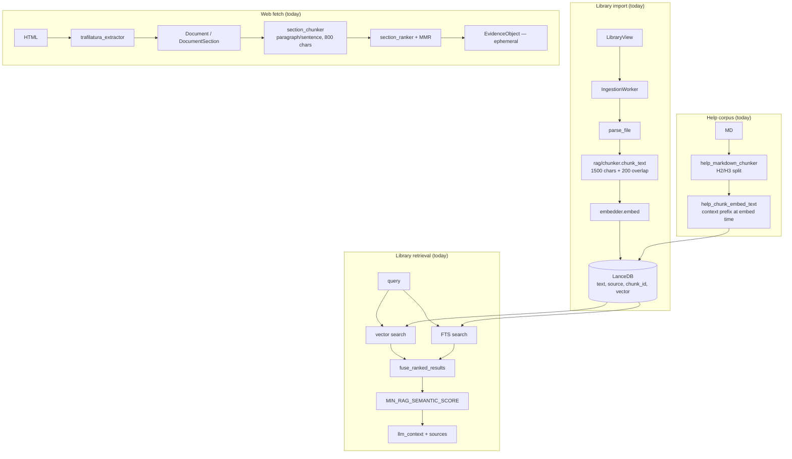
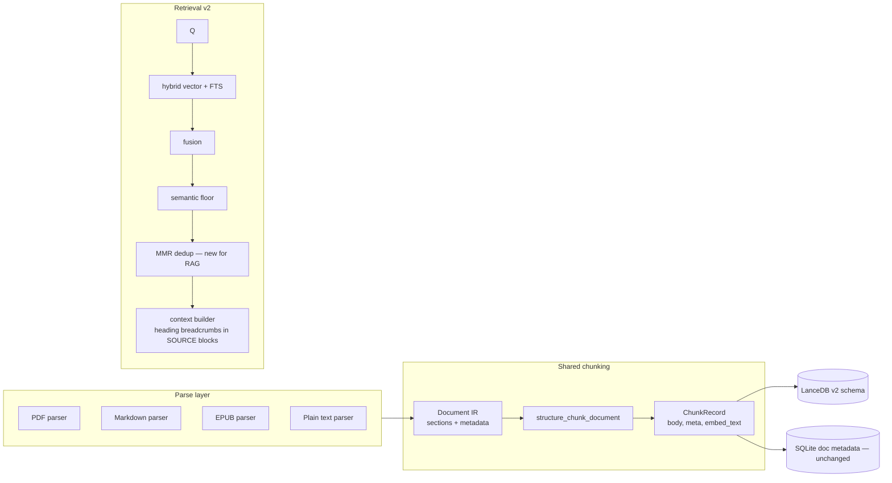

# Library Chunking & Retrieval — Design & Implementation Plan

**Status:** Draft v1 — Phases 1–3 implemented; Phase 0 lite eval harness; Pro Library depth shipped (license gates, per-import mode chooser, gem badge)  
**Audience:** Contributors working on Library ingest, RAG retrieval, and knowledge pipeline convergence  
**Related code:** `workers/ingestion_worker.py`, `rag/chunker.py`, `rag/parsers.py`, `rag/store.py`, `mcp/rag_tool.py`, `core/knowledge/document/types.py`, `core/knowledge/fetch/section_chunker.py`, `core/chunking/semantic_ingest.py`, `core/chunking/precision_rerank.py`, `core/library_pro_features.py`, `core/library_ingest_modes.py`, `ui/components/library_ingest_mode_dialog.py`, `ui/components/pro_gem_badge.py`, `core/help_markdown_chunker.py`, `core/help_corpus_text.py`, `core/help_corpus_seed.py`  
**Related docs:** [rag_relevance_and_router_T4_plan.md](rag_relevance_and_router_T4_plan.md), [web_content_fetch_plan.md](web_content_fetch_plan.md), [in_app_help_knowledge_base.md](in_app_help_knowledge_base.md)

---

## 1. Executive summary

Direct Library imports today use **character-bounded sliding-window chunking** (`rag/chunker.py`), while web fetch uses **structure-aware chunking** (`section_chunker.py`) and the help corpus uses **heading-first chunking plus contextual embed prefixes**. None of these paths use embedding- or LLM-driven semantic segmentation.

This plan evaluates external architectural feedback against Qube's codebase and defines a phased roadmap to:

1. Converge Library, help, and web ingest onto a shared **`Document` / `DocumentSection` IR** and structural chunking pipeline.
2. Adopt **contextual embed enrichment** (already proven in the help corpus) for Library imports.
3. Fix **PDF page-boundary artifacts** in parsing.
4. Add **MMR reranking** to Library RAG retrieval (pattern already exists for web and memory).
5. Introduce **token-target chunk sizing** with character safety caps.
6. Persist **chunk metadata** (`meta_json`) for richer retrieval context.
7. **Ship embedding-breakpoint semantic chunking** as optional **Pro: precision ingest** (per-import mode; see §14).

Chunking is **one component** of retrieval quality — not the primary bottleneck. Qube already has hybrid vector + FTS fusion, semantic relevance gating, and dual-query merge. The highest-ROI improvements are structural chunking, contextual enrichment, PDF continuity, and post-fusion MMR. Embedding-breakpoint semantic chunking is available as optional **Pro precision ingest** (§14), not the default path.

---

## 2. Feedback validation against Qube today

| External feedback | Valid? | Qube reality |
|---|---|---|
| **Chunking is one component, not the whole retrieval story** | **Yes — high value** | Library retrieval already runs vector + FTS hybrid fusion, semantic floor (`MIN_RAG_SEMANTIC_SCORE = 0.30`), FTS token-overlap filtering, and dual-query merge (`core/dual_query_retrieval.py`). Web fetch adds MMR reranking (`section_ranker.mmr_select_chunks`). **Library RAG has no MMR/reranker.** |
| **Avoid overselling "semantic chunking"** | **Yes** | Accurate taxonomy. No embedding/LLM breakpoint chunking anywhere. Web = structural; Library = character window. |
| **markdown → structural → shared pipeline → optional embedding chunking** | **Yes — matches existing patterns** | Help corpus already does heading-first chunking + contextual embed prefix. Web already uses `Document` → `section_chunker`. Library bypasses both. |
| **PDF pages ≠ sections** | **Yes — real bug today** | `parse_pdf()` returns **one string per page**. Those are fed independently into `chunk_text()`, so chunks rarely span pages and tables/paragraphs split at page breaks. |
| **Heading detection beyond markdown** | **Yes — gap for Library** | Web HTML uses `<h1–h6>` via `trafilatura_extractor`. Help uses H2/H3 regex. Library `.txt`/`.md`/PDF have **no heading inference**. |
| **Token limits > character limits** | **Partially valid** | Embeddings are token-bounded internally, but Qube sizes chunks with **characters only** (`DEFAULT_CHUNK_SIZE = 1500`, `MAX_EMBED_CHARS = 2400`). No RAG token counter exists. Char cap remains a necessary guardrail (`llama.cpp` crash prevention). |
| **Overlap depends on boundary quality** | **Yes** | Library uses fixed ~13% overlap (200/1500). `section_chunker` uses **zero overlap**. Help structural chunks use **no overlap**. Overlap should become strategy-dependent. |
| **Metadata enrichment** | **Yes — biggest structural gap** | LanceDB schema is strictly `{vector, text, source, chunk_id}`. SQLite stores document-level metadata only (`filename`, `chunk_count`, `summary_blurb`). **No heading, breadcrumb, or page range on chunks.** |
| **Parser-agnostic IR (`ParsedDocument`)** | **Already partially exists** | `core/knowledge/document/types.py` defines `Document` + `DocumentSection` (heading, level, text, char_offset). Web fetch uses it; Library does not. Renaming is optional; **converging on this IR is the right move.** |
| **Contextual chunk enrichment (Option G)** | **Already proven in-repo** | Help corpus embeds `title + tags + chunk` via `help_chunk_embed_text()` but stores the **raw chunk** in `text` for display/citations. This pattern should become standard for Library. |
| **Embedding-based semantic chunking is expensive** | **Yes** | Sequential embedding (`rag/embedder.py`) makes sentence-level breakpoint chunking costly at ingest. Defer as optional. |

### Corrections to external feedback where Qube already differs

- **Hybrid retrieval exists** — the external agent assumed it might not. Qube has it; the gap is **post-fusion reranking (MMR)** and **richer chunk metadata**, not basic hybrid search.
- **"Reranking" partially exists** — web sections use MMR + relevance scoring; memory optionally uses `apply_mmr`. Library `rag_search` does rank fusion only.
- **DOCX is not supported** — Library parsers handle `.pdf`, `.epub`, `.txt`, `.md` only (`rag/parsers.py`).

---

## 3. Current architecture (as-is)

### 3.1 Library import path

```
LibraryView → IngestionWorker → parse_file() → chunk_text() → embedder.embed() → LanceDB
```

- **Chunker:** `rag/chunker.py` — 1500 char window, 200 char overlap at ingest.
- **Break heuristics:** Prefer `\n\n` → `. ` → `\n` within window; hard slice fallback.
- **Parsers:** PDF returns one string per page; EPUB one per HTML item; `.md` rendered to plain text as one blob.

Key code references:

```python
# workers/ingestion_worker.py
raw_sections = parse_file(path)
for section in raw_sections:
    chunks.extend(chunk_text(section, chunk_size=DEFAULT_CHUNK_SIZE, overlap=_INGEST_OVERLAP))
chunks = [c[:MAX_EMBED_CHARS] for c in chunks]
```

```python
# rag/chunker.py
DEFAULT_CHUNK_SIZE = 1500
DEFAULT_OVERLAP = 150
# Hard cap — protects against pathological splits / huge single-line tables
```

### 3.2 Web fetch path

```
HTML → trafilatura_extractor → Document / DocumentSection → section_chunker → section_ranker + MMR → EvidenceObject (ephemeral)
```

- **Chunk cap:** 800 chars (`DEFAULT_MAX_SECTION_CHARS`).
- **Strategy:** Heading-aware sections; paragraph → sentence packing; small-chunk merge; zero overlap.

### 3.3 Help corpus path

```
Markdown → help_markdown_chunker (H2/H3 split) → help_chunk_embed_text (prefix at embed) → LanceDB
```

- **Embed prefix:** Title + tags prepended to embedding input; raw chunk stored in `text`.
- Closest existing pattern to the target Library design.

### 3.4 Library retrieval path

```
query → vector search + FTS → fuse_ranked_results → MIN_RAG_SEMANTIC_SCORE gate → llm_context + sources
```

- **No MMR** on fused RAG results.
- **No heading/breadcrumb** in SOURCE blocks.
- LanceDB rows: `{vector, text, source, chunk_id}` only.

### 3.5 Architecture diagram (today)



**Key takeaway:** Help corpus is closest to the desired end state (structural split + contextual embedding). Library imports are the outlier.

---

## 4. Target architecture

### 4.1 Design principles

1. **One document IR, many parsers** — all ingest paths emit `Document` / `DocumentSection[]`.
2. **One chunking pipeline** — generalize `section_chunker` (or extract shared `core/chunking/`) for Library, help, and web.
3. **Separate concerns:**
   - `chunk_body` — what the user sees in citations/UI
   - `embed_text` — what gets embedded (body + contextual prefix)
   - `chunk_meta` — structured metadata for retrieval, filtering, and future UI
4. **Token-primary, char-guardrailed** — target chunk size in tokens; keep `MAX_EMBED_CHARS` as a hard safety cap.
5. **Retrieval wins before ingest complexity** — ship contextual enrichment + MMR for RAG before optional embedding-chunking.
6. **Reindex-friendly** — schema/metadata changes must survive `ReindexWorker` export/re-embed cycle.

### 4.2 Target pipeline diagram



---

## 5. Component design

### 5.1 Parser layer → `Document` IR

| Format | Today | Target |
|---|---|---|
| **PDF** | Page strings | Concatenate with `\n\n`, track `page_spans: [(start, end, page_no)]`. Optionally detect headings (font size from PyMuPDF `get_text("dict")` in a later phase). **Do not treat pages as sections.** |
| **Markdown** | Render to plain text, one blob | Split on `#`/`##`/`###` (reuse `split_help_markdown_sections`, generalized). |
| **EPUB** | One string per HTML item | Map each item to a `DocumentSection` with inferred heading from `<title>`/first `<h*>` if available. |
| **Plain text** | One blob | Paragraph split + lightweight heading heuristics (ALL CAPS lines, numbered headings, short title-case lines surrounded by blank lines). |

**New module proposal:** `rag/document_builders/` (or `core/knowledge/document/builders/`) with `build_document_from_path(path) -> Document`.

### 5.2 Shared chunking module

Extract/refactor from `section_chunker.py`:

```python
@dataclass
class ChunkRecord:
    body: str              # stored in LanceDB `text`, shown in UI
    embed_text: str        # passed to embedder
    source: str
    chunk_id: int
    heading: str | None
    heading_level: int
    breadcrumb: str        # "Chapter 4 > Section 4.2"
    page_start: int | None
    page_end: int | None
    section_index: int
    chunk_index: int
```

**Chunking parameters (defaults — tune in eval):**

| Parameter | Structural chunks | Recursive fallback |
|---|---|---|
| Target size | **512 tokens** (~384–768 range) | same |
| Hard char cap | **2400** (`MAX_EMBED_CHARS`) | same |
| Overlap | **0–5%** or none | **10–15%** |
| Min chunk | ~100 tokens or 50 chars (keep existing floor) | same |

**Token counting strategy:**

- **Phase 1:** Use embedder-agnostic heuristic (`len(text) / 4` for Latin prose) with char hard cap — zero new deps, good enough for v1.
- **Phase 2:** Add `count_embed_tokens(text) -> int` using fastembed model tokenizer when available; GGUF path uses `llama.tokenize` (pattern exists in `core/output_token_budget.py`).

**Overlap guidance (from external feedback, validated):**

| Strategy | Overlap |
|---|---|
| Structural chunks (heading/paragraph/sentence boundaries) | 0–10% |
| Recursive char split | 10–20% |
| Blind fixed windows (current Library) | 15–25% |

Reducing unnecessary overlap decreases index size and duplicate retrieval once structural boundaries improve.

### 5.3 Contextual enrichment (Option G — adopt help corpus pattern)

Generalize `help_chunk_embed_text` → `core/chunking/embed_context.py`:

```
Document: {title or filename}
Section: {breadcrumb or heading}
---
{chunk body}
```

**Rules:**

- Prefix applies **only to embedding input**, not stored `text`.
- Keep prefix under ~200 tokens so body dominates the vector.
- At retrieval time, optionally repeat breadcrumb in `--- SOURCE N: filename (Section X) ---` context blocks for the LLM (cheap, high impact).

**Existing reference implementation:**

```python
# core/help_corpus_text.py
def help_chunk_embed_text(doc: dict[str, Any], chunk: str) -> str:
    prefix = help_document_embed_prefix(doc)
    body = (chunk or "").strip()
    if prefix and body:
        return f"{prefix}\n\n{body}"
    return prefix or body
```

Help corpus stores raw chunk in LanceDB `text` while embedding the prefixed form — Library should follow the same contract.

### 5.4 LanceDB schema v2 (metadata)

**Constraint:** `.cursor/rules/rag-engine.mdc` mandates schema stability. Any new columns require explicit migration in `rag/store.py`.

**Proposed additive schema:**

| Column | Type | Purpose |
|---|---|---|
| `text` | utf8 | chunk body (unchanged contract) |
| `vector` | float[] | unchanged |
| `source` | utf8 | unchanged |
| `chunk_id` | int32 | unchanged |
| `meta_json` | utf8 (optional) | JSON blob: `{heading, breadcrumb, page_start, page_end, section_index, chunk_index, total_chunks}` |

**Why JSON column vs many columns:** minimizes schema churn, mirrors memory's JSON-in-`text` pattern, keeps FTS on clean `text`. Migration: on open, if column missing → add nullable column; old rows get `{}`.

**Metadata hierarchy example:**

```
Document
 ├── Chapter 4
 │     ├── Section 4.2
 │            ├── Chunk 1
 │            └── Chunk 2
```

**Alternative (lighter v1):** skip persisted metadata; compute breadcrumb only at ingest into `embed_text` prefix. Retrieval filtering by section would not be possible — recommend persisted `meta_json` if doing the work anyway.

### 5.5 Retrieval improvements (parallel track)

These may outperform chunking changes alone:

| Improvement | Status | Action |
|---|---|---|
| Hybrid vector + FTS | ✅ exists | keep |
| Semantic relevance floor | ✅ exists | keep |
| Dual-query fusion | ✅ exists | keep |
| **MMR on RAG results** | ❌ missing | Port `apply_mmr` / `mmr_select_chunks` pattern into `rag_search` post-fusion (reuse `core/memory_retrieval_policy.apply_mmr` or shared util) |
| **Heading in SOURCE blocks** | ❌ missing | If `meta_json.heading` present, format `--- SOURCE 1: doc.pdf — § Installation ---` |
| Cross-encoder reranker | ❌ missing | **Defer** — adds model load + latency; evaluate after structural chunking + MMR |
| Source-scoped metadata filter | ❌ missing | **Defer** — needs UI/API for `@doc` scoped search first |

**Retrieval stack framing:**

```
embedding model
        ↓
chunking
        ↓
metadata
        ↓
retrieval (hybrid search + fusion + gates)
        ↓
reranking (MMR → optional cross-encoder)
```

Before investing in embedding-based chunking, evaluate whether MMR, metadata enrichment, or hybrid retrieval tuning provide larger retrieval gains for the corpus.

---

## 6. Phased implementation plan

### Phase 0 — Baseline & metrics (1–2 days)

**Goal:** Measure before changing chunking.

- [ ] Add offline eval script (extend `tools/evaluate_retrieval.py` or new `tools/evaluate_library_chunking.py`):
  - Query set from real Library docs (or `router_eval_seed` corpus)
  - Metrics: recall@k, MRR, duplicate-chunk rate, avg chunk length (chars + estimated tokens)
- [ ] Capture current ingest stats: chunks/doc, ingest time/doc, index size
- [ ] Document baseline for PDF page-boundary failures (manual spot-check)

**Exit criteria:** Baseline numbers recorded; no behavior change.

---

### Phase 1 — Quick wins without schema migration (3–5 days)

**Goal:** Maximum retrieval ROI, minimal risk.

1. **Contextual embed prefix for Library** (mirror help corpus)
   - Add `library_chunk_embed_text(source, chunk, meta?)`
   - Wire in `IngestionWorker`: embed prefixed text, store raw chunk in `text`
   - Files: `workers/ingestion_worker.py`, new `core/chunking/embed_context.py`

2. **MMR for Library RAG**
   - After fusion + semantic gate in `mcp/rag_tool.py`, apply `apply_mmr` before context build
   - Reuse `MMR_LAMBDA = 0.72` from web/memory for consistency
   - Add test in `tests/test_rag_relevance_gate.py` or new MMR test

3. **Markdown structural chunking for Library**
   - Route `.md`/`.markdown` through generalized heading splitter (extract from `help_markdown_chunker`)
   - Oversized sections still fall through to `chunk_text()` with reduced overlap (5%)

4. **Improve PDF continuity**
   - Change `parse_pdf()` to return **one concatenated string** with `\n\n` page separators
   - Track page boundaries in parser metadata (return `Document` instead of `list[str]` — can be incremental)
   - Stop feeding page-per-section into chunker immediately

**Exit criteria:** Re-ingest sample docs; eval script shows ≥ neutral on recall, improved duplicate rate; no LanceDB schema change; `ReindexWorker` unaffected.

---

### Phase 2 — Shared document IR + structural chunking (1–2 weeks)

**Goal:** Library and web share one chunking pipeline.

1. **Create `build_document_from_path(path) -> Document`**
   - PDF: concatenated text + page span metadata
   - MD: heading sections
   - EPUB: section per spine item with heading inference
   - TXT: paragraph blocks + heading heuristics

2. **Generalize chunking**
   - Move/refactor `section_chunker.py` → `core/chunking/structure_chunker.py`
   - Add token-target sizing (heuristic v1)
   - Strategy-dependent overlap (0% structural, 10% recursive fallback)
   - Emit `ChunkRecord[]`

3. **Wire `IngestionWorker`**

   ```
   path → Document → chunk_records → embed(record.embed_text) → LanceDB
   ```

4. **Align help corpus**
   - Refactor `help_corpus_seed.py` to use shared chunker + shared embed_context (remove duplication)

5. **Tests**
   - Port patterns from `tests/test_section_ranker.py`, `tests/test_help_markdown_chunker.py`
   - Add PDF cross-page paragraph test
   - Add plain-text heading heuristic tests

**Exit criteria:** All formats ingest through `Document` → shared chunker; web fetch continues using same chunker module; test suite green.

---

### Phase 3 — Persisted chunk metadata (1 week)

**Goal:** Metadata available at retrieval and for future UI.

1. **LanceDB schema migration**
   - Add nullable `meta_json` column in `rag/store.py`
   - Migration on table open; `export_all_rows` / `add_chunks` updated
   - `ReindexWorker`: export must include `meta_json`; re-embed preserves metadata without re-chunking (unless `--rechunk` flag added later)

2. **Retrieval context enrichment**
   - `rag_search` reads `meta_json.heading` / `breadcrumb` for SOURCE block labels
   - FTS still indexes `text` only (body), not prefix

3. **Optional: breadcrumb in Library preview** (UI — only if requested)

**Exit criteria:** Reindex round-trip preserves metadata; retrieval SOURCE blocks show section context.

---

### Phase 4 — Retrieval polish & tuning (ongoing)

1. **Eval-driven parameter tuning**
   - Token target (384 vs 512 vs 768)
   - MMR lambda
   - Overlap for fallback path

2. **PDF heading detection (Phase 4b)**
   - PyMuPDF `"dict"` mode for font-size/bold heuristics
   - Only if eval shows PDF-heavy libraries still underperform

3. **Consider cross-encoder reranker** only if Phase 1–3 plateau on Phase 0 metrics — candidate for **Pro precision retrieval** (§14)

**Exit criteria:** Eval script shows measurable recall/citation improvement on representative corpus (`tools/evaluate_library_chunking.py`).

---

### Phase 5 — Optional / deferred

| Item | When to consider |
|---|---|
| **Embedding breakpoint chunking** | Shipped as **Pro: precision ingest** — per-import mode chooser (see §14); async; warn about 20–100× embed cost |
| **LLM chunking** | Not recommended for default path; bundle under Pro ingest profile if ever shipped |
| **DOCX support** | Separate parser → `Document` builder when product requests it |
| **Dedicated cross-encoder** | **Pro: precision retrieval** (see §14) — after MMR + structural chunking plateau on Phase 0 metrics |
| **Full token tokenizer integration** | When heuristic token sizing proves insufficient for CJK/code-heavy libraries |

**Embedding-breakpoint cost note:**

For a long document:

- Today: 1 embedding per final chunk
- Embedding breakpoint chunking: hundreds of sentence embeddings before chunking
- Can easily become **20–100× more embedding work** at ingest

---

## 7. File-level change map

| File / area | Change |
|---|---|
| `rag/parsers.py` | PDF concatenation; optional `Document` return |
| `rag/chunker.py` | Keep as **recursive fallback** only; deprecate as primary Library path |
| `core/knowledge/fetch/section_chunker.py` | Refactor → shared `core/chunking/structure_chunker.py` |
| `core/help_markdown_chunker.py` | Thin wrapper over shared heading splitter |
| `core/help_corpus_text.py` | Generalize → `core/chunking/embed_context.py` |
| `workers/ingestion_worker.py` | New pipeline: Document → ChunkRecord → embed |
| `rag/store.py` | Schema v2: `meta_json`; migration |
| `mcp/rag_tool.py` | MMR post-fusion; heading-aware SOURCE blocks; optional Pro precision rerank |
| `workers/reindex_worker.py` | Export/import `meta_json` |
| `core/database.py` | `documents.ingest_mode` (`standard` \| `precision`) for per-document Pro ingest marker |
| `ui/views/library_view.py` | Import mode dialog; sidebar gem badge for precision-indexed docs |
| `tests/` | New chunking + PDF continuity + MMR + Pro depth + ingest-mode tests |

---

## 8. Risk register

| Risk | Mitigation |
|---|---|
| Re-chunking breaks existing citations (`chunk_id` shifts) | Full re-ingest on deploy; or version ingest schema and lazy re-index per document |
| Schema migration breaks LanceDB | Follow existing `recreate_for_dim` patterns; test export/import round-trip |
| Increased chunk count → larger index | Structural chunking + lower overlap may **reduce** duplicates; monitor index size in Phase 0 |
| Token heuristic inaccurate for code/CJK | Char hard cap remains; tune heuristic; Phase 2b real tokenizer |
| Scope creep into DOCX/new formats | Explicitly out of Phase 1–3 |
| Equating tokens ≈ chars globally | Use char/4 heuristic for Latin prose only; never remove `MAX_EMBED_CHARS` guardrail |

---

## 9. Recommended priority order

If pursuing highest ROI with least engineering risk:

1. **Contextual embed prefix** (already proven in help corpus)
2. **MMR on RAG results** (pattern exists for web + memory)
3. **Fix PDF page-boundary parsing** (clear bug)
4. **Shared `Document` IR + structural chunker for Library**
5. **Persist `meta_json` + heading-aware SOURCE blocks**
6. **Token-target sizing** (heuristic first)
7. **Pro precision ingest** — embedding-breakpoint mode (§14; per-import chooser)

---

## 10. External feedback — adopted vs deferred

### Adopted

- Frame chunking as **one layer in a retrieval stack** — add MMR and contextual enrichment before expensive semantic segmentation.
- **Do not use PDF pages as sections** — confirmed anti-pattern in `parse_pdf()`.
- **Generalize the help corpus embed-prefix pattern** (Option G) — lowest-cost retrieval boost.
- **Converge on `Document`/`DocumentSection` IR** — already exists; Library should use it.
- **Token-primary sizing with char guardrails** — valid gap; implement heuristically first.
- **Overlap should vary by boundary quality** — align with structural (low) vs fallback (moderate) strategies.
- **Metadata enrichment** — persist heading/breadcrumb hierarchy when schema migration lands.

### Deferred or scoped down

- **Full metadata hierarchy in v1** — start with breadcrumb + heading; expand in Phase 3+.
- **Cross-encoder reranking as co-equal recommendation** — not in Qube today; higher cost than MMR.
- **Equating 512 tokens ≈ 1200–1800 chars globally** — rough default for Latin prose only.
- **Embedding/LLM semantic chunking** — shipped as Pro precision ingest (per-import); LLM chunking still deferred.

---

## 11. Chunking taxonomy (reference)

| Term | Meaning in Qube | Used where |
|---|---|---|
| **Fixed-size / character chunking** | Sliding window with char hard cap + light break heuristics | Library imports (`rag/chunker.py`) |
| **Structure-aware chunking** | Headings, paragraphs, sentences; char/token caps as secondary | Web fetch (`section_chunker.py`), help corpus (partial) |
| **Contextual enrichment** | Prefix document/section context at embed time; raw body in storage | Help corpus (`help_chunk_embed_text`) |
| **True semantic chunking** | Embedding-similarity breakpoints at ingest (on top of structural pipeline) | **Pro: precision ingest** (`core/chunking/semantic_ingest.py`); chosen per Library import |

---

## 12. Success metrics

| Metric | Phase 0 baseline | Target after Phase 1–3 |
|---|---|---|
| Recall@5 on eval query set | measure | ≥ baseline or +5% relative |
| Duplicate/near-duplicate chunks in top-k | measure | decrease |
| Avg chunks per document | measure | stable or slightly lower |
| Ingest time per MB | measure | ≤ 1.5× baseline (Phase 1); ≤ 2× after structural chunking |
| Index size (rows) | measure | stable or lower (less overlap) |
| Citation relevance (manual QA) | spot-check | improved section coherence |

---

## 13. First PR recommendation

**Phase 1** is the best first PR — no schema migration, reuses three existing patterns, addresses highest-impact feedback:

1. Contextual embed prefix for Library (`embed_context.py`)
2. MMR in `rag_search`
3. PDF concatenation fix in `parse_pdf()`
4. Markdown heading split for `.md` imports

No LanceDB schema change required; `ReindexWorker` behavior unchanged unless users re-ingest.

---

## 14. Pro Library depth (commercial — shipped)

Aligns with the monetization roadmap: **Pro sells depth and opt-in power; Library RAG moats stay free.** Capability ids are registered in `core/capabilities.py`; user-facing gates are wired via `has_feature()` with `_MIT_LAUNCH_GRANTS_ALL = False`.

### 14.1 Free tier (Home — always on)

These are launch moats and must **not** be paywalled:

| Layer | Free default |
|---|---|
| Ingest | Structural `Document` → `ChunkRecord` pipeline; contextual embed prefix; `meta_json` breadcrumbs |
| Retrieval | Hybrid vector + FTS fusion; semantic relevance floor; **MMR** post-fusion |
| UI | Library preview breadcrumbs (when metadata present) |
| Quality bar | Phase 0 lite baseline (`tools/evaluate_library_chunking.py`) — tune defaults for everyone |

PDF heading detection (Phase 4b) and eval-driven parameter tuning (Phase 4a) ship as **global improvements**, not Pro features.

### 14.2 Pro: precision ingest (first Pro Library feature)

| Field | Value |
|---|---|
| **Capability id** | `pro.library_high_quality_ingest` |
| **Feature id** | `library.ingest_high_quality` |
| **User-facing name** | Precision ingest (or “High-quality ingest”) |
| **Minimum tier** | Pro (Team/Enterprise inherit) |

**What it does:** Optional **per-import** ingest mode using embedding-similarity breakpoints on large sections (semantic segmentation on top of standard structural chunking). Runs **async** with clear progress and cost warning (20–100× embed work vs standard ingest).

**What Pro sells:** The **mode chooser, job orchestration, and UX in Qube** — not “chunking” as a vague upsell. Free tier keeps structural ingest that already passes the Phase 0 corpus.

**UX (shipped):**

1. **Library → Import (+)** — After file picker (and optional overwrite prompt), **Choose indexing mode** dialog:
   - **Normal indexing** — standard structural pipeline (free).
   - **Precision indexing (Pro)** — semantic breakpoints; gem icon on button; disabled + tooltip when no Pro license.
2. **Settings → Knowledge → Library Pro depth → Default precision ingest on import** — When licensed, pre-selects **Precision indexing** in the import dialog (user can still choose Normal per upload). Confirmation dialog warns about indexing cost.
3. **Library sidebar** — Precision-indexed documents show a **gem badge** (`fa5s.gem`) before the filename; preview stats include “Precision ingest”.
4. **Re-import to change mode** — Overwrite an existing file and pick a different mode; legacy docs ingested before this feature default to `standard` (no badge until re-imported).

Copy: *“Maximum citation accuracy for dense PDFs, contracts, and papers — slower indexing.”*

**Implementation (done):**

- `core/chunking/semantic_ingest.py` — embedding-similarity breakpoint chunking
- `core/library_ingest_modes.py` — `standard` / `precision` constants and normalization
- `core/library_pro_features.py` — license + settings helpers; `default_import_ingest_mode()`, `resolve_import_ingest_mode()`
- `core/database.py` — `documents.ingest_mode TEXT DEFAULT 'standard'`
- `workers/ingestion_worker.py` — branch on per-job `ingest_mode` via `is_precision_ingest_mode()`
- `ui/components/library_ingest_mode_dialog.py` — import mode chooser
- `ui/components/pro_gem_badge.py` — reusable Pro gem badge for sidebar and dialog
- `ui/views/library_view.py` — dialog wiring, gem in `_append_library_doc_row`, preview stats
- Settings → Knowledge → **Default precision ingest on import** + **Precision retrieval** toggles (license required)
- Gated via `has_feature("library.ingest_high_quality")`; `_MIT_LAUNCH_GRANTS_ALL = False`
- Tests: `tests/test_library_pro_features.py`, `tests/test_library_ingest_modes.py`

**Intentionally not persisted:** `ingest_mode` is stored on the SQLite `documents` row only — not duplicated in LanceDB chunk `meta_json` (minimal scope).

**Marketing guardrail:** *“Unlock precision ingest in Qube”* — never *“Pro includes better chunking”* (free structural chunking must remain credible).

### 14.3 Pro: precision retrieval (second Pro Library feature)

| Field | Value |
|---|---|
| **Capability id** | `pro.library_precision_rerank` |
| **Feature id** | `library.rag_precision_rerank` |
| **User-facing name** | Precision retrieval |
| **Minimum tier** | Pro |

**What it does:** Optional **bi-encoder rerank** pass after hybrid fusion + MMR in `mcp/rag_tool.py`. Improves top-k ordering for large or high-stakes libraries. (Phase 5 “dedicated cross-encoder” remains deferred until eval proves lift beyond bi-encoder rerank.)

**When to build:** Only after Phase 0 baseline shows free tier (structural + MMR) has **plateaued** and offline eval proves measurable lift from reranking.

**What stays free:** Hybrid search, semantic floor, MMR, breadcrumb SOURCE blocks. Pro adds a **second-stage precision mode**, not “working Library search.”

**UX (shipped):**

- Settings → Knowledge → **Library Pro depth → Precision retrieval** toggle (Pro license required)

**UX deferred (not shipped):**

- Auto-enable precision retrieval for `@doc`-scoped queries
- Optional extra model download (local cross-encoder) with latency note

**Implementation (done):**

- `core/chunking/precision_rerank.py` — bi-encoder rerank after MMR
- `mcp/rag_tool.py` — call when `precision_rerank_enabled()`
- Settings → Knowledge → **Precision retrieval** toggle (license required)
- Tests: `tests/test_library_pro_features.py`

**Marketing guardrail:** *“Precision retrieval for serious libraries”* — not *“Pro makes RAG work.”*

### 14.4 Sequencing

```text
Phase 0 lite baseline (done)
  → Pro precision ingest engine (done)
  → Pro precision rerank (done)
  → License gates (done)
  → Per-import mode chooser + documents.ingest_mode + sidebar gem badge (done)
```

### 14.5 Deferred (out of scope for Pro depth v1)

| Item | Notes |
|---|---|
| Legacy ingest-mode backfill | Pre-feature documents stay `standard`; re-import to upgrade |
| `ingest_mode` in LanceDB `meta_json` | SQLite `documents` row is source of truth |
| `@doc`-scoped auto precision retrieval | Needs source-scoped search UI/API first (see §5) |
| Dedicated cross-encoder model | Phase 5; current implementation uses bi-encoder rerank |
| “Re-index with precision” context-menu action | Optional polish |

### 14.6 Related

- User guide: [user/library-pro-depth.md](user/library-pro-depth.md)
- In-app help: `assets/help/en/faq/library-pro-depth.md`, `workflows/enable-library-pro-depth.md`
- Eval harness: `eval/library_corpus/v1_baseline.json`, `tools/evaluate_library_chunking.py`
- Capabilities: `core/capabilities.py`, `docs/private/capability_registry.md`
- Monetization: `docs/private/monetization_implementation_roadmap.md` (Pro depth pattern mirrors 2.5 deep research profiles)
