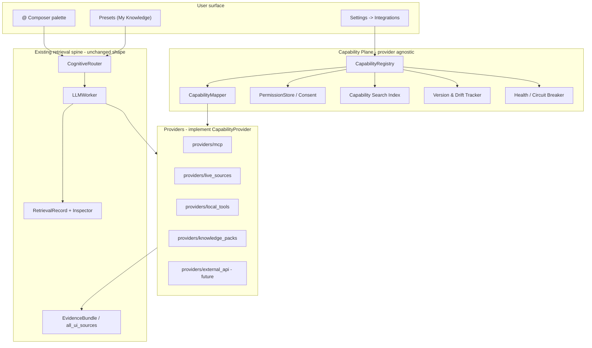

# MCP & Capability Integration — Architecture Review & Refinement

**Status:** Architecture review — refines the implementation plan before coding begins
**Date:** 2026-07-20
**Audience:** Engineers and maintainers implementing MCP interoperability; product reviewers
**Companion to:** [MCP & Capability Integrations — Design & Implementation Plan](./mcp_capability_integrations_plan.md) (the *source of truth* for scope and phases)
**Related:** [Competitive roadmap](./competitive_roadmap.md) (Theme C), [Cognitive router](./cognitive_router.md), [Knowledge Platform Evolution Review](./knowledge_platform_evolution_review.md)

> This document does not replace the implementation plan. It strengthens it with one load-bearing decision: **MCP is one provider behind a provider-agnostic Capability core.** Nothing in Qube's runtime, UI, or data model should ever branch on the word "MCP."

---

## 1. Executive summary

The existing plan is directionally correct but still treats MCP as a semi-privileged citizen (an "MCP Server Registry", MCP-specific phases). The strongest long-term design inverts this: **MCP is an implementation detail of a general Capability system.**

Three structural moves carry most of the value:

1. **`CapabilityProvider` is the only abstraction the runtime knows.** MCP becomes `core/integrations/providers/mcp/`. The router, composer, evidence pipeline, and INSPECT never branch on provider type.
2. **A stable capability address (URN)** — `cap:<provider>:<namespace>/<action>[@version]` — is the single identity used by composer tokens, presets, permissions, provenance, and audit. This resolves the plan's open "token grammar TBD" and delivers provenance for free.
3. **Three clean planes** — Control (registry / discovery / permissions / versioning / health), Data (invocation → normalized hits → evidence), Observability (INSPECT / egress / audit) — so each evolves independently.

Product identity is unchanged and reinforced: **Qube is the assistant that lets you deliberately compose trusted capabilities around a conversation, and shows you exactly what ran.** MCP is a supply channel for capabilities, never the center of gravity.

---

## 2. Refined product philosophy

### Critique of the founding statement

> "MCP should extend Qube's assistant, not replace it."

A good slogan, a weak specification: "extend not replace" is directional, not testable — two engineers can disagree on whether a PR "replaces." A design principle must be falsifiable in review. It also frames the work *relative to MCP*; if the philosophy is written around MCP, the architecture ossifies around MCP. The healthier framing is provider-neutral: the assistant composes **capabilities**; MCP is one source of them.

### The principles (testable, memorable)

| # | Principle | Review question it answers |
|---|-----------|----------------------------|
| P1 | **Users choose capabilities; models use capabilities.** | Can the model gain a capability the user didn't attach? |
| P2 | **Capabilities are attached intentionally, not exposed indiscriminately.** | Is any tool auto-injected into context on connect? |
| P3 | **Permissions are understood before they're granted.** | Could a user grant "write" without seeing it's write? |
| P4 | **Every invocation is inspectable and attributable.** | Can I trace this answer to `cap:…` + inputs + outputs? |
| P5 | **Capabilities extend Qube's workflow; Qube does not reorganize around any provider.** | Did we add a provider-shaped code path instead of a provider-agnostic one? |
| P6 | **Provider-agnostic by construction.** | Does this module `import mcp`? If it's not in `providers/mcp/`, that's a smell. |
| P7 | **Least privilege by default; escalation is explicit.** | Does anything default-enable write/destructive? |
| P8 | **Provenance is never lost.** | Does the normalized hit carry its `cap:` origin end-to-end? |

P1–P5 are the philosophy; P6–P8 are how we keep it true.

---

## 3. Capability-first architecture

Everything the runtime touches is a **Capability**, produced by a **CapabilityProvider**. MCP is one provider implementation.



### The provider contract

One protocol; the runtime depends only on this — never on `providers/mcp`. See the concrete Phase 0 sketch in [`core/integrations/capabilities/protocol.py`](../core/integrations/capabilities/protocol.py).

```python
class CapabilityProvider(Protocol):
    provider_id: str                      # "mcp" | "live" | "local" | "pack" | ...

    async def discover(self) -> list[CapabilityDescriptor]: ...
    async def invoke(self, urn: CapabilityURN, args: dict,
                     *, ctx: InvokeContext) -> list[NormalizedHit]: ...
    async def health(self) -> HealthStatus: ...
    def fingerprint(self) -> str          # hash of descriptors + schemas + tiers
```

**Why this wins long-term:** adding a provider (Plugin SDK, cloud connector, enterprise gateway) is a new folder implementing four methods — no registry, UI, router, or INSPECT change. That is a maintainable extension point (satisfies P5/P6).

### Capability address (URN) — the spine of the system

`cap:<provider>:<namespace>/<action>[@<version>]`

- `cap:mcp:github/search-issues`
- `cap:live:pubmed/search`
- `cap:local:filesystem/read`
- `cap:mcp:github/search-issues@2` (pinned after a drift event)

This single string is used by composer tokens, presets, permission grants, INSPECT steps, egress logs, and knowledge-pack exports. It resolves the plan's "token grammar TBD" and avoids collision with `@[tool:user:…]` by unifying under `@[cap:…]` (keep `@[tool:user:…]` as a back-compat alias resolving to a preset of `cap:` ids). Provenance (P8) is automatic — the origin is in the identifier.

---

## 4. Registry architecture

Split into **three planes** so caching, invocation, and observability evolve independently.

**Control plane** — the source of truth for *what exists and what's allowed*:

- Provider records: id, label, transport config, env-var **names** (never secrets), cwd.
- Connection metadata: protocol version, server version, last-seen, last-successful-connection.
- Cached descriptors: grouped capabilities + JSON schemas + tiers + fingerprint.
- Consent records: per-capability grants, versioned (§5).
- Health state: circuit-breaker status, latency EWMA, last error.
- Persistence: `~/.qube/integrations/<provider>/*.json` — descriptor cache separate from the consent file so re-discovery never risks grants.

**Data plane** — *invocation*:

- Transport abstraction (`stdio` now; `streamable-http` / SSE / remote later) behind a `Transport` interface.
- **Persistent sessions** with a pool + idle eviction, replacing today's one-shot `subprocess.run` per query in `core/knowledge/connectors/mcp_connector.py`.
- Full JSON-RPC lifecycle: `initialize` -> `tools/list` (+ optional `resources/list`) on connect; `tools/call` on invoke; monotonic request ids; cancellation; timeouts; output caps (`_MAX_OUTPUT_BYTES`-style, already present).
- Output -> **NormalizedHit** in the *same shape Live Source adapters emit* (`title`, `snippet`, `url`, `_adapter`, `retrieval_method`) so it flows through the existing EvidenceBundle with zero special-casing.

**Observability plane** — *what happened*: emits INSPECT steps and egress records (§7).

**Protocol evolution:** version-negotiate at `initialize`; store the negotiated version; keep a compat shim so a future MCP spec bump is isolated to `providers/mcp/`.

---

## 5. Permission model

The unit of trust is a **capability, not a server**. Trusting "the GitHub server" is the anti-pattern; trusting "read issues on GitHub" is the goal.

| Tier | User label | Default | Extra gate |
|------|-----------|---------|-----------|
| `read` | Read / search | may be on at opt-in | none |
| `write` | Create / update | **off** | explicit toggle |
| `destructive` | Delete / merge / exec | **off** | toggle **+ per-invocation confirm** (agent mode) |

**Consent as a first-class, versioned record.** A grant references `cap:…@fingerprint`. When a provider's fingerprint changes (§6), grants stay valid *only for capabilities whose schema/tier didn't escalate*. New or escalated (read->write) capabilities are **default-deny until re-reviewed** — no silent privilege gain (P7).

**First-connect is a grant review, not "Connected ✓":**

```
GitHub  —  review capabilities
  Enabled        Read repositories   Search issues   Read PRs
  Off by default Create issues       Merge PRs        Delete branch
                                                    [Save permissions]
```

**Enterprise-ready:** grants and denials are declarative config (`cap:` + tier), so an org can ship a policy that force-denies `destructive` globally or allow-lists providers — no code — composing with signed provider manifests (preferred over heuristic grouping).

---

## 6. Versioning, drift & health

**Fingerprint** = hash of (grouped capabilities + schemas + tiers). Store per provider: server version, protocol version, capability list, last-seen, last-successful-connection, fingerprint history.

On reconnect, diff fingerprints; surface only meaningful change and never auto-expand privilege:

```
GitHub updated
  + 3 new capabilities   - 1 removed   ^ 1 now requires "write"
  [Review changes]
```

**Health** reuses the existing **Source Status** UI rather than a parallel widget: connection status, latency (EWMA), error snippet, last invocation, and a circuit breaker that marks a provider degraded instead of failing every query. Because health lives on the provider-agnostic record, Live Sources and MCP share one status surface (P5).

---

## 7. Composer UX + INSPECT (the two user-facing moats)

### Composer palette — built for 30 servers / 400+ capabilities

Granularity is the **capability**, never the raw tool. Three sections, layered search:

```
@ github issues
  -- My presets ------------------------
     * Development        (12 capabilities)
  -- Integrations ----------------------
     [lock] GitHub - Search issues     read
     [lock] GitHub - Create issue      write  (!)
  -- Built-in --------------------------
     @evidence  @library  @finance
```

- **Layered search** (§ Searchability): exact/prefix on provider+action -> fuzzy on label/description -> **semantic** over capability descriptions (reuse Qube's existing embedding/retrieval infra). This makes 400 capabilities usable: "find open bugs" surfaces `github/search-issues`.
- **Facets/tags** (provider, tier, tag); **recent & pinned** at top (usage-ranked).
- **Inline trust hints:** lock / (!) badges on write/destructive so risk is visible before attaching (P3).
- Attachment chips render `cap:` provenance; tiers carry through to the run.

### INSPECT — a provenance graph, the flagship differentiator

Every NormalizedHit carries its `cap:` origin, so INSPECT is a projection of the existing `RetrievalRecord`. Extend `ui/components/retrieval_inspector.py` rather than build a new debug story:

```
Sources     Library    GitHub - Search issues
Inspect
  1  Attachment   user attached cap:mcp:github/search-issues
  2  Invoke       search_issues(query="crash on export", state=open)
  3  Returned     18 issues
  4  Ranked       kept 3 (relevance >= 0.72)
  5  Answer       model cited #4821, #4790, #4655
```

**Why it beats traditional MCP hosts:** LM Studio, Claude Desktop, Cursor, and Open WebUI expose tools to the model and, at best, show that a tool was called. None show *what the user authorized, what ran, what came back, what was discarded, and which fragment became a citation.* Inspectability + provenance is hard to retrofit onto architectures that never modeled capabilities as user-attached, permissioned, provenance-bearing objects — a durable moat, not a feature race.

---

## 8. Repository architecture

Provider-agnostic core, providers as leaves; the runtime never imports a provider.

```
core/
  integrations/
    capabilities/          # THE abstraction (provider-agnostic)
      protocol.py          #   CapabilityProvider, InvokeContext
      urn.py               #   CapabilityURN (cap:<provider>:<ns>/<action>[@ver])
      model.py             #   CapabilityDescriptor, tiers, NormalizedHit, fingerprint
      mapper.py            #   raw tools -> grouped capabilities (heuristics + manifest)
    registry/              # control plane: records, descriptor cache, versioning, drift
    permissions/           # consent records, tiers, policy evaluation
    discovery/             # connect/handshake orchestration, health, circuit breaker
    search/                # exact + fuzzy + semantic capability index
    providers/
      mcp/                 # ALL Model Context Protocol code lives here
        client.py          #   persistent stdio session, JSON-RPC lifecycle
        transport/         #   stdio | streamable_http | sse (future)
      live_sources/        #   adapter -> CapabilityProvider bridge (later)
      local_tools/         #   native Qube capabilities (later)
      knowledge_packs/     #   packs as capability bundles (later)
ui/
  views/settings/sections/integrations/   # registry, grant review, health
  components/retrieval_inspector.py        # extended for capability steps
mcp/   # UNCHANGED internal router lanes -- recommend eventual rename -> routing/
```

**On the `mcp/` name collision:** the existing `mcp/` (`cognitive_router.py`, `memory_tool.py`, `rag_tool.py`, router lanes) is *internal routing* and unrelated to the protocol. Short term: hard rule — external protocol code only under `core/integrations/providers/mcp/`, plus a CONTRIBUTING note. **Recommended low-urgency follow-up:** rename internal `mcp/ -> routing/`. Mechanical, high-clarity; deferring it compounds confusion for new contributors. Track as debt, not a blocker.

---

## 9. Future extensibility strategy

Because the runtime knows only `CapabilityProvider`, provider growth is additive and non-breaking:

| Future provider | Slots in as | Notes |
|---|---|---|
| **Live Sources** (58+ adapters) | `providers/live_sources/` bridge | Unifies the `@` palette; adapters stay first-class |
| **Native Qube capabilities** | `providers/local_tools/` | `@evidence` etc. become built-in capability groups |
| **Knowledge Packs** | `providers/knowledge_packs/` | Packs export/import `cap:` bundles + grants (env names only) |
| **Plugin SDK** | new provider + manifest schema | Third parties ship signed capability manifests |
| **Cloud / Enterprise connectors** | provider + remote transport | Reuses consent/policy + health unchanged |
| **Next protocol after MCP** | sibling of `providers/mcp/` | Compat shim isolates the spec; core untouched |

Guardrail: **no `if provider == "mcp"` anywhere outside `providers/mcp/`.** If it appears in the registry, router, or UI, the abstraction has leaked — treat as a review failure (P6).

---

## 10. Product positioning

State the identity **without a competitor in the sentence**:

> **Qube is the assistant that lets you deliberately compose trusted capabilities around a conversation — and shows you exactly what ran, what it returned, and why.**

Pillars (all self-standing): *intentional composition · trust & least privilege · inspectable provenance · privacy/egress transparency · reusable presets.*

Contrast only as background, never identity: LM Studio / Claude Desktop / Cursor / Open WebUI compete on "connect the most tools and hand them to the model." Qube competes on **the discipline around capabilities** — a category where "more servers" isn't the win condition. **Drop any "use LM Studio for full MCP" messaging** — identity must not depend on a competitor's existence.

---

## 11. Long-term roadmap

Reordered so the **abstraction lands before MCP specifics** — the key sequencing change vs. the current plan.

- **Phase 0 — Capability Plane foundations.** `CapabilityProvider` protocol, descriptor/URN model, fingerprint, PermissionStore, mapper v1. **MCP client (`providers/mcp/`)** as the *first* provider. Refactor `McpConnector` to delegate. Mock-server tests (handshake, invoke, deny, timeout, drift).
- **Phase 1 — Integrations UI + consent.** Settings -> Integrations; add/edit/test provider; first-connect grant review; Source-Status health parity; drift review; knowledge-pack export/import (env names, not secrets).
- **Phase 2 — Composer + presets + INSPECT.** `@[cap:…]` grammar + parser; layered search (incl. semantic); suggested presets -> My Knowledge; INSPECT capability steps; Sources provenance.
- **Phase 3 — Agent scope + egress + transports.** Scoped agent mode with per-step approval of write/destructive; session egress summary; optional router opt-in suggestions (default off); `streamable-http`/remote transports.
- **Phase 4 — Provider expansion.** Bridge Live Sources into the plane; Plugin SDK + signed manifests; enterprise policy config. Tracked debt: rename internal `mcp/ -> routing/`.

---

## 12. Final engineering design principles (PR checklist)

Copy into the PR template; each is a yes/no a reviewer can enforce:

- [ ] **P1** No path lets the model gain a capability the user didn't attach.
- [ ] **P2** Nothing is injected into model context on connect; attachment is explicit.
- [ ] **P3** Any write/destructive capability is visibly labeled before grant.
- [ ] **P4** The result is traceable end-to-end: `cap:` -> inputs -> outputs -> citation.
- [ ] **P5** No provider-specific code path was added to registry/router/UI/INSPECT.
- [ ] **P6** No module outside `providers/mcp/` imports MCP or branches on `provider == "mcp"`.
- [ ] **P7** Nothing defaults to write/destructive; drift cannot silently escalate privilege.
- [ ] **P8** NormalizedHit preserves its `cap:` provenance through EvidenceBundle to the UI.
- [ ] **Shape rule** MCP hits use the same normalized shape as Live Source adapters.
- [ ] **Naming rule** External protocol code lives only under `core/integrations/providers/mcp/`.

---

## 13. Key deltas vs. the implementation plan

1. **Elevated the abstraction above MCP** — `CapabilityProvider` is the only runtime contract; MCP is a peer provider.
2. **Introduced the `cap:` URN** as universal identity — resolves the plan's "token grammar TBD".
3. **Three-plane registry** with a **Transport abstraction** for future SSE/remote.
4. **Consent as versioned records** with drift that defaults to deny on escalation.
5. **Semantic capability search** for 400+ capabilities, reusing existing retrieval infra.
6. **Reordered roadmap** so the provider abstraction (not MCP plumbing) is Phase 0's real deliverable.
7. **Called the `mcp/ -> routing/` rename** a tracked debt with rationale.

---

## Changelog

| Date | Change |
|------|--------|
| 2026-07-20 | Initial architecture review — refines the implementation plan around a provider-agnostic Capability Plane |
