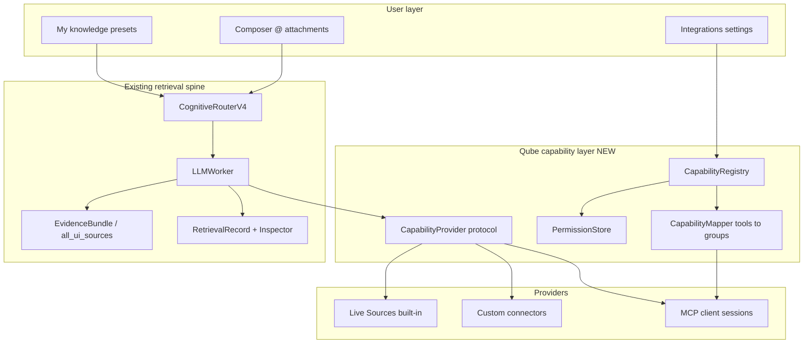

# MCP & Capability Integrations — Design & Implementation Plan

**Status:** Draft — ready for engineering  
**Date:** 2026-07-20  
**Audience:** Developer implementing MCP interoperability; maintainers reviewing scope  
**Related:** [External Knowledge Platform Plan](./external_knowledge_platform_plan.md), [Knowledge Platform Evolution Review](./knowledge_platform_evolution_review.md), [Cognitive router](./cognitive_router.md), [Logging & diagnostics](./logging_and_diagnostics.md)

This document is the **source of truth** for Qube’s MCP interoperability work. It merges competitive analysis, product strategy, and an external architecture review into one plan a developer (or Cursor agent) can execute without re-litigating product identity.

**How to use it**

| Section | Read when… |
|---------|------------|
| [§1 Product constraints](#1-product-constraints-non-negotiable) | Deciding *whether* to build something |
| [§2 Design principles](#2-design-principles) | Any ambiguous trade-off |
| [§3–§6 Product design](#3-strategic-frame) | UX, naming, user flows |
| [§7–§9 Engineering](#7-current-state-codebase-baseline) | Files, phases, acceptance tests |

---

## 0. Executive summary

**Feature:** Qube gains **MCP interoperability** — users can connect standard MCP servers and use their capabilities in chat.

**Product philosophy:** Qube helps users **deliberately compose trusted capabilities around a conversation**, with visibility into what was used and why. MCP is one provider of those capabilities — not the product itself.

**Core thesis (unchanged, validated by review):**

> MCP extends Qube’s assistant job; it does not replace it.

Mid-2026, many apps compete to become “the MCP operating system.” Qube should not chase that race. It should compete on **how capabilities are surfaced, trusted, inspected, and composed** — the same moat as `@` composer routing and INSPECT RETRIEVAL.

**Strategic framing:** Target **compatibility / interoperability**, not “parity.” We are not catching up to LM Studio or Odysseus by cloning their MCP hub UX. We are implementing MCP **on Qube’s terms**: intentional attachment, grouped capabilities, permissions before grant, and inspectable invocation.

---

## 1. Product constraints (non-negotiable)

These are **product decisions**. Engineering should not reopen them without an explicit strategy change.

| Constraint | Rationale |
|------------|-----------|
| **MCP is a complement, not the primary extension model** | Curated Live Sources + `@` tools remain the default assistant path (see intentional non-goals in maintainer competitive roadmap) |
| **Users choose capabilities; models use capabilities** | Capabilities are attached intentionally, not exposed indiscriminately to the model |
| **Never surface raw MCP tool lists as the primary UX** | Users think in capabilities (e.g. “Search GitHub issues”), not `search_issues_v2` |
| **Permissions are understandable before they are granted** | Default-deny for risky actions; grouped toggles, not 27 checkboxes |
| **Every capability invocation is inspectable** | INSPECT / Retrieval Inspector shows server, capability, steps, and outcomes |
| **MCP integrates into Qube’s workflow, not the other way around** | Same citation pipeline, composer tokens, knowledge presets, egress transparency |
| **First-run bootstrap stays MCP-free** | Integrations are Advanced / opt-in |
| **Voice / Desktop Companion stays retrieval-first** | No auto-run shell/write MCP tools from the orb without explicit user approval |
| **No competitor-dependent positioning** | Do not message “use LM Studio for MCP.” Users who want an MCP-first host can run one **alongside** Qube |
| **Non-goals unchanged** | Roleplay frontend, email/calendar workspace, multi-tenant Docker hub, image gen hub, becoming the model runner |

When someone proposes “auto-expose every MCP tool to the model,” the answer is **no** — refer to §2.

---

## 2. Design principles

Use these as a filter for every implementation choice (human or agent):

1. **Capabilities are attached intentionally, not exposed indiscriminately.**
2. **Every capability invocation is inspectable.**
3. **Permissions are understandable before they’re granted.**
4. **MCP integrates into Qube’s workflow, not the other way around.**
5. **Users choose capabilities. Models use capabilities.**

Supporting principle from the knowledge platform:

6. **Inspectability by default** — extend existing `RetrievalRecord` / INSPECT patterns; do not invent a parallel debug story ([Knowledge Platform Evolution Review](./knowledge_platform_evolution_review.md)).

---

## 3. Strategic frame

### What we are building

| Layer | Name | What it is |
|-------|------|------------|
| **User-facing** | **Capability** | A named, permissioned action the user can attach to a turn (e.g. “Search GitHub issues”) |
| **Implementation** | **Capability provider** | Built-in Live Source, custom connector, local tool, or **MCP server** |
| **Wire protocol** | **MCP** | One standard way to discover and invoke external capabilities |

### Capability attachment (the moat)

Competitors increasingly treat MCP as: *“The model now has 47 tools.”*

Qube treats integrations as: *“The user attached exactly these capabilities to this conversation.”*

That is the same mental model as `@library`, `@evidence`, and `@[tool:user:…]` — and it should apply to MCP-derived capabilities too.

### Compatibility goal (not “parity”)

Close the credible gap in the competitive matrix (**MCP tool servers ◐ → ●**) by letting users connect **standard MCP servers** alongside Live Sources — without becoming an MCP operating system.

---

## 4. Target user experience

### 4.1 Settings → Integrations (new top-level area)

MCP is not “knowledge.” It is an **integration**. Reorganize settings (can be phased):

```
Settings → Integrations
  • Live Sources          (existing — link or migrate subsection)
  • MCP Servers           (new registry)
  • External models       (existing External Server path — link only)
  • Custom connectors     (existing REST/GraphQL/MCP custom sources — link)
```

**Knowledge** settings remain for Library search, retrieval profiles, web discovery tiers, and **My knowledge** presets. Integrations **feed** presets; they do not replace them.

### 4.2 Capability Registry (not “MCP Server Registry” in UX copy)

**Engineering name:** `CapabilityRegistry` (or extend existing knowledge registry).  
**UI name:** **Integrations → MCP Servers** with capability-centric sub-views.

An MCP server is one **provider**. The registry stores:

- Server id, label, launch command (stdio), env, cwd
- Connection metadata: last seen, protocol version, server version/revision
- **Discovered capabilities** (grouped — see §4.3)
- User permission grants per capability group
- Health / circuit-breaker state (reuse Live Source **Source status** patterns)

On connect: full MCP handshake (`initialize` → `tools/list` → optional `resources/list`). Cache metadata locally. On reconnect: diff against cache (§4.7).

### 4.3 Group raw MCP tools into capabilities (required)

**Do not** expose six filesystem tools because the server exposes six tools.

**Do** expose one integration card:

```
Filesystem (MCP)
  ✓ Search files      [enabled]
  ✓ Read files        [enabled]
  □ Write files       [disabled by default]
  □ Delete files      [disabled by default]
```

Implementation approach:

| Layer | Responsibility |
|-------|----------------|
| **MCP client** | Discovers raw `tools/list` |
| **Capability mapper** | Maps tools → capability groups via heuristics + optional server manifest |
| **Permission store** | User toggles at **group** level; maps to allowed raw tools |
| **Runtime** | Invokes only permitted tools when a capability is attached |

Ship a default mapping table for common servers (filesystem, GitHub, Postgres, etc.). Allow **Advanced → show raw tools** for power users only.

**Server-provided manifest (stretch):** If an MCP server ships a Qube capability manifest (JSON), prefer it over heuristics.

### 4.4 Permissions as flagship UX

On first connect, show a **grant review** dialog — not “Connected ✓”.

Example:

```
GitHub MCP

Capabilities discovered

✓ Read repositories
✓ Search issues
✓ Read pull requests

Disabled by default

□ Create issues
□ Merge pull requests
□ Delete branches

[Save permissions]
```

Capability tiers (internal enum):

| Tier | User label | Default | Examples |
|------|------------|---------|----------|
| `read` | Read / search | Often enabled on opt-in | search, read, list |
| `write` | Create / update | Off by default | create, update, post |
| `destructive` | Delete / merge / exec | Off; extra confirm | delete, merge, bash |

Session **egress summary** (Theme B roadmap) must list integration calls: server id, capability group, raw tool if Advanced.

### 4.5 Recommended capability presets

When a server connects, offer **Suggested presets** — aligned with **My knowledge** philosophy:

```
GitHub MCP — Suggested presets

Software development    ✓ Search code  ✓ Search issues  ✓ Read PRs
Documentation           ✓ Read wiki    ✓ Search code
Minimal                 ✓ Search issues only

[Save as My knowledge preset]
```

Saved presets become `@[tool:user:github-dev]` (or `@[cap:user:…]` if token grammar evolves). Presets bundle **capability ids**, not raw tool names.

Reuse: `core/knowledge/presets.py`, knowledge pack import/export.

### 4.6 Composer: searchable capability attachment

Users with many integrations need **discovery in the composer** — Cursor-style fuzzy search:

```
@  github          → GitHub MCP capabilities
@  jira           → matching integrations
@  search repo    → fuzzy match on capability descriptions
```

Requirements:

- `@` palette sections: **Built-in tools** · **My presets** · **Integrations**
- Fuzzy match on: integration label, capability group, description, recent attachments
- Recent / pinned capabilities at top (roadmap: composer discoverability P0)
- Attached tokens visible on the message: `@[cap:mcp:github/search-issues]` (exact grammar TBD — must not collide with `@[tool:user:…]`)

**Router behavior:** Cognitive router does **not** auto-invoke arbitrary MCP capabilities in v1. User attachment or explicit preset only. Optional later: user-opt-in “router may suggest integration X” with INSPECT explainability.

### 4.7 Versioning & drift detection

MCP servers evolve. Cache on each successful connect:

```
server_id
last_connected_at
protocol_version
server_info.version (if present)
capability_fingerprint (hash of grouped capabilities + schemas)
```

On reconnect, if fingerprint differs:

```
GitHub MCP updated

3 new capabilities discovered
1 capability removed

[Review permissions]
```

Do not silently expand write/destructive grants.

### 4.8 INSPECT as a first-class goal

INSPECT is not a footnote — it is a **surpass** differentiator (see competitive roadmap § Surpass, maintainer-private).

Target UX for an integration-heavy turn:

```
Sources
  ✓ Library
  ✓ GitHub MCP — Search issues

Inspect
  Step 1  Router: user attached @[cap:mcp:github/search-issues]
  Step 2  MCP call: search_issues(query=…)
  Step 3  Returned 18 issues; ranker kept 3
  Step 4  Prompt injection + model answer
```

Extend existing surfaces:

- Reply **Sources** panel
- **Retrieval Inspector** (`ui/components/retrieval_inspector.py`) — Summary / Graph / steps
- `RetrievalRecord` persistence ([knowledge platform](./knowledge_platform_evolution_review.md))
- Optional JSONL audit line (routing / web-search audit pattern)

---

## 5. Architecture



**Key rule:** MCP client returns normalized hits in the **same shape** as Live Source adapters (`title`, `snippet`, `url`, `_adapter`, `retrieval_method`). Custom source `McpConnector` today is a minimal stub — replace/extend, do not fork a second retrieval path.

### CapabilityProvider protocol (sketch)

```python
# core/integrations/capabilities/protocol.py (new)

class CapabilityProvider(Protocol):
    provider_id: str  # "mcp", "live_source", "custom_connector"

    def list_capability_groups(self) -> list[CapabilityGroup]: ...
    def invoke(self, capability_id: str, query: str, *, context: InvokeContext) -> list[NormalizedHit]: ...
    def test_connection(self) -> tuple[bool, str]: ...
```

MCP implements `CapabilityProvider`. Live Sources can remain as today initially; long-term, built-in `@evidence` etc. can register as built-in capability groups for one composer abstraction.

---

## 6. Relationship to existing features

| Existing feature | Relationship |
|------------------|--------------|
| **Live Sources (58+ adapters)** | Stay first-class; not replaced by MCP. Optional future: register as built-in capabilities in same `@` palette section |
| **Custom sources (`McpConnector`)** | Migrate MCP custom sources into Integrations registry OR keep as Advanced alias pointing to same backend |
| **My knowledge presets** | Primary UX for bundling integration capabilities |
| **Knowledge packs** | Export/import integration configs + permission grants + presets |
| **Cognitive router** | No auto MCP in v1; attachment-driven routing |
| **Scoped agent mode** (roadmap P1) | Phase 2 consumer of **approved** write/destructive capabilities with plan + INSPECT steps |
| **External Server** | Orthogonal — inference host, not required for MCP integrations |
| **Internal `mcp/` package** | **Not** Model Context Protocol — cognitive router lanes (`memory_tool`, `rag_tool`, …). New code lives under `core/integrations/` to avoid confusion |

---

## 7. Current state (codebase baseline)

| Component | Location | Today |
|-----------|----------|-------|
| MCP custom connector | `core/knowledge/connectors/mcp_connector.py` | One-shot subprocess; single `tools/call`; no session |
| Custom sources UI | `ui/views/settings/sections/knowledge_custom_sources.py` | MCP is one connector type among REST, GraphQL, … |
| Knowledge presets | `core/knowledge/presets.py` | `@[tool:user:…]` bundles adapters/domains |
| Composer attachments | `core/composer_attachments.py` | Built-in `@` tools |
| Retrieval Inspector | `ui/components/retrieval_inspector.py` | Summary / Graph / Compare / Explain |
| Retrieval records | `core/knowledge/retrieval_records.py` | Persisted traces |
| Cognitive router | `mcp/cognitive_router.py` | Memory / RAG / WEB lanes — unrelated to MCP protocol |
| Competitive gap | Feature matrix (maintainer-private competitive landscape) | MCP tool servers **◐** vs LM Studio / Odysseus **●** |

---

## 8. Implementation phases

### Phase 0 — Foundations (P1)

**Goal:** Real MCP client + capability model; no composer UX yet.

| Task | Details |
|------|---------|
| **`core/integrations/mcp/`** | Stdio MCP client: persistent session, JSON-RPC, `initialize`, `tools/list`, `tools/call`, timeouts, output caps |
| **Capability model** | `CapabilityGroup`, `Capability`, `PermissionGrant`, fingerprint |
| **CapabilityMapper v1** | Heuristic grouping for 3–5 common server patterns + Advanced raw view |
| **Persistence** | `~/.qube/integrations/mcp/` JSON (or extend knowledge store) |
| **Replace subprocess stub** | Refactor `McpConnector` to delegate to shared client OR deprecate in favor of registry |
| **Tests** | Mock MCP server fixture; handshake, call, permission denial, timeout |

**Acceptance:** Connect test server; list grouped capabilities; invoke permitted read capability; denied write returns clear error.

### Phase 1 — Integrations UI + permissions (P1, Theme C)

**Goal:** User can install a server and grant capabilities safely.

| Task | Details |
|------|---------|
| **Settings → Integrations → MCP Servers** | Add / edit / remove / test connection |
| **First-connect grant review** | §4.4 dialog |
| **Source status parity** | Health, last error, circuit breaker on integration card |
| **Drift detection** | §4.7 “Review permissions” flow |
| **Knowledge pack** | Export/import server config + grants (not secrets — env var names only) |

**Acceptance:** Install GitHub MCP (or fixture); user enables read-only; write tools never called until toggled.

### Phase 2 — Composer + presets + INSPECT (P1)

**Goal:** Capabilities attach to turns and show up in citations.

| Task | Details |
|------|---------|
| **`@` palette** | Integrations section + fuzzy search (§4.6) |
| **Attachment tokens** | Grammar + parser in `core/composer_attachments.py` |
| **LLMWorker wiring** | Route attached capabilities through existing retrieval / evidence path |
| **Suggested presets** | §4.5 → save to `KnowledgePreset` |
| **INSPECT steps** | Extend `RetrievalRecord` + Inspector for MCP steps (§4.8) |
| **Sources panel** | Show integration provenance |

**Acceptance:** User attaches GitHub search to one message; answer cites issues; INSPECT shows 4-step trace; other turns unaffected.

### Phase 3 — Agent scope + egress (P1–P2)

**Goal:** Multi-step approved actions; session privacy summary.

| Task | Details |
|------|---------|
| **Scoped agent mode** | Plan UI; user approves write/destructive capabilities per step |
| **Session egress summary** | Integrations section in Telemetry / privacy report (Theme B) |
| **Router opt-in suggestions** | Optional; default off |
| **SSE / remote MCP transport** | P2 if needed; document BYO |

**Acceptance:** Write capability requires explicit approval; egress report lists MCP calls for session.

---

## 9. Engineering checklist (for issues / PRs)

Link PRs to these items and update the competitive roadmap changelog (maintainer-private) when shipped.

- [ ] MCP stdio client with session lifecycle
- [ ] CapabilityRegistry + CapabilityMapper
- [ ] PermissionStore with read / write / destructive tiers
- [ ] Integrations settings UI
- [ ] First-connect grant review + drift detection
- [ ] Composer `@` fuzzy search for integrations
- [ ] Attachment token grammar + worker routing
- [ ] Normalized hits → EvidenceBundle / `all_ui_sources`
- [ ] RetrievalRecord + Inspector MCP steps
- [ ] Suggested presets → My knowledge
- [ ] Knowledge pack import/export for integrations
- [ ] `@help` workflow + update competitive matrix row
- [ ] Rename / document internal `mcp/` vs external MCP in CONTRIBUTING or architecture doc

---

## 10. Success criteria

| Metric | Target |
|--------|--------|
| Competitive matrix | MCP tool servers **◐ → ●** for “attach standard MCP servers with Qube UX” |
| User story | “I connected my MCP server, enabled read-only GitHub search, attached it to one turn, and inspected exactly what ran.” |
| Moat | INSPECT shows integration steps; permissions were explicit; no silent tool expansion |
| Safety | Write/destructive capabilities default off; agent mode requires approval |
| Scope | First-run bootstrap unchanged; no MCP-first repositioning |
| Docs | `@help` article; competitive landscape matrix note with date |

---

## 11. Explicit non-goals (engineering)

Do **not** implement in this epic unless strategy changes:

- Raw MCP tool dump as default UI
- Auto-expose all tools to the model context
- Replace Live Sources catalog with “install MCP for PubMed”
- MCP-driven voice/Companion exec without approval
- Competing with dedicated MCP hosts on “most servers connected”
- LM Studio–specific coupling in UI copy or code paths
- Universal workflow editor for MCP tool chains

---

## 12. Review feedback incorporated

External review of the initial strategy brief was **directionally aligned**. Adopted changes in this document:

| Feedback | Resolution |
|----------|------------|
| Separate product constraints from engineering work | §1 vs §7–§9 |
| “Capability Registry” over “MCP Server Registry” | §4.2, architecture §5 |
| Group tools into capabilities | §4.3 (required) |
| Permissions as flagship | §4.4 |
| Avoid “parity” language | §0, §3 — use **compatibility / interoperability** |
| Design principles as decision filter | §2 |
| Elevate INSPECT | §4.8, Phase 2 |
| Recommended presets | §4.5 |
| Settings → Integrations | §4.1 |
| Remove LM Studio positioning dependency | §1 constraint |
| Composer fuzzy search | §4.6 |
| Server versioning / drift | §4.7 |
| “Users choose capabilities. Models use capabilities.” | §1, §2 |

**Nuances retained from Qube side:**

- Live Sources and institutional adapters remain the **default** research path; MCP does not replace `@evidence` / `@finance` / `@legal`.
- Internal `mcp/` package name stays for router lanes; new external MCP code uses `core/integrations/`.
- Heuristic capability grouping ships first; server manifests are optional enhancement.

---

## 13. Related roadmap items

| Roadmap item | This plan |
|--------------|-----------|
| Theme C — MCP server registry | §4.2, Phase 1 |
| Theme C — permission model | §4.4, Phase 1 |
| Theme C — knowledge pack templates | §4.5, Phase 1–2 |
| Theme C — scoped research agent | Phase 3 |
| Theme B — session egress summary | §4.4, Phase 3 |
| Moat — `@` palette discoverability | §4.6, Phase 2 |
| Moat — INSPECT RETRIEVAL | §4.8, Phase 2 |

---

## Changelog

| Date | Change |
|------|--------|
| 2026-07-20 | Initial plan — merges competitive analysis + external product review |
