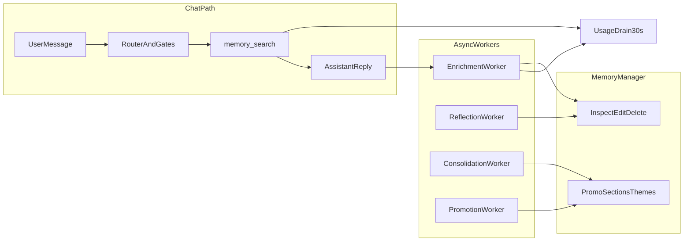

# Qube Memory — Manual QA Test Plan

Use this document as a **repeatable manual QA checklist** after memory changes. Most background behaviors are **async** (enrichment per turn; reflection/promotion/consolidation on **6h** cadence with startup jitter). Where a test depends on a worker cycle, either wait or use the **fast-path** alternatives noted below.

**Automated smoke proxy:** [`tests/test_memory_qa_smoke.py`](../tests/test_memory_qa_smoke.py) covers settings defaults, export, and negative-list behavior that map to Section 1 / Section 6 / E2E-2. Run before release:

```bash
.venv/bin/python -m pytest tests/test_memory_qa_smoke.py -q
```

## How to use this plan

| Column | Meaning |
|--------|---------|
| **Preconditions** | Settings, data, or session state required before running |
| **Steps** | What the tester does in the app |
| **Pass criteria** | Observable outcomes that mean the feature works |
| **Fail signals** | Common regressions to watch for |
| **Timing** | When results appear (immediate vs delayed) |

**Recommended baseline for memory QA sessions**

- Settings → Performance: **Memory Enrichment & Reflection = ON** (default)
- Use a **fresh or dedicated test session** so episode/promotion state is predictable
- After chat turns that should create memories, open **Memories** (nav index 2) and click **Refresh** (or navigate away and back)
- For worker-heavy tests (reflection, promotion, consolidation), plan a **multi-day** or **simulated multi-day** session (see Section 12–13) or accept 6h+ wait

**Key file references:** extraction in [`workers/enrichment_worker.py`](../workers/enrichment_worker.py), retrieval in [`mcp/memory_tool.py`](../mcp/memory_tool.py), UI in [`ui/views/memory_manager_view.py`](../ui/views/memory_manager_view.py), settings in [`core/app_settings.py`](../core/app_settings.py) + [`ui/views/settings_view.py`](../ui/views/settings_view.py).

---

## Section 1 — Settings & Worker Gating

**Capability tested:** User toggles correctly enable/disable background memory pipelines without crashing or blocking chat.

| ID | Test | Preconditions | Steps | Pass criteria | Fail signals |
|----|------|---------------|-------|---------------|--------------|
| S1.1 | Enrichment master toggle | App running | Turn **Memory Enrichment & Reflection** OFF → chat 5 turns with clear facts → Memories | No **new** rows after refresh; existing rows still visible | New facts appear; app hangs on send |
| S1.2 | Enrichment re-enable | S1.1 done | Turn enrichment ON → say *"Remember that my favorite color is teal for QA test S1.2"* | Within ~1–2 min, new preference/knowledge row with that content in Memory Manager | No row after 5 min; extraction error toast |
| S1.3 | Promotion toggle default | Fresh settings | Open Settings → Performance | **Enable Memory Promotion** is **OFF** by default | ON by default without user action |
| S1.4 | Promotion toggle wiring | Promotion OFF | Enable promotion → chat (no crash) → disable → chat | No errors; worker respects toggle (no promotions while off) | Crash on toggle; promotions while off |
| S1.5 | Promotion preset | Promotion ON | Change preset Conservative → Standard → Aggressive | Selector shows label; persists after app restart | Preset resets; UI blank |
| S1.6 | Consolidation toggle default | Fresh settings | Open Settings | **Enable Memory Consolidation** is **ON** by default | OFF by default |
| S1.7 | Consolidation toggle wiring | Consolidation OFF | Chat several days' worth of retrieval patterns (Section 12) | No **STAGED** badges / `consolidation_staged_at` when off | Staging while off |

---

## Section 2 — Atomic Fact Extraction & Validation

**Capability tested:** Enrichment extracts durable, provenance-backed facts and rejects noise, stubs, and assistant failures.

| ID | Test | Preconditions | Steps | Pass criteria | Fail signals |
|----|------|---------------|-------|---------------|--------------|
| E2.1 | Valid preference fact | Enrichment ON | User: *"I always use metric units for measurements."* Assistant acknowledges | Row in Memory Manager: `category=preference`, `subject=user`, non-empty `provenance_quote`, tier badge **PREF**, source `qube_memory::preference::...` | No row; empty provenance |
| E2.2 | Thin content rejection | Enrichment ON | User: *"Alice"* (no context) | **No** new identity/knowledge stub for bare name | Single-token name memory created |
| E2.3 | Assistant failure scrub | Enrichment ON | Provoke assistant refusal (*"What's the weather?"* with internet off) | **No** memory claiming "assistant has no internet" / failure pattern text | Failure message stored as user fact |
| E2.4 | Provenance gate | Enrichment ON | User states fact; verify quote in Memory Manager | `provenance_quote` is a substring of what user actually said (or explicit-remember path) | Quote unrelated to chat |
| E2.5 | Knowledge / third-party | Enrichment ON + Library doc ingested | *"According to my files, Project Omega deadline is March 15"* (RAG trigger) | Knowledge-tier row with `links_to_document_ids` or document-derived origin when applicable | Fact with no doc link on RAG turn |
| E2.6 | Confidence floor | Enrichment ON | Vague chitchat (*"nice day"*) | No durable memory row | Low-quality fact stored |

**Timing:** Rows usually appear within **30s–2min** after assistant reply finishes (extraction is async).

---

## Section 3 — Explicit Remember

**Capability tested:** `detect_explicit_remember` bypasses retrieval, seeds a high-confidence fact, and skips full extractor LLM on acknowledgement turns.

| ID | Test | Preconditions | Steps | Pass criteria | Fail signals |
|----|------|---------------|-------|---------------|--------------|
| R3.1 | Explicit remember write | Enrichment ON, empty or clean session | *"Please remember that my QA codename is Nightjar-7."* | Brief acknowledgement; **no** memory/RAG source block in UI for that turn | Long answer with fake citations |
| R3.2 | Fact appears in store | R3.1 done | Open Memories, search `Nightjar` | Row exists; knowledge or preference tier; high confidence (~0.95 path) | Missing after 5 min |
| R3.3 | Explicit remember retrieval | R3.2 row exists | New session or later turn: *"What's my QA codename?"* | Assistant recalls **Nightjar-7**; memory source(s) cited if routed to memory | Generic guess; no memory hit |

---

## Section 4 — Memory Retrieval in Chat

**Capability tested:** Correct memories inject on the right routes with appropriate tier scope and citation discipline.

### 4A — CHAT core memory (silent preference/context)

| ID | Test | Preconditions | Steps | Pass criteria | Fail signals |
|----|------|---------------|-------|---------------|--------------|
| C4.1 | Core memory inject | Strong preference stored (*"I hate cilantro"*), plain chat question unrelated to food | Ask: *"Suggest a simple pasta recipe"* | Answer may reflect preference **without** user asking to recall; or no inject if relevance gate fails (weak match) | Random unrelated memory injected |
| C4.2 | Core memory gate suppress | Only weak/tangential context memories | Plain chitchat | No memory sources on message (0 sources) when top hit below gate | Weak memory forced into prompt |

**Gate reference:** top score ≥ **0.45** and margin ≥ **0.08** ([`core/memory_retrieval_policy.py`](../core/memory_retrieval_policy.py)).

**Presentation profile (v7.2):** Units/locale/name/verbosity are merged from Settings (`qube.profile.*`) + [`~/.qube/user_profile.json`](../core/user_profile.py) via [`core/preference_policy.py`](../core/preference_policy.py). Presentation prefs apply at **tool/formatter** layers; CHAT semantic injection skips `preference_kind=presentation` LanceDB rows.

### 4A-P — Presentation policy + weather/units

| ID | Test | Preconditions | Steps | Pass criteria | Fail signals |
|----|------|---------------|-------|---------------|--------------|
| C4.P1 | Metric profile + weather (internet on) | Settings **Default units = Metric** OR inferred `units=metric` in profile card; internet enabled | *"What's the weather like today?"* | Web route or search runs; answer uses metric-friendly numbers (°C / km/h) or augmented snippets; no *"I've noted metric units"* re-ack | Imperial-only answer; unrelated memory ack |
| C4.P2 | Weather + internet off | Internet tool disabled | *"What's the weather like?"* | Clear message that live weather is unavailable because internet is disabled; no fabricated forecast | Random preference re-ack; hallucinated weather |
| C4.P3 | Explicit overrides inferred | Settings **Imperial**; conversation previously inferred metric | Ask measurement question | Imperial formatting wins | Metric leaks despite Settings |
| C4.P4 | Profile card | Inferred or explicit prefs exist | Open Memory Manager | **Presentation profile** card lists merged keys + provenance | Card empty when prefs set |

### 4B — Recall / hybrid fusion

| ID | Test | Preconditions | Steps | Pass criteria | Fail signals |
|----|------|---------------|-------|---------------|--------------|
| C4.3 | Recall phrasing | Stored fact about user | *"Remind me what I said about metric units"* | MEMORY or HYBRID route behavior; answer uses stored fact; `[N]` memory citation if sources shown | "I don't have that information" with memory in store |
| C4.4 | Entity recall + RAG expansion | Memory with `links_to_document_ids` | *"Tell me about Alice"* (Alice in library doc) | Answer draws from **document context**, not bare name stub | Only name with no doc expansion |

### 4C — Narrative / episode recap

| ID | Test | Preconditions | Steps | Pass criteria | Fail signals |
|----|------|---------------|-------|---------------|--------------|
| C4.5 | Narrative intent routing | Session with ≥8 turns or 15 min idle episode summary | *"Recap what we've been working on in this session"* | Prefers **EPISODE**-labelled sources; session summary content in answer | Only atomic facts; no episode hit |
| C4.6 | Episode boost | Session episode row exists | Same as C4.5 | Episode outranks unrelated atomic facts in cited sources | Wrong fact cited over episode |

**Episode cadence:** summarizer fires at **8 turns** or **15 min idle** per session ([`workers/enrichment_worker.py`](../workers/enrichment_worker.py)).

### 4D — Follow-up / discourse continuity

**Capability tested:** Anaphoric follow-ups inherit the active conversational topic; CHAT core memory does not hijack with imperative retrieval framing.

| ID | Test | Preconditions | Steps | Pass criteria | Fail signals |
|----|------|---------------|-------|---------------|--------------|
| C4.D1 | Game topic follow-up | Same thread; `qube.discourse.grounding_enabled=true` | 1. *"What is Slay the Spire?"* 2. *"Can you give me the top 10 tips and tricks to be successful at this?"* | Turn 2 answers about **Slay the Spire** (game tips); not generic life-success advice | Generic self-help / career tips with no game context |
| C4.D2 | Core memory suppressed on follow-up | Stored tangential context memory matching "successful" | Same as C4.D1 | Turn 2 shows **0 sources** or background-only framing without cite-[1] wrapper; no life-advice pivot from memory | Memory sources with imperative "use sources" wrapper on follow-up |
| C4.D3 | Explicit entity follow-up | Fresh thread | *"Give me 10 Slay the Spire tips for beginners"* (no prior turn) | Game-specific tips from model knowledge | N/A |
| C4.D4 | Discourse debug telemetry | `QUBE_DISCOURSE_DEBUG=1` | Run C4.D1 | Logs include `[Discourse] follow_up=…`, `topic='Slay the Spire'`, `wrapper=background` or `core_memory_suppressed=True` | No discourse log lines |
| C4.D5 | Follow-up WEB with topic expansion | Internet tool **enabled** | Same as C4.D1 with internet on | Turn 2 may stay **WEB**; log `[Discourse] web search query expanded for follow-up (topic='Slay the Spire')`; search uses expanded query; answer is **game-specific** tips (from web + thread), not generic life advice | Literal deictic query sent to search (`…successful at this?`) with unrelated snippets |
| C4.D6 | Ungrounded follow-up WEB veto | Internet on; **no** prior topic in thread | Single message: *"Give me tips for this"* (no context) | **CHAT** (`route=NONE`); log `ungrounded follow-up (no topic); vetoing WEB` | Web search for meaningless deictic query |

---

## Section 5 — Tier Scoping & Memory Manager Filters

**Capability tested:** LanceDB `source` namespaces map to correct tiers; UI filters match backend.

| ID | Test | Preconditions | Steps | Pass criteria | Fail signals |
|----|------|---------------|-------|---------------|--------------|
| T5.1 | Tier badge accuracy | Rows in multiple tiers | Open Memories | **PREF/KNOW/EP/CTX** badges match `source` namespace | Mismatch badge vs source |
| T5.2 | Tier filter | Mixed store | Set tier filter **Preferences** only | Only preference-tier rows visible | Knowledge/episode leak through |
| T5.3 | Category filter | Mixed categories | Filter **Episode** | Only `category=episode` rows | Other categories shown |
| T5.4 | Flagged-only toggle | At least one flagged row | Enable **Flagged only** | Only flagged rows; section header still sensible | Non-flagged visible |
| T5.5 | Text search | Known string in content | Search unique substring | Matching rows only | Case sensitivity bugs (should be insensitive) |

---

## Section 6 — Memory Manager CRUD & Negative List

**Capability tested:** Edit, flag, delete, bulk delete, export; delete prevents re-extraction.

| ID | Test | Preconditions | Steps | Pass criteria | Fail signals |
|----|------|---------------|-------|---------------|--------------|
| M6.1 | Edit memory | Any row | Edit → change text → save | Content updates; row persists after refresh | Duplicate row; lost metadata |
| M6.2 | Flag / unflag | Unflagged row | Flag → refresh → Unflag | **FLAGGED** badge toggles; `flagged_for_review` in payload | Badge stuck |
| M6.3 | Single delete + negative list | Row with distinctive fact | Delete → confirm | Row gone; re-chat similar fact within ~5 min | **Same fact reappears** (negative list failure) |
| M6.4 | Bulk delete visible | Filter to subset | **Delete all visible** | Only filtered rows removed | Deletes hidden rows |
| M6.5 | Export visible | Several rows visible | **Export visible** | File at `~/.qube/exports/memory_YYYYMMDD.md`; status shows path; markdown contains exported content | Empty file; wrong row count |

---

## Section 7 — Reflection & Flagged Review

**Capability tested:** Reflection worker flags suspect rows; **never auto-deletes**; user reviews in Memory Manager.

| ID | Test | Preconditions | Steps | Pass criteria | Fail signals |
|----|------|---------------|-------|---------------|--------------|
| F7.1 | Flagged section | Wait for reflection cycle OR manually flag | Open Memories | **⚑ FLAGGED FOR REVIEW** section at top when flagged rows exist | Flagged rows buried in categories only |
| F7.2 | Structural tier_mismatch | Manually create/edit odd row (QA env): preference tier + `subject=third_party` if possible | Wait for reflection (6h cycle, 7d min age) | Row flagged with structural label path | Auto-deleted |
| F7.3 | No auto-delete invariant | Flagged row exists | Wait multiple reflection cycles | Row still present until user deletes | Row disappears without user action |
| F7.4 | Episode skip | Episode row exists | Reflection cycle | Episode **not** flagged by LLM judge path | Episode flagged as transient fact |

**Timing:** Reflection runs every **6h**, batches **10**, skips rows reflected within **7 days**. For manual QA, use **Flag** button (M6.2) to validate UI without waiting.

---

## Section 8 — Usage Telemetry & Decay

**Capability tested:** Retrieval and citation counters drain into JSON payload; decay reduces stale memory influence.

| ID | Test | Preconditions | Steps | Pass criteria | Fail signals |
|----|------|---------------|-------|---------------|--------------|
| U8.1 | Retrieval counter | Row exists | Ask questions that retrieve it 3+ times (recall phrasing) | Memory Manager meta shows `used X/Y` with **X (retrieved) increasing** | Counters stuck at 0 |
| U8.2 | Citation counter | Memory retrieved | Answer that cites memory with `[N]` | **Y (cited)** increments after enrichment drain (~30s) | Cited count never moves |
| U8.3 | retrieval_days (v7.1) | Same memory retrieved on **different calendar days** (or QA simulates by manual payload edit in dev) | Inspect payload (export or debug) | `retrieval_days` contains ISO dates, max 16, deduped | Missing days |
| U8.4 | Decay behavior | Old low-use memory (QA: aged test row) | Retrieve many times on other memories; wait for decay sweep (24h) | Stale row ranks lower or purged if decay < 0.15 | Ancient junk always top hit |

**Drain interval:** **30s** batch flush ([`core/memory_usage_drain.py`](../core/memory_usage_drain.py)).

---

## Section 9 — Episodic Memory (Session + Daily Rollup)

**Capability tested:** Session summaries and calendar-day rollup rows are created, replace-in-place, and retrievable on recap.

| ID | Test | Preconditions | Steps | Pass criteria | Fail signals |
|----|------|---------------|-------|---------------|--------------|
| EP9.1 | Session episode cadence | Enrichment ON | Hold **8+ turn** conversation on one topic | Episode row: source `qube_memory::episode::<session_id>`, `category=episode`, **topics:** line in UI | No episode after 8 turns |
| EP9.2 | Idle episode gate | Enrichment ON | 4 turns, wait **15+ min** idle, 1 more turn | Episode summary written (idle trigger) | No summary after idle |
| EP9.3 | SKIP trivial session | Short chitchat only | 8 trivial turns | No episode OR LLM returns SKIP — no thin episode row | Garbage episode paragraph |
| EP9.4 | Daily rollup | Session episodes from prior days exist | Wait **24h** OR trigger idle maintenance in dev | Row `qube_memory::episode::YYYYMMDD` with `origin=daily_rollup` | Duplicate daily rows; wrong merge |
| EP9.5 | Episode overlap counter | Daily rollup written | Atomic fact content appears in rollup text | Matching atomic rows get `times_episode_overlap` > 0 (visible in promotion/consolidation scoring) | Overlap never increments |

---

## Section 10 — Memory v7: Salvage, Action Boundaries, Hybrid Retrieval

**Capability tested:** Windowed history salvage, expiry gates, hybrid vector+FTS retrieval quality.

### 10A — Salvage

| ID | Test | Preconditions | Steps | Pass criteria | Fail signals |
|----|------|---------------|-------|---------------|--------------|
| V7.1 | Salvage extraction | Enrichment ON, salvage ON (default), **short chat history window** in settings/toolbar | Long session (> window), state fact in **dropped** early turns | Fact from early turn still extracted; `times_salvage_considered` may increment | Early facts permanently lost |
| V7.2 | Salvage rate limit | Same session | Trigger salvage twice within 5 min | Second salvage skipped (no duplicate storm) | Duplicate extractions |

### 10B — Action boundaries

| ID | Test | Preconditions | Steps | Pass criteria | Fail signals |
|----|------|---------------|-------|---------------|--------------|
| V7.3 | Expired memory hidden | Row with `expires_at` in past (QA seed) | Recall query targeting it | Not retrieved / not injected | Expired row cited |
| V7.4 | ACTION badge | Action-sensitive payload | Open Memories | **ACTION** badge + tooltip with constraints/expiry | Missing badge |

### 10C — Hybrid retrieval & MMR

| ID | Test | Preconditions | Steps | Pass criteria | Fail signals |
|----|------|---------------|-------|---------------|--------------|
| V7.5 | Hybrid FTS path | Memory with rare token not strong vector match | Recall using distinctive keyword from memory | Memory appears in results (FTS channel) | Miss despite lexical match |
| V7.6 | MMR diversity | Two near-duplicate memories + one distinct | Recall broad topic | Distinct memory survives in top results (not two paraphrases) | Near-duplicates both top-2 |
| V7.7 | Semantic floor | Unrelated memory in store | Unrelated query | No citation of irrelevant memory (semantic gate) | "Least bad" wrong memory cited |

---

## Section 11 — Memory v7.1: Consolidation Worker

**Capability tested:** Cross-day staging metadata without auto-promote or auto-delete.

| ID | Test | Preconditions | Steps | Pass criteria | Fail signals |
|----|------|---------------|-------|---------------|--------------|
| CO11.1 | STAGED badge | Consolidation ON; context/knowledge row with multi-day retrieval | Wait for consolidation cycle OR simulate `retrieval_days` with 2+ dates + usage | **STAGED** badge; tooltip lists hints (`multi_day_retrieval`, etc.) | Badge on episode/preference rows |
| CO11.2 | consolidation_staged_at | Same as CO11.1 | Export or inspect payload | `consolidation_score` ≥ 0.55, `consolidation_staged_at` timestamp set | Score below threshold but staged |
| CO11.3 | No auto-promote | Consolidation ON, promotion OFF | High consolidation score | Tier unchanged (still context/knowledge) | Silent promotion |
| CO11.4 | Flagged veto | Flagged row with good signals | Consolidation cycle | **Not** staged while flagged | Staging despite flag |
| CO11.5 | Consolidation OFF | Toggle OFF | Multi-day pattern | No new staging metadata | Staging continues |

**Timing:** **6h** cycle, batch **15**, startup jitter **3–9 min**.

---

## Section 12 — Memory v7.1: Promotion Worker

**Capability tested:** Opt-in promotion from context/knowledge → preference with presets, vetoes, and explainability.

| ID | Test | Preconditions | Steps | Pass criteria | Fail signals |
|----|------|---------------|-------|---------------|--------------|
| P12.1 | Promotion OFF invariant | Promotion OFF | Build high-signal context row (many retrievals, citations, multi-day) | Source stays `qube_memory::context::...`; no `promoted_at` | Row moves to preference |
| P12.2 | Promotion ON — happy path | Promotion ON, preset **Aggressive**, unflagged context row meeting gates | Wait promotion cycle OR lower thresholds via preset | Source becomes `qube_memory::preference::...`; `promoted_at` set; **PREF** badge | Stuck in Almost promoted forever |
| P12.3 | Reflection veto | Promotion ON | Flag row that would promote | Row **not** promoted while flagged | Promotion despite flag |
| P12.4 | Near-duplicate block | Promotion ON; near-identical preference already exists | Promote candidate with paraphrase | Promotion skipped (no duplicate preference rows) | Two nearly identical PREF rows |
| P12.5 | Preset strictness | Two QA rows with borderline stats | Run with **Conservative** vs **Aggressive** | Conservative promotes fewer / slower | No difference between presets |
| P12.6 | Negative list veto | Deleted-then-similar fact | Re-extract + promote attempt | Blocked by negative list at promote time | Promoted duplicate of deleted fact |

**Promotion gates (Standard preset):** min retrieved **3**, min unique context **3**, max age **30d**, min score **0.78** ([`core/memory_promotion.py`](../core/memory_promotion.py)).

---

## Section 13 — Memory v7.1: Memory Manager Explainability UX

**Capability tested:** Promotion candidates, Almost promoted, recurring themes, tooltips.

| ID | Test | Preconditions | Steps | Pass criteria | Fail signals |
|----|------|---------------|-------|---------------|--------------|
| UX13.1 | Promotion candidates section | Rows passing gates + score ≥ 0.65 | Open Memories | **PROMOTION CANDIDATES** section (≤12 rows); hover shows score breakdown | Section missing for qualifying rows |
| UX13.2 | Almost promoted section | Row with score ≥ 0.65 but fails one gate (e.g. low retrieval count) | Open Memories | **ALMOST PROMOTED** section; tooltip shows **gate failure reason** + signal components | No tooltip; wrong reason |
| UX13.3 | Section order | Rows qualifying for multiple sections | Open Memories | Order: Almost promoted → Promotion candidates → Flagged → categories | Wrong order |
| UX13.4 | Recurring themes card | Several memories sharing category/topic | Open Memories (broad filter) | **Recurring themes** card with `category:*`, `topic:*`, or `query:*` counts | Card missing when themes exist |
| UX13.5 | Row duplication awareness | Row in Almost promoted | Scroll to category section | Same row may appear in category list (known behavior) | Tester documents if confusing — not necessarily fail |

---

## Section 14 — End-to-End Regression Scenarios

**Capability tested:** Real-world flows combining routing, extraction, retrieval, and UI.

| ID | Scenario | Steps (summary) | Pass criteria |
|----|----------|-----------------|---------------|
| E2E-1 | **Learn → recall → edit → recall** | State preference → ask recall → edit in Memory Manager → ask again | Updated text in answer |
| E2E-2 | **Delete → re-learn block** | Create fact → delete → repeat similar statement in chat | Fact does **not** reappear |
| E2E-3 | **Library + memory fusion** | Ingest doc → chat fact linked to doc → hybrid recall | Answer cites memory **and** library source appropriately |
| E2E-4 | **Long session recap** | 10-turn project discussion → *"summarize this conversation"* | Episode-led recap, not random atomic facts |
| E2E-5 | **Promotion journey** | Create context fact → simulate usage over days → enable promotion → verify preference tier | Full pipeline with Memory Manager sections reflecting progress |
| E2E-6 | **WEB empty downgrade** | Internet tool OFF → *"weather today"* | No fake `[W]` citation; no "live web results" hallucination; thin reply not mined (skip enrichment) |

---

## Section 15 — Performance & Stability Smoke

**Capability tested:** Memory pipeline does not block UI, TTS, or streaming.

| ID | Test | Steps | Pass criteria | Fail signals |
|----|------|-------|---------------|--------------|
| PERF15.1 | Chat during enrichment | Rapid 10-turn chat | Streaming smooth; UI responsive | Stutters >2s per turn |
| PERF15.2 | Memory Manager load | 500+ rows (stress env) | Loads within acceptable time; scroll smooth | UI freeze >5s |
| PERF15.3 | Settings toggle under load | Toggle enrichment during active chat | No crash | Segfault / hang |

---

## Section 16 — Optional: Notifications

**Capability tested:** Memory extraction toasts when enabled.

| ID | Test | Preconditions | Steps | Pass criteria |
|----|------|---------------|-------|---------------|
| N16.1 | Memory notification | Settings → **Memory extraction notifications** ON | Turn creates new fact | Toast **"Memories saved"** / **View Memories** action |

---

## QA sign-off template

For each release candidate, record:

- **Build / commit:**
- **Sections run:** (e.g. S1–M6 smoke + E2E-1–4)
- **Deferred (timing):** (e.g. P12.2 promotion cycle — scheduled Day 2)
- **Failures:** ID + observed vs expected
- **Notes:** preset used, session IDs, export paths
- **Automated smoke:** output of `pytest tests/test_memory_qa_smoke.py -q`

---

## Mermaid — Memory QA flow (high level)


