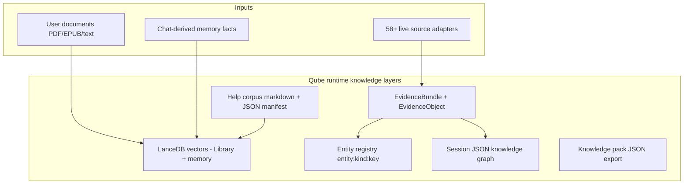
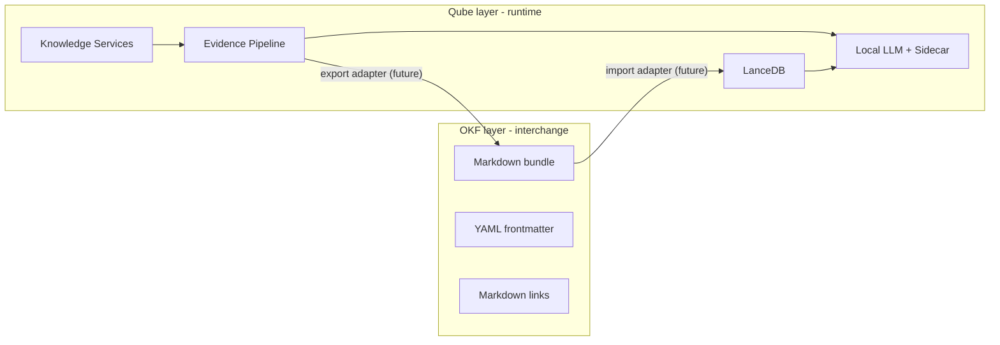

# Open Knowledge Format (OKF) — Comparison with Qube

**Status:** Reference / analysis  
**Date:** 2026-07-22  
**Related:** [External Knowledge Platform Plan](./external_knowledge_platform_plan.md), [In-App Help Knowledge Base](./in_app_help_knowledge_base.md), [Knowledge Platform Evolution Review](./knowledge_platform_evolution_review.md), [OKF v0.1 spec (Google)](https://github.com/GoogleCloudPlatform/knowledge-catalog/blob/main/okf/SPEC.md)

---

## Executive summary

**Google OKF** and **Qube** address different layers of the “knowledge for AI” problem. OKF is a **portable interchange format** for curated, human/agent-readable concept documents. Qube is a **local retrieval-and-assistant runtime** built around live evidence, vector search, and structured internal contracts.

They are **not substitutes**. Qube is already substantially more capable than OKF in **runtime retrieval, grounding, ranking, and evidence quality**. OKF is more purpose-built for **cross-tool, cross-org sharing of durable curated knowledge** as plain files in git.

The one area where they overlap meaningfully is Qube’s **in-app help corpus** — which already follows a similar *spirit* (modular markdown, typed concepts, cross-links) but uses a **different packaging model** (JSON manifest + LanceDB ingestion, explicitly **no** YAML frontmatter).

**Bottom line:** Adopting OKF as a core architecture would be a step backward for Qube’s evidence platform. Selective OKF **export/import** could still be useful later for interoperability, not as a replacement for what Qube already does.

---

## 1. What is Google OKF?

[Open Knowledge Format (OKF) v0.1](https://github.com/GoogleCloudPlatform/knowledge-catalog/blob/main/okf/SPEC.md) is an open specification published by Google Cloud’s Data Cloud team (June 2026). It formalizes the “LLM wiki” pattern into a vendor-neutral standard.

### Core model

| Concept | Definition |
|--------|------------|
| **Knowledge bundle** | A directory tree of Markdown files — the unit of distribution |
| **Concept** | One `.md` file = one knowledge unit |
| **Concept ID** | File path without `.md` (e.g. `tables/orders`) |
| **Metadata** | YAML frontmatter at top of each file |
| **Relationships** | Standard Markdown links between concepts |
| **Navigation** | Optional `index.md` (directory listing) and `log.md` (change history) |

### Required vs. optional

OKF is deliberately minimal. The **only required field** is `type` in frontmatter. Recommended optional fields: `title`, `description`, `resource` (URI to underlying asset), `tags`, `timestamp`.

Body sections like `# Schema`, `# Examples`, and `# Citations` are **conventions**, not requirements.

### Design goals

1. Human-readable without tooling (`cat` a file)
2. Agent-parseable without proprietary SDKs
3. Git-diffable and portable (clone, tarball)
4. Producer/consumer independence — humans or agents can write; any agent can read
5. **Format, not platform** — no prescribed storage, vector DB, or serving layer

### What OKF explicitly is *not*

- Not a schema registry or ontology standard
- Not a query/retrieval engine
- Not a replacement for Avro, Protobuf, OpenAPI, etc. (OKF *references* them)
- Not tied to BigQuery, Google Cloud, or any specific agent framework

### Primary use case

OKF targets **organizational knowledge catalogs**: data team metadata (tables, datasets, metrics), playbooks, runbooks, API docs — curated context that surrounds live systems. Google’s [Knowledge Catalog](https://github.com/GoogleCloudPlatform/knowledge-catalog) repo is the reference implementation.

---

## 2. Qube’s knowledge architecture (relevant layers)

Qube is a **privacy-first desktop AI assistant** (PyQt6, local inference). Its knowledge design is documented primarily in:

- [`docs/external_knowledge_platform_plan.md`](./external_knowledge_platform_plan.md) — external/live knowledge
- [`docs/in_app_help_knowledge_base.md`](./in_app_help_knowledge_base.md) — curated product help
- [`docs/architecture/memory-system.md`](./architecture/memory-system.md) — long-term memory

Qube runs **several parallel knowledge layers**, not one universal document format:

### Layer A: Live external knowledge — `EvidenceBundle`

The primary contract between retrieval and reasoning. Defined in `core/knowledge/types.py`:

- **`EvidenceObject`** — atomic retrieved item with bibliographic metadata (DOI, authors, venue), pipeline scores (relevance, authority, reliability, freshness), provenance, and `entity_ids`
- **`EvidenceBundle`** — assembled answer with confidence, coverage, conflicts, warnings, adapter call trace
- **58+ institutional adapters** (PubMed, SEC EDGAR, CourtListener, EUR-Lex SPARQL, etc.) orchestrated through Knowledge Services

Core principle from the design plan: *optimize for evidence quality, not retrieval sophistication*. Confidence, coverage, and conflicts are **computed deterministically by the pipeline**, not invented by the LLM.

### Layer B: User Library (RAG)

- LanceDB table with vector + FTS (Tantivy), MMR, RRF fusion
- Unit of knowledge: **semantic text chunks** (~1500 chars), not typed concept documents
- Hybrid retrieval with relevance gates

### Layer C: Long-term atomic memory

- JSON fact payloads stored in LanceDB `text` column
- Schema: subject, category, durability, provenance quote, confidence, links to sessions/documents
- Mostly **LLM-extracted** from chat, not human-authored concept files

### Layer D: Entity resolution

Compositional registry under `core/knowledge/entities/`:

- Stable IDs: `entity:{kind}:{normalized-key}`
- Extractors + optional linkers (e.g. RxNorm)
- Used for deduplication and session graph nodes — not a full RDF/OWL ontology

### Layer E: Session knowledge graph

Lightweight JSON graph (`query`, `source`, `entity` nodes; `about`, `supports`, `mentions`, `conflicts` edges) stored in SQLite. **Derived from evidence bundles**, not authored as standalone knowledge. Explicitly not Neo4j/RDF.

### Layer F: In-app help corpus (closest OKF analogue)

From [`docs/in_app_help_knowledge_base.md`](./in_app_help_knowledge_base.md):

| Aspect | Qube help corpus |
|--------|------------------|
| Files | Modular markdown under `assets/help/en/source/` |
| Types | `feature`, `workflow`, `faq`, `reference`, `troubleshooting`, `index` |
| Relationships | `related` arrays in manifest + markdown cross-links |
| Metadata | **Separate JSON manifest** (`qube.help_corpus_manifest.v1`) — **not YAML frontmatter** |
| Delivery | Ingested into LanceDB like any Library document; scoped via `@help` |
| Index | `00-index.md` as thin router (similar to OKF `index.md`) |

Explicit design choice (§3.1): *“Avoid YAML frontmatter inside markdown (metadata lives elsewhere).”*

### Layer G: Knowledge pack export

`core/knowledge/knowledge_pack.py` exports **configuration only** (presets, source preferences, redacted credentials) as JSON v1 — not evidence, memory facts, or curated concept bundles.

---

## 3. Side-by-side comparison

| Dimension | Google OKF v0.1 | Qube |
|-----------|-----------------|------|
| **Primary artifact** | Static file bundle (git repo / tarball) | Running desktop app + runtime stores |
| **Problem solved** | Portable interchange of curated knowledge | Grounded local AI assistant with live retrieval |
| **Knowledge unit** | One typed `.md` concept file | `EvidenceObject`, memory JSON atom, LanceDB chunk |
| **Identity model** | File path = concept ID | `entity:kind:key`, bundle IDs, LanceDB row keys |
| **Metadata** | YAML frontmatter in each file | JSON manifests, SQLite payloads, Python dataclasses |
| **Relationships** | Untyped markdown links | Typed graph edges + manifest `related` + memory provenance links |
| **Schema rigor** | Minimal (only `type` required) | Strong internal contracts (`EvidenceBundle`, memory schema v7.1, help manifest v1) |
| **Vector search** | Not part of spec | Core (Library, memory, relevance gates) |
| **Live data** | Citations point to external URLs | 58+ adapters fetch, normalize, rank live sources |
| **Quality signals** | None (consumer’s problem) | Confidence, coverage, conflicts, authority/reliability scores |
| **Conflict detection** | Not specified | Pipeline-computed `EvidenceConflict` objects |
| **Entity resolution** | Not specified | Compositional registry with biomedical/finance packs |
| **Human authoring** | First-class | Help corpus yes; memory mostly LLM-extracted |
| **Agent consumption** | Read/traverse markdown bundle | RAG injection + bundle summaries + skills scaffolding |
| **Portability** | `git clone` = full bundle | JSON knowledge pack (config only); no OKF-style full export |
| **Ontology/RDF** | Explicit non-goal | Also non-goal (except one SPARQL adapter) |
| **Versioning** | Optional `log.md`, git history | Corpus version in manifest, JSONL audit traces |

---

## 4. Is Qube “more advanced” than OKF?

**They are not directly comparable on a single axis.** Qube is more advanced in runtime intelligence; OKF is more advanced in interchange simplicity and ecosystem portability.

### Where Qube is clearly ahead (OKF does not address these)

1. **Live evidence retrieval** — Multi-adapter orchestration, page fetch, bibliographic normalization, authority reranking. OKF assumes knowledge is already curated in files; it has no retrieval pipeline.

2. **Evidence quality contract** — `EvidenceBundle` with deterministic confidence, coverage, and conflict signals. OKF has no equivalent; quality is entirely up to the producer and consumer.

3. **Hybrid vector + lexical retrieval** — LanceDB embeddings, FTS, MMR, RRF fusion, relevance gates. OKF has no search model at all.

4. **Entity resolution across turns** — Compositional extractors, dedupe policy, optional RxNorm linking. OKF links are untyped markdown edges with no normalization layer.

5. **Session-scoped knowledge graphs** — Derived operational graphs (`supports`, `conflicts`, `mentions`) tied to research sessions. OKF’s link graph is static and authorship-time.

6. **Privacy-local runtime** — Full on-device inference, storage, and telemetry. OKF is format-only; it says nothing about where or how knowledge runs.

7. **Deep Research** — Async multi-step evidence assembly with budgeted adapter calls. Far beyond static document traversal.

### Where OKF is ahead (or Qube simply doesn’t do this)

1. **Vendor-neutral interchange** — Any tool can read/write an OKF bundle with zero Qube-specific code. Qube’s formats are app-internal.

2. **Git-native human curation** — One file per concept, frontmatter co-located with prose, diffable in PRs. Qube splits metadata (JSON manifest) from body (markdown) by design.

3. **Progressive disclosure standard** — `index.md` + directory hierarchy as a specified navigation pattern. Qube has an analogous index but it’s app-specific, not a portable standard.

4. **Cross-org knowledge exchange** — OKF’s explicit goal. Qube’s knowledge pack exports config, not curated concept corpora.

5. **Minimal interoperability surface** — One required field. Easy for any agent to consume without schema negotiation.

### Where they are similar in spirit, different in packaging

The **in-app help corpus** is the clearest parallel:

| OKF pattern | Qube equivalent |
|-------------|-----------------|
| Concept = one `.md` file | One help doc per topic |
| `type` frontmatter field | `type` in `manifest.json` |
| Markdown cross-links | `Related` sections + manifest `related` |
| `index.md` progressive disclosure | `00-index.md` thin router |
| `log.md` change history | `release/whats-new.md` + corpus_version |
| `# Citations` section | Not a standard help pattern (product docs, not research) |

Qube made a deliberate choice **against** YAML frontmatter (retrieval purity, generation pipeline simplicity). That is a meaningful divergence from OKF, not an accidental gap.

---

## 5. Would OKF be useful somewhere in Qube?

### Low value / poor fit (do not adopt as core architecture)

| Qube subsystem | Why OKF is a poor fit |
|----------------|----------------------|
| **EvidenceBundle / live adapters** | OKF is static curation; Qube needs fetch, rank, score, cache, conflict-detect |
| **Library RAG chunks** | Chunks are retrieval artifacts, not authored concepts |
| **Long-term memory** | Atomic JSON facts with provenance/decay — wrong granularity for OKF concept files |
| **Session knowledge graph** | Ephemeral, derived, typed edges — OKF’s static link graph is too weak |
| **Entity registry** | Normalized IDs + linkers need programmatic registry, not markdown files |

Replacing Qube’s evidence platform with OKF would lose the core value proposition: **grounded answers from live, scored, conflict-aware retrieval**.

### Moderate value (optional future integration)

| Use case | How OKF could help |
|----------|-------------------|
| **Help corpus export** | Emit `assets/help/en/` as a conformant OKF bundle for external agents, GitHub browsing, or third-party doc tools |
| **Help corpus import** | Accept OKF bundles from partners or Google Knowledge Catalog as a new Library collection type |
| **Research map export** | Serialize session graph + key evidence summaries into OKF concept files for sharing/archival |
| **Knowledge preset documentation** | Document what a preset does (adapters, policies) as OKF playbooks alongside JSON config |
| **Deep Research reports** | Export final synthesized reports as OKF bundles with `# Citations` linking back to source concepts |

These are **export/import adapters**, not architectural replacements.

### Highest-value single integration point

**In-app help corpus ↔ OKF** is the natural convergence point because:

- Already markdown-first, modular, typed, cross-linked
- Already treated as “product data” in git
- Already has an index router and release notes
- Migration path is straightforward: merge manifest fields into YAML frontmatter, map `related` → markdown links, add `okf_version: "0.1"` to index

Whether that’s worth doing depends on **interop goals** (share Qube help outside the app? ingest Google catalog bundles?) — not on retrieval quality, which OKF doesn’t improve.

---

## 6. Architectural assessment

Qube and OKF sit at **different layers of a stack**:

- **OKF** = durable, shareable, human/agent-readable **knowledge documents**
- **Qube** = **retrieval runtime** that turns live sources + local stores into grounded evidence for a local LLM

Qube’s design is **more sophisticated for an assistant product** because it solves problems OKF explicitly defers: search, ranking, freshness, authority, conflicts, entity deduplication, and session-scoped reasoning.

OKF is **more standardized for knowledge exchange** because it solves problems Qube doesn’t prioritize: vendor-neutral portability, minimal conformance surface, and git-native curation workflows that any agent can consume.

Neither subsumes the other. Google’s own spec says OKF *references* domain schemas rather than replacing them — analogous to how Qube’s `EvidenceObject` references DOI/PMID conventions without being an OKF bundle.

---

## 7. Recommendations

1. **Do not adopt OKF as a core internal format.** Qube’s evidence platform, memory schema, and vector pipeline are the right abstractions for a local grounded assistant. OKF would be a regression for live retrieval and quality signaling.

2. **Monitor OKF ecosystem adoption.** If Google Knowledge Catalog, enterprise data teams, or agent frameworks standardize on OKF bundles, a **read-only import path** (OKF bundle → Library collection) could become valuable — especially for users who already maintain organizational knowledge catalogs.

3. **Consider OKF export for the help corpus only** if you want Qube’s product documentation readable outside the app (GitHub, static site, external agents) without maintaining a parallel docs system. The migration is low-risk because the corpus is already markdown-modular; the main change would be inlining manifest metadata into frontmatter.

4. **Do not conflate “Open Knowledge” in Qube UI with OKF.** Qube’s Settings → Knowledge feature refers to live source configuration and presets, not Google’s format. Naming collision only.

5. **Preserve Qube’s intentional divergences** — separate JSON manifest, no frontmatter in help markdown, LanceDB as the consumption layer — unless interoperability requirements explicitly justify changing them.

---

## 8. Conclusion

Google OKF is a well-designed **interchange standard** for the “LLM wiki” pattern: typed markdown concepts, cross-linked in a portable bundle. It is **not** a retrieval engine, evidence platform, or assistant runtime.

Qube has already built a **substantially more capable runtime layer** for its use case: live multi-adapter evidence, hybrid vector search, deterministic quality signals, entity resolution, and session graphs. Those capabilities are orthogonal to OKF and would not be improved by adopting it internally.

The meaningful overlap is narrow: Qube’s **help corpus** already resembles an OKF bundle in structure and intent, but differs in packaging (JSON manifest vs. YAML frontmatter, LanceDB ingestion vs. direct file consumption). OKF’s practical value to Qube would be as an **optional export/import format** for curated static knowledge — not as a replacement for the evidence-centric architecture that defines the product.

---

## References

- [OKF v0.1 specification](https://github.com/GoogleCloudPlatform/knowledge-catalog/blob/main/okf/SPEC.md)
- [Google Cloud blog — How OKF can improve data sharing](https://cloud.google.com/blog/products/data-analytics/how-the-open-knowledge-format-can-improve-data-sharing)
- [Google Knowledge Catalog repository](https://github.com/GoogleCloudPlatform/knowledge-catalog)
