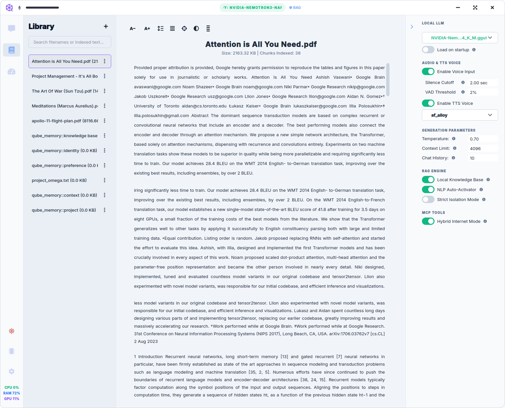

# How to use Qube

Practical workflows for voice, Library (RAG), and Memory Manager. For control-by-control reference, use in-app **Library → Qube** or **`@[tool:help]`**.

---

## Voice interaction

1. **Set up inference** — In **Settings → AI & Models**, choose **Internal Engine** (after loading a `.gguf` in **Model Manager**) or **External Server** and start LM Studio / Ollama if using external mode.
2. **Choose audio devices** — **Settings → Voice & Audio** → **Audio Input** / **Audio Output**.
3. **Enable listening** — Turn on **Enable Voice Input** in the Conversations tools panel, or use **push-to-talk** beside the composer.
4. **Wake word (optional)** — **Settings → Voice & Audio → Wakeword** → pick **Active Wakeword**, download models if prompted, test in **Open Wakeword Test Lab**.
5. **Speak** — Qube uses voice-activity detection: it listens while you talk and processes after a silence window (configurable in Settings).

**Barge-in:** you can interrupt TTS mid-sentence by speaking again (when voice input is active).

---

## Library (document retrieval)

Ask questions grounded in your own files.

1. Open **Library** and import documents (**PDF**, **EPUB**, **TXT**, **MD**). Qube parses and embeds them locally.
2. Ground a turn:
   - Attach **`@[tool:library]`** in the composer, and/or
   - Enable **Local Knowledge Base** in the tools panel, and/or
   - Use natural phrasing — the cognitive router generalizes from a few trigger examples in **Settings → Knowledge**.
3. Ask your question. Replies include numbered citations (e.g. `[1]`) linking to source chunks.
4. **Follow-ups** — conversation context carries forward; you often do not need to re-attach Library for the next question on the same topic.

| Dark | Light |
| :---: | :---: |
|  |  |

---

## Live sources and research

Attach **`@` tools** in the composer for capabilities beyond your Library:

| Tool | Use for |
|------|---------|
| `@trusted` | General facts from allowlisted sources |
| `@evidence` | Scientific literature |
| `@finance` | SEC filings |
| `@legal` | U.S. case law |
| `@research` | Multi-step async evidence report |
| `@internet` | Live web search |

See **Library → Qube → reference/composer-tools.md** for the full list.

---

## Memory Manager

Qube learns preferences and facts over time in the background. You do not have to open Memory Manager — decay and reflection help keep the store healthy — but it gives full editorial control.

1. Open **Memory Manager** in the main navigation.
2. Review top sections: **Promotion candidates**, **Almost promoted**, **Flagged for review** (when applicable).
3. Filter by **tier**, **category**, or search text; toggle **Flagged only**.
4. **Edit**, **Flag**, or **Delete** individual rows. **Delete** also adds the fact to a negative list so it is not re-extracted from similar chat.
5. **Export visible** writes Markdown to `~/.qube/exports/`.

Optional background workers: **Settings → Memory** (promotion, consolidation).

---

## Desktop Companion

Optional floating orb for quick voice turns without raising the main window.

**Settings → Desktop Companion** — enable the companion, set position, fullscreen suppression, and optional commentary.

---

## Getting help

- **`@[tool:help]`** in chat
- **Library → Qube** — full corpus index at `00-index.md`
- **`?` buttons** on each screen — guided tours

---

## Related

- [Install from source](install-from-source.md)
- [System requirements](system-requirements.md)
- [Cognitive router (technical)](../cognitive_router.md)
